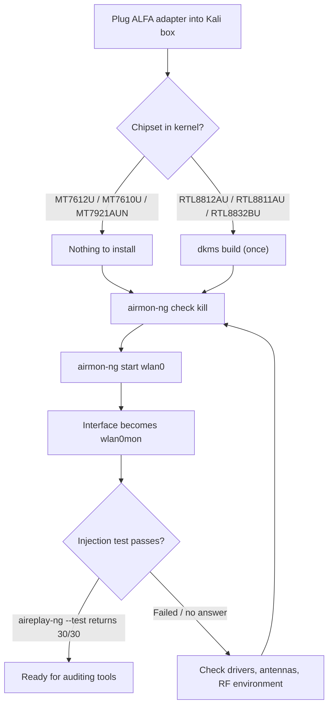

# ALFA 网卡适配器在 Kali Linux 上——监听模式与数据包注入

> **学习目标（Learning goal）**：学完本指南，你的 ALFA 网卡适配器将进入**监听模式**，并且**证明数据包注入可用**——这是每个 Wi-Fi 审计工具（Aircrack-ng、Wifite、Wireshark、Bettercap）都依赖的两项能力。
> **适用对象**：初学者–中级，Kali 用户 ｜ **前置需求**：已安装 Kali Linux（任意较新版本）、网络访问、你的 ALFA 网卡适配器。

## 概念：为什么 Kali 与众不同

Ubuntu 把 Wi-Fi 网卡适配器当作*礼貌的客户端*：它们只捕获自己的流量。Kali 的整套工具链——Aircrack-ng、Reaver、Wifite——假设网卡适配器还能做两件额外的事：

1. **监听模式（monitor mode）**——捕获信道上的*每一个*帧，而不仅仅是你的连接。
2. **数据包注入（packet injection）**——发送原始构造的帧（deauth、probe request、握手重放）。

不是每个芯片组都能做到这两点。好消息是：除 **AWUS036EACS** 外，所有 ALFA 网卡适配器都可以，而且内核内置的 MediaTek 芯片组无需安装任何驱动就能做到。



## 前置需求

- [ ] 已安装 Kali Linux（在 Kali rolling、内核 6.x 上测试过）
- [ ] `sudo` 权限和网络连接
- [ ] 你的 ALFA 网卡适配器——先查看[兼容性矩阵](/alfa-network/linux-compatibility-matrix/)
- [ ] （仅 Realtek 型号）构建工具：`sudo apt install -y build-essential dkms git`

## 第 1 步：检查内核看到了什么

插上网卡适配器并确认它被检测到：

```bash
lsusb | grep -iE "realtek|mediatek"
iw dev
```

**预期输出**：你的网卡适配器出现在 `lsusb` 中，并且 `iw dev` 中至少有一个 `Interface wlan0`（或 `wlan1`）。

## 第 2 步：安装驱动（仅 Realtek 芯片组）

如果你的芯片组是 RTL8812AU / RTL8811AU / RTL8832BU，用 DKMS 构建 aircrack-ng 维护的驱动。如果你的芯片组是 MediaTek（MT7612U / MT7610U / MT7921AUN），**跳到第 3 步**——驱动已经在你内核里。

### RTL8812AU（AWUS036ACH）

```bash
sudo apt update
sudo apt install -y build-essential dkms git
cd /opt
sudo git clone https://github.com/aircrack-ng/rtl8812au.git
cd rtl8812au
sudo make dkms_install
```

**预期输出**：以 `DKMS: install completed.` 结尾。

> 为什么用 aircrack-ng 分支？Kali 的内核滚动很快，aircrack-ng 维护者会在每次内核发布后几天内更新这些驱动——在滚动发行版上至关重要。[RTL8812AU 驱动页面](/alfa-network/drivers/rtl8812au/)有深度解析。

### RTL8811AU（AWUS036ACS）

```bash
cd /opt
sudo git clone https://github.com/aircrack-ng/rtl8811au.git
cd rtl8811au
sudo make dkms_install
```

### RTL8832BU（AWUS036AX / AWUS036AXER）

```bash
cd /opt
sudo git clone https://github.com/aircrack-ng/rtl88x2bu.git
cd rtl88x2bu
sudo make dkms_install
```

重新插拔网卡适配器（或 `sudo modprobe <module>`）并确认出现接口：`iw dev`。

## 第 3 步：终止干扰进程

Kali 的 NetworkManager 会争夺 Wi-Fi 接口的控制权。在切换到监听模式之前先停掉它：

```bash
sudo airmon-ng check kill
```

**预期输出**：

```text
Killing these processes:

    PID Name
   1234 wpa_supplicant
   2345 NetworkManager
```

> ⚠️ 这会断开你当前的 Wi-Fi 连接（你杀掉了 NetworkManager！）。如果你正通过 Wi-Fi 工作，会失去连接——请使用以太网线或在本机操作。之后可以用 `sudo systemctl restart NetworkManager` 恢复。

## 第 4 步：启动监听模式

```bash
sudo airmon-ng start wlan0
```

（把 `wlan0` 替换成第 1 步得到的接口名。）

**预期输出**：

```text
PHY	Interface	Driver		Chipset
phy0	wlan0		mt76x2u		MediaTek Inc. MT7612U
		(mac80211 monitor mode vif enabled for [phy0]wlan0 on [phy0]wlan0mon)
		(mac80211 station mode vif disabled for [phy0]wlan0)
```

你的接口现在是 **wlan0mon**。验证：

```bash
iwconfig
```

**预期输出**：`wlan0mon  IEEE 802.11  Mode:Monitor  ...`

## 第 5 步：证明数据包注入可用

注入是每款 Wi-Fi 网卡适配器的技能考核。运行 Aircrack-ng 自测（它广播发送，无需目标）：

```bash
sudo aireplay-ng --test wlan0mon
```

**预期输出**：

```text
12:34:56  Trying broadcast probe requests...
12:34:56  Injection is working!
12:34:56  Found 1 AP
12:34:56  30/30:  100%
```

**`30/30: 100%`**——这就是魔法行。它意味着网卡适配器注入了 30 个 probe request 并听到了全部 30 个，证明监听模式下 TX 和 RX 都正常。如果你看到 `Failed` 或低百分比，说明网卡适配器实际上没有在注入——参见下面的常见错误表。

## 第 6 步：把工具指向它

一个快速的端到端健全性检查——捕获并计数 10 秒内的帧：

```bash
sudo timeout 10 tcpdump -i wlan0mon -c 100
```

**预期输出**：`100 packets captured`（或 10 秒内到达的任意数量——看到*任何* 802.11 帧就证明捕获可用）。

完成后，把网卡适配器恢复正常模式：

```bash
sudo airmon-ng stop wlan0mon
sudo systemctl restart NetworkManager
```

## 常见错误（FAQ）

| 错误 / 症状 | 原因 | 修复 |
|---|---|---|
| `airmon-ng start` 提示 `No such device` | 接口名是 `wlan1` 或驱动未加载 | 运行 `iw dev` 找到真实名称；Realtek 用 `sudo modprobe <module>` |
| `aireplay-ng --test` → `No such device` | 你还在 `wlan0` 上，而不是 `wlan0mon` | 重新检查 `iwconfig`；从第 4 步重新启动监听模式 |
| `Injection is working!` 但 `0/30` 回复 | 网卡适配器 TX 正常但 RX 过滤坏了（某些 Realtek 驱动常见） | 尝试锁定信道：`sudo iw wlan0mon set channel 6`；重测；升级 DKMS 驱动 |
| DKMS 构建失败并提示 "No rule to make target" | Kali 内核对仓库快照来说太新 | `cd /opt/rtl8812au && sudo git pull && sudo make dkms_install` |
| 监听模式几分钟后失效 | USB 省电 / 热节流 | 使用带供电的 USB 集线器或 USB 3.0 端口；`sudo iwconfig wlan0mon txpower 20` |
| `airmon-ng check kill` 杀掉了我的网络 | 预期行为——NetworkManager 被停止了 | 会话结束后 `sudo systemctl restart NetworkManager` |
| 网卡适配器在 managed 模式正常，但 `iw` 中没有列出 `monitor` | 驱动构建时未包含监听支持 | 用 aircrack-ng 仓库重建（它们启用监听 + VIF） |

> **你可能想知道**——*「捕获这些东西合法吗？」* 监听模式和注入是技术能力，不是许可证。在大多数司法管辖区，在你未拥有或未获授权测试的网络上捕获或注入是非法的。每门课程实验都假设你在**自己的接入点或实验网络**上测试。请保持在那里。

## 参考

- [本指南的 Ubuntu 版本](/alfa-network/linux-setup-ubuntu/)——客户端模式设置
- [NetHunter 指南](/alfa-network/linux-setup-nethunter/)——同样的工作流在 Android 上
- [芯片组驱动页面](/alfa-network/drivers/rtl8812au/)——各芯片组细节与故障排查
- [故障排查索引](/alfa-network/troubleshooting/)
- [Aircrack-ng 文档](https://www.aircrack-ng.org/doku.php)——官方工具文档