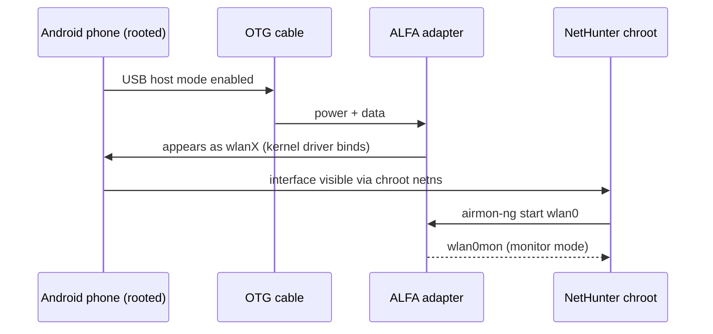

# ALFA 网卡适配器在 NetHunter（Android）上——OTG 设置指南

> **学习目标（Learning goal）**：学完本指南，你的 ALFA 网卡适配器将连接到运行 **Kali NetHunter** 的 Android 手机，在 NetHunter chroot 内可见，并准备好使用监听模式工具——全部由一根 USB **OTG** 线缆供电。
> **适用对象**：中级（需要 root 知识）｜ **前置需求**：已 root 的 Android 手机、已安装 NetHunter、OTG 线缆、一款**内核内置芯片组**的 ALFA 网卡适配器（见下文）。

## 概念：为什么 Android 是最苛刻的环境

NetHunter 是运行在 Android 设备 **chroot** 中的 Kali Linux。真正干活的是手机的内核——而手机内核*不是* Ubuntu 内核：

1. **内核内置驱动**：受主线 Linux 支持的芯片组（MT7612U、MT7610U、MT7921AUN）通常能用，因为 NetHunter 的内核镜像包含主线 `mt76` 驱动家族。
2. **DKMS 驱动**：在 Android chroot 内编译 Realtek DKMS 驱动很痛苦——手机内核很少提供构建所需的头文件和工具链。RTL8812AU 在部分设备上*可以*工作，但请把它当作一个项目，而不是一个设置步骤。

**经验法则**：对于 NetHunter，优先选择 **AWUS036ACM（MT7612U）**。它是社区默认的 NetHunter 网卡适配器，这是有原因的。



## 前置需求

- [ ] 已 root 且安装了 **Kali NetHunter** 的 Android 手机（官方 NetHunter 镜像，或已 root 设备上的 **NetHunter Store** 应用）
- [ ] OTG 线缆（USB-C 或 micro-USB，取决于你的手机）——高功率网卡适配器最好带外接供电
- [ ] 内核内置芯片组的 ALFA 网卡适配器：**AWUS036ACM / AWUS036ACHM / AWUS036AXM / AWUS036AXML**
- [ ] 内核足够新以支持你的芯片组的手机（MT7921AUN 型号需要内核 5.18+）

## 第 1 步：检查你的内核

某些芯片组需要较新的内核。在 NetHunter 应用中打开终端（或 adb shell）并运行：

```bash
uname -r
```

**预期输出**：类似 `4.19.157-perf+`（较旧手机）或 `5.15.xx-gki`（较新）。对于 MT7921AUN 网卡适配器，你需要 **5.18 或更新**；MT7612U 在 4.19 上就能正常工作。

> **你可能想知道**——*「我需要特定的 NetHunter 内核吗？」* 是的——NetHunter 团队为一份特定的受支持设备列表构建内核。先查看[官方设备列表](https://www.kali.org/docs/nethunter/)：不受支持的手机意味着没有支持监听模式的内核，无论你怎么做，网卡适配器都永远无法离开 managed 模式。

## 第 2 步：通过 OTG 连接

把 OTG 线缆插入手机，再把网卡适配器插入 OTG 线缆。大多数手机会出现通知（「USB 设备已连接」）。然后确认内核看到了网卡适配器：

```bash
lsusb
```

**预期输出**（MediaTek 型号）：

```text
Bus 001 Device 002: ID 0e8d:7612 MediaTek Inc. MT7612U 802.11a/b/g/n/ac 2T2R Wireless Adapter
```

如果 `lsusb` 什么都没有，说明 OTG 线缆没有供电，或手机没有处于 USB host 模式——尝试带供电的 OTG 集线器（对耗电更大的 AWUS036AXM/AXML 很重要）。

## 第 3 步：在 NetHunter 内验证接口

启动 **NetHunter** 应用 → 打开 **Kali Chroot** → *Kali 终端*：

```bash
iw dev
```

**预期输出**：

```text
phy#0
	Interface wlan0
		ifindex 3
		type managed
```

接口在 chroot 内可见——大多数 OTG 设置都在这一步失败，所以如果你在这里看到 `wlan0`，你已经完成了 90%。

## 第 4 步：监听模式

在 Kali 终端内（你需要 root——NetHunter 默认以 root 运行）：

```bash
airmon-ng check kill
airmon-ng start wlan0
iwconfig
```

**预期输出**：出现 `wlan0mon`，显示 `Mode:Monitor`。

## 第 5 步：验证注入（可选但推荐）

```bash
aireplay-ng --test wlan0mon
```

**预期输出**：`30/30: 100%` 和 `Injection is working!`

## Realtek 芯片组怎么办？

**RTL8812AU（AWUS036ACH）**值得一段诚实的说明：在那些内核包含预构建 `8812au` 模块的 NetHunter 设备上（某些社区内核有），它*可以*工作，但**不要把你的课程项目押在它上面**。在 Android chroot 内编译 DKMS 在大多数手机上都会失败，因为手机内核头文件缺失。如果你唯一的网卡适配器是 Realtek，先在笔记本上测试——[Kali 指南](/alfa-network/linux-setup-kali/)在那里有效——把手机当作额外奖励。

## 常见错误（FAQ）

| 错误 / 症状 | 原因 | 修复 |
|---|---|---|
| `lsusb` 什么都没有 | OTG 未处于 host 模式 / 供电问题 | 使用带供电的 OTG 集线器；换一根 OTG 线缆；检查手机的「USB」通知 |
| chroot 内 `iw dev` 为空 | 接口尚未创建 / 网络命名空间错误 | 重新插拔网卡适配器；先检查 `lsusb`；重启手机重试 |
| `airmon-ng` 提示 `command not found` | NetHunter chroot 不完整 | 通过 NetHunter 应用重装 chroot；`apt update && apt install aircrack-ng` |
| 网卡适配器被检测到但卡在 `managed` | 手机内核缺少该芯片组的监听支持 | 查看 [NetHunter 受支持设备](https://www.kali.org/docs/nethunter/)列表；改用内核内置芯片组网卡适配器 |
| MT7921AUN 网卡适配器完全检测不到 | 手机内核低于 5.18 | 使用更新的 NetHunter 内核镜像，或使用 GKI 5.18+ 内核的手机 |
| 高负载下 WLAN 失效 | 手机 USB 供电限制 | 带供电的 OTG 集线器；为 NetHunter 关闭手机电池优化 |

## 参考

- [Kali Linux 桌面指南](/alfa-network/linux-setup-kali/)——完整的监听 + 注入工作流
- [Ubuntu 指南](/alfa-network/linux-setup-ubuntu/)——客户端模式设置
- [兼容性矩阵](/alfa-network/linux-compatibility-matrix/)——芯片组 vs 操作系统表
- [Kali NetHunter 文档](https://www.kali.org/docs/nethunter/)——官方安装与设备支持