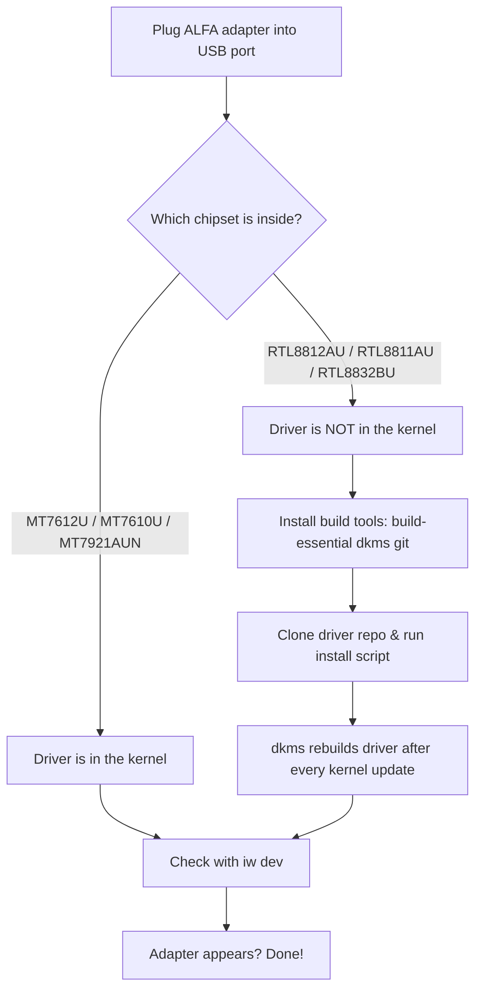

# ALFA 网卡适配器在 Ubuntu 上——完整设置指南

> **学习目标（Learning goal）**：学完本指南，你的 ALFA 网卡适配器将在 Ubuntu 中可见（`iw dev`）、能连接 Wi-Fi，并且——对于受支持的芯片组——能够切换进监听模式。
> **适用对象**：初学者–中级 ｜ **前置需求**：Ubuntu 20.04+（Wi-Fi 6E 型号需要 22.04+）、网络连接（安装软件包需要！），以及你的 ALFA 网卡适配器。

## 概念：两类驱动程序

在碰终端之前，先理解*为什么*不同网卡适配器的设置不同。存在两个世界：

1. **内核内置芯片组（MediaTek）**——驱动程序已经编译进 Ubuntu。插上 → 就能用。这涵盖 **MT7612U**（AWUS036ACM）、**MT7610U**（AWUS036ACHM）和 **MT7921AUN**（AWUS036AXM / AWUS036AXML，需要 Ubuntu 22.04+ / 内核 5.18+）。
2. **DKMS 芯片组（Realtek）**——驱动程序不在内核中，所以你需要编译一次，之后 **DKMS** 会在每次内核更新后保持重建。这涵盖 **RTL8812AU**（AWUS036ACH）、**RTL8811AU**（AWUS036ACS）和 **RTL8832BU**（AWUS036AX / AWUS036AXER）。



## 前置需求

- [ ] Ubuntu 20.04 或更新（用 `lsb_release -a` 检查）
- [ ] 可用的网络（Wi-Fi 或以太网）以下载软件包
- [ ] 你的 ALFA 网卡适配器和一根 USB-A 或 USB-C 线缆（AXML 使用 USB-C）
- [ ] `sudo` 权限

## 第 1 步：识别你的芯片组

插上网卡适配器，然后询问 Ubuntu 它看到了什么：

```bash
lsusb
```

**预期输出**（查找 MediaTek / Realtek 条目）：

```text
Bus 001 Device 004: ID 0e8d:7612 MediaTek Inc. MT7612U 802.11a/b/g/n/ac 2T2R Wireless Adapter
Bus 001 Device 005: ID 0bda:8812 Realtek Semiconductor Corp. RTL8812AU 802.11a/b/g/n/ac 2T2R Wireless Adapter
```

- `0e8d` = MediaTek（内核内置路径）
- `0bda` = Realtek（DKMS 路径）
- 不确定？对照[兼容性矩阵](/alfa-network/linux-compatibility-matrix/)中的芯片组表。

## 第 2 步：内核内置路径（MediaTek——即插即用）

如果你的网卡适配器使用 MediaTek 芯片组，无需安装任何东西。验证：

```bash
iw dev
```

**预期输出**：

```text
phy#0
	Interface wlan0
		ifindex 3
		addr 00:c0:ca:xx:xx:xx
		type managed
```

看到 `wlan0` 了？恭喜——驱动程序已生效。通过桌面 Wi-Fi 菜单或 NetworkManager 连接：

```bash
nmcli device wifi connect "MySSID" password "my-passphrase"
```

**预期输出**：`Device 'wlan0' successfully activated with 'MySSID'.`

跳到[第 4 步：验证一切](#step-4-verify-everything)。

## 第 3 步：DKMS 路径（Realtek——一次性构建）

对于 RTL8812AU（AWUS036ACH）、RTL8811AU（AWUS036ACS）和 RTL8832BU（AWUS036AX / AXER），构建一次驱动程序。三者遵循相同模式——安装工具、克隆仓库、运行安装程序。

### 3.1 安装构建工具

```bash
sudo apt update
sudo apt install -y build-essential dkms git
```

**预期输出**：以 `Setting up dkms ...` 结尾且无错误。DKMS 就是那个会在内核更新后重新编译驱动的组件。

### 3.2 RTL8812AU（AWUS036ACH）

久经考验的仓库由 aircrack-ng 项目维护：

```bash
cd /opt
sudo git clone https://github.com/aircrack-ng/rtl8812au.git
cd rtl8812au
sudo make dkms_install
```

**预期输出**：

```text
DKMS: install completed.
```

模块现在是 `8812au`，DKMS 会在每次内核更新时重建它——你可以忘记它的存在。

### 3.3 RTL8811AU（AWUS036ACS）

```bash
cd /opt
sudo git clone https://github.com/aircrack-ng/rtl8811au.git
cd rtl8811au
sudo make dkms_install
```

**预期输出**：`DKMS: install completed.`——模块名 `8811au`。

### 3.4 RTL8832BU（AWUS036AX / AWUS036AXER）

```bash
cd /opt
sudo git clone https://github.com/aircrack-ng/rtl88x2bu.git
cd rtl88x2bu
sudo make dkms_install
```

**预期输出**：`DKMS: install completed.`——模块名 `88x2bu`。

### 3.5 重新插拔并检查

拔下再插上网卡适配器（或运行 `sudo modprobe <module>`），然后验证：

```bash
iw dev
```

**预期输出**：出现 `Interface wlan1`（如果它是你唯一的网卡适配器则为 `wlan0`）条目。

> **你可能想知道**——*「哪个模块名对应我的网卡适配器？」* 匹配你的芯片组：`8812au` → AWUS036ACH，`8811au` → AWUS036ACS，`88x2bu` → AWUS036AX / AXER。[驱动页面](/alfa-network/drivers/rtl8812au/)有更深入的芯片组细节。

## 第 4 步：验证一切

三项命令的健康检查：

```bash
ip link show | grep -E "^[0-9]+: wl"        # interface exists?
iw dev                                       # interface + phy info
iw reg get | head -20                        # regulatory domain (affects power/channels)
```

**预期输出**：

```text
3: wlan1: <BROADCAST,MULTICAST,UP,LOWER_UP> mtu 1500 qdisc mq state UP
phy#1
	Interface wlan1
		ifindex 3
		addr 00:c0:ca:xx:xx:xx
		type managed
```

三条命令都有输出 = 你的 ALFA 网卡适配器完全正常。

## 进阶：监听模式（受支持芯片组）

监听模式让网卡适配器捕获信道上的每一个数据包，而不仅仅是自己的连接。在内核内置芯片组上，这是两条命令的事：

```bash
sudo ip link set wlan1 down
sudo iw wlan1 set monitor none
sudo ip link set wlan1 up
iw dev
```

**预期输出**：`type monitor` 而不是 `type managed`。

> ⚠️ **重要**：`type managed`（默认）意味着驱动程序会过滤掉所有不是发给你的数据。`type monitor` 会关闭该过滤器——突然会有大量流量变得可见。只在你拥有或已获明确授权测试的网络上运行。完整的 packet injection（数据包注入）工作流见 [Kali 指南](/alfa-network/linux-setup-kali/)。

## 常见错误（FAQ）

| 错误 / 症状 | 原因 | 修复 |
|---|---|---|
| `lsusb` 显示网卡适配器但没有 `wlanX` 接口 | DKMS 模块未加载（Realtek） | `sudo modprobe 8812au`（匹配你的芯片组），然后检查 `dmesg \| tail` |
| `make dkms_install` 失败并提示 "Kernel preparation unnecessary" | 缺少内核头文件 | `sudo apt install linux-headers-$(uname -r)` 然后重试 |
| `apt upgrade` 后网卡适配器消失 | 内核更新，DKMS 重建静默失败 | `sudo dkms autoinstall` 然后重启 |
| 重启后 `iw dev` 什么都没有（Realtek） | 模块不在自动加载列表中 | `echo 8812au \| sudo tee /etc/modules-load.d/alfa.conf` |
| Wi-Fi 6E 网卡适配器（AXML）在 20.04 上检测不到 | 内核太旧，不支持 `mt7921u` | 升级到 Ubuntu 22.04+（内核 5.18+） |

## 参考

- [本指南的 Kali Linux 版本](/alfa-network/linux-setup-kali/)——监听模式 + 数据包注入
- [芯片组驱动页面](/alfa-network/drivers/mt7612u/)——各芯片组深度解析
- [故障排查索引](/alfa-network/troubleshooting/)——其他任何出错的情况
- [兼容性矩阵](/alfa-network/linux-compatibility-matrix/)——完整操作系统覆盖表
- aircrack-ng 驱动仓库：[rtl8812au](https://github.com/aircrack-ng/rtl8812au)、[rtl8811au](https://github.com/aircrack-ng/rtl8811au)、[rtl88x2bu](https://github.com/aircrack-ng/rtl88x2bu)