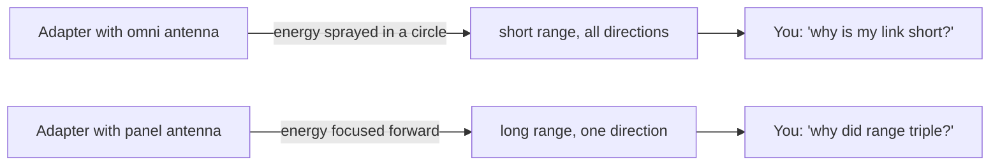
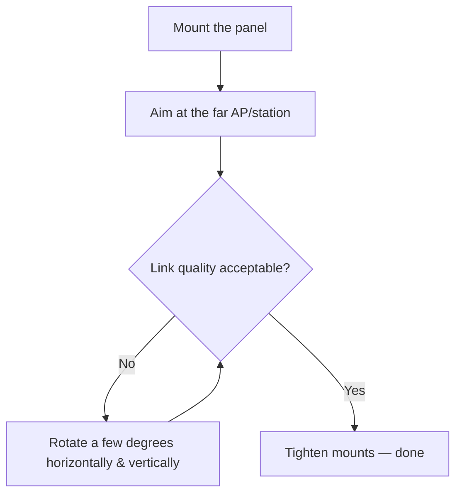

# ALFA APA-M04——2.4 GHz 面板定向天线

> **一句话定位（One-liner）**：**APA-M04** 是一款**面向 2.4 GHz 频段的扁平 7 dBi 定向面板天线**，以 **PR-SMA** 接口收尾。它把无线电的能量聚焦到一个方向——想想「激光笔」而不是「灯泡」——用于点对点链路、中继跳和远距离客户端连接。

## 规格总览（Spec overview）

| 项目 | 规格 |
|---|---|
| 类型 | 定向面板天线 |
| 频段 | 2.4 GHz（802.11b/g/n） |
| 增益 | 7 dBi |
| 接口 | PR-SMA（母头） |
| 极化 | 线性，垂直 |
| 波束宽度 | 窄（定向——见概念部分） |
| 安装 | 壁挂 / 桅杆安装，面板外形 |
| 兼容性 | 所有带 RP-SMA 天线的 ALFA 网卡适配器（通过 PR-SMA/RP-SMA 配对） |

## 总览

面板天线是固定户外 Wi-Fi 链路的主力。APA-M04 小巧、扁平、耐候，它的 **7 dBi 增益货真价实**：足以有意义地延长 2.4 GHz 链路，又不会把天线变成需要三脚架的碟形天线。

它的闪光点：

- 两栋楼之间的**点对点链路**（另一端配一块匹配的面板）。
- 把实验室接入点的覆盖**聚焦**到一条走廊或一个庭院。
- **仅 2.4 GHz 的设备**——IoT 节点、较旧的接入点、仅 2.4 GHz 的网卡适配器，比如复古中继设置。

它的短板：不要指望它修复 5 GHz 网卡适配器的覆盖——它只支持 2.4 GHz，要 5 GHz 请选 [APA-M25](/alfa-network/products/apa-m25/) 或三频 [APA-M25-6E](/alfa-network/products/apa-m25-6e/)。

## 天线 30 秒速成



**全向**天线绕其轴均匀辐射（一个甜甜圈）。**面板**天线把这个甜甜圈压成一个锥体——总能量相同，但更集中。dBi 越高 = 锥体越窄 = 覆盖越远，代价是需要精确瞄准。APA-M04 的 7 dBi 是短固定链路的甜点，此时你仍希望保留一些瞄准宽容度。

## 安装与连接

### 第 1 步：检查你的接口

APA-M04 是 **PR-SMA（母头）**。网卡适配器的天线是 **RP-SMA（公头）**。PR-SMA 和 RP-SMA 设计上就是配对的——内针极性匹配。如果你有一根接口不同的通用 WiFi 天线（例如 N 型），需要一根转接引线——不要硬来；接口不匹配会损坏针脚。

### 第 2 步：拧上

- 拆下网卡适配器的原厂天线。
- 把 APA-M04 的接口手指拧紧，然后**轻轻转四分之一圈**——贴合即可，绝不要用力拧。过紧会损坏脆弱的中心针。

### 第 3 步：指向它



### 第 4 步：验证

```bash
iw dev wlan0 link
```

**预期输出**：`signal: -55 dBm`（或更好）——瞄准循环是：调整 → 重新检查 `signal` → 重复直到数值不再改善。每 6 dB 信号就是覆盖翻倍，所以小幅角度变化很重要。

## 进阶用法

- **垂直 vs 水平极化**：保持面板的长轴与远端的天线朝向一致。90° 错位可能损失 20+ dB——比天线的增益还多。
- **两块面板，一条链路**：配对两块 APA-M04（每端一块），组成经典的固定 2.4 GHz 点对点链路。
- **安装高度**：每高一米就能清除更多菲涅尔区遮挡。让面板高于屋顶线，而不只是高于桌面。

## 兼容性

| 搭配 | 结果 |
|---|---|
| 所有 ALFA USB 网卡适配器（RP-SMA 天线端口） | ✅ 直接拧上 |
| 仅 2.4 GHz 的网卡适配器 / 接入点 | ✅ 理想 |
| 仅 5 GHz 的链路 | ❌ 频段错误——使用 [APA-M25](/alfa-network/products/apa-m25/) |
| 集成天线的网卡适配器（AXER、EACS） | ❌ 没有可连接的 RP-SMA 端口 |

## 故障排查

| 症状 | 诊断 | 修复 |
|---|---|---|
| 覆盖比原厂天线还差 | 接口未完全插到位，或面板指向错误 | 重新插好接口；用 `iw dev wlan0 link` 信号读数重新瞄准 |
| 信号好，速度差 | 2.4 GHz 拥塞，不是天线问题 | 换到干净信道（`sudo iw dev wlan0 set channel 1/6/11`） |
| 换天线后什么都没有 | 网卡适配器的 RP-SMA 针因过紧损坏 | 检查中心针；用原厂天线做对照测试 |
| 中午正常，晚上死 | 菲涅尔区 / 天气路径 | 抬高安装；接受长链路上的大气波动 |

## 相关资源

- [APA-M25](/alfa-network/products/apa-m25/)——双频 2.4/5 GHz 面板，同样的思路 + 5 GHz
- [APA-M25-6E](/alfa-network/products/apa-m25-6e/)——含 6 GHz（Wi-Fi 6E）的三频面板
- [网卡适配器对比](/alfa-network/wifi-adapter-comparison/)——为这根天线挑选无线电
- [Ubuntu 设置指南](/alfa-network/linux-setup-ubuntu/)——先让网卡适配器跑起来