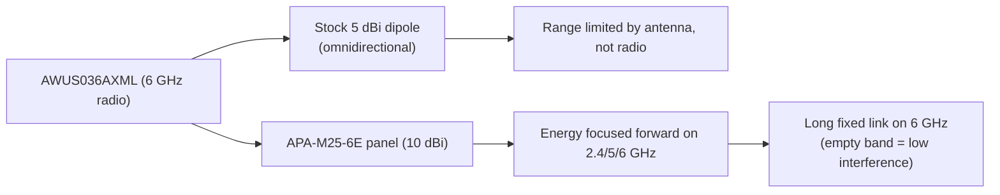

# ALFA APA-M25-6E——三频面板天线（支持 Wi-Fi 6E）

> **一句话定位（One-liner）**：**APA-M25-6E** 是一款覆盖 **2.4、5 和 6 GHz** 的 **10 dBi 定向面板天线**——经典 APA-M25 的 Wi-Fi 6E 版本。如果你的网卡适配器有 6 GHz 无线电（[AWUS036AXML](/alfa-network/products/awus036axml/)），这块天线就是让它真正跨校园覆盖的东西。

## 规格总览（Spec overview）

| 项目 | 规格 |
|---|---|
| 类型 | 定向面板天线 |
| 频段 | 2.4 GHz / 5 GHz / **6 GHz（Wi-Fi 6E）** |
| 增益 | 10 dBi |
| 接口 | PR-SMA（母头）——与网卡适配器的 RP-SMA 配对 |
| 极化 | 线性，垂直 |
| 设计 | 紧凑面板，壁挂/桅杆安装 |
| 用途 | 固定点对点链路、6 GHz 回程、远距离客户端链路 |

## 总览

APA-M25 曾是标准的双频面板。**6E** 变体增加了 **6 GHz 频段**——相同的 10 dBi 面板设计，重新调谐，让频谱顶端不再是事后才想到的。为什么这很重要？6 GHz 频段（5 GHz 以上的信道 1–233）是今天 Wi-Fi 链路能用的拥塞最少的频谱，但前提是你的*天线*真的能通过它。旧的「双频」面板在 5.8 GHz 以上急剧衰减；6E 版本就是为它而造。

它的闪光点：

- 楼宇间的**固定 6 GHz 回程链路**（Wi-Fi 6E 接入点正在进入每个校园网络）。
- AWUS036AXML 的**远距离客户端链路**——它的两根原厂 5 dBi 偶极子在 500 m 链路上会成为瓶颈；面板消除了它。
- **面向未来**：无论你的项目最终落在 2.4、5 还是 6 GHz，一块面板始终有用。

## 三频面板如何工作



增益的工作原理与 [APA-M04](/alfa-network/products/apa-m04/) 完全相同：面板用 360° 覆盖换取聚焦锥体。10 dBi 在它朝向的方向上大约是 5 dBi 偶极子的 3 倍线性覆盖提升——随之而来的是瞄准纪律。

## 安装与连接

### 第 1 步：接口检查

APA-M25-6E 是 **PR-SMA 母头**，匹配 ALFA 网卡适配器上的 **RP-SMA 公头**天线端口。把它与任何带外置天线的 ALFA 网卡适配器配对——[AWUS036AXML](/alfa-network/products/awus036axml/) 是 6 GHz 工作的天然搭档。

### 第 2 步：安装并瞄准

1. 把面板装高——高于屋顶线能为长链路清除菲涅尔区。
2. 用面板替换网卡适配器的原厂天线。
3. 用网卡适配器自己的信号读数来瞄准（见下文）。

### 第 3 步：在每个频段上验证

检查瞄准前后链路报告的内容：

```bash
iw dev wlan0 link
iw dev wlan0 info | grep channel
```

**预期输出**：

```text
signal: -48 dBm
channel 37 (6115 MHz)
```

`6115 MHz` 这一行证明你在 **6 GHz 频段**上——这正是这块天线的意义所在。瞄准面板直到 `signal` 不再改善。

## 进阶用法

- **6 GHz 链路配对**：要完整的 6 GHz 点对点链路，两端都需要支持 6 GHz 的设备（接入点 + 客户端）。面板是客户端侧的那块。
- **极化纪律**：保持两端的极化同为垂直（或同为水平）。90° 错位浪费的增益比天线提供的还多。
- **实验**：把面板与监听模式结合，把捕获场聚焦到一个方向——非常适合无线通信课程作业。

## 兼容性

| 搭配 | 结果 |
|---|---|
| AWUS036AXML（6 GHz 无线电，RP-SMA） | ✅ 完美匹配——解锁 6 GHz 覆盖 |
| 任何带 RP-SMA 天线端口的 ALFA 网卡适配器 | ✅ 可用（2.4/5 GHz） |
| 仅 6 GHz 的设备（Wi-Fi 6E 接入点） | ✅ 为它而设计 |
| 集成天线的网卡适配器（AXER、EACS） | ❌ 没有可连接的接口 |

## 故障排查

| 症状 | 诊断 | 修复 |
|---|---|---|
| `iwlist wlan0 freq` 中没有 6 GHz 信道 | 法规域或驱动/频段不匹配——不是天线问题 | `sudo iw reg set <CC>`；确认网卡适配器是 AXML |
| 链路信号好但慢 | 面板瞄准了错误的波瓣 / 极化不匹配 | 重新瞄准；把面板翻转 90° 比较信号 |
| 信号比原厂偶极子差 | 面板指向偏了 180° | 观察 `signal` 的同时缓慢扫过 360° |
| 接口感觉松 | 与第三方设备 PR-SMA/RP-SMA 不匹配 | 只把 PR-SMA 与 RP-SMA 配对；否则使用合适的转接引线 |

## 相关资源

- [APA-M25](/alfa-network/products/apa-m25/)——这块面板的双频（2.4/5 GHz）版本
- [APA-M04](/alfa-network/products/apa-m04/)——仅 2.4 GHz 的 7 dBi 面板
- [AWUS036AXML 产品页面](/alfa-network/products/awus036axml/)——这块天线为之而造的网卡适配器
- [mt7921aun 驱动页面](/alfa-network/drivers/mt7921aun/)——6 GHz 驱动细节