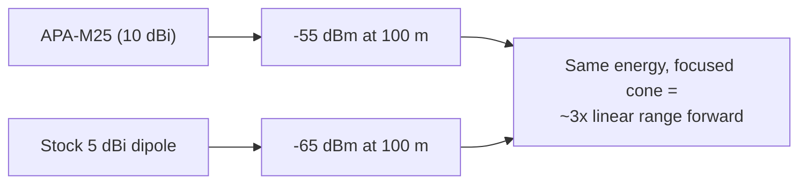

# ALFA APA-M25——双频面板天线（2.4/5 GHz）

> **一句话定位（One-liner）**：**APA-M25** 是 ALFA 经典的 **10 dBi 双频定向面板**，用于 **2.4 和 5 GHz**，以 **RP-SMA** 收尾。它是任何带外置天线的 ALFA 网卡适配器的「指向接入点就赢」升级——校园中继项目就是建在这块面板上的。

## 规格总览（Spec overview）

| 项目 | 规格 |
|---|---|
| 类型 | 定向面板天线 |
| 频段 | 2.4 GHz + 5 GHz |
| 增益 | 10 dBi |
| 接口 | **RP-SMA（公头）**——注意与 PR-SMA 面板的区别 |
| 极化 | 线性，垂直 |
| 设计 | 紧凑扁平面板，壁挂/桅杆安装 |
| 用途 | 固定点对点链路、远距离客户端链路、覆盖聚焦 |

## 总览

APA-M25 是大多数人想到「ALFA 定向天线」时浮现的面板：一块扁平、耐候的矩形，把任何带外置天线的 ALFA 网卡适配器变成远距离链路工具。它在 **2.4 和 5 GHz 上都是 10 dBi**，这是肉眼可瞄准面板的实际上限——再往上，天线会变得又大、波束又窄、又难伺候。

先注意两件事：

1. **RP-SMA（公头）接口**——它直接插入网卡适配器的 **RP-SMA（母头）**天线端口，无需任何转接头，因为针极性匹配适配器侧的插座。（[APA-M25-6E](/alfa-network/products/apa-m25-6e/)和 [APA-M04](/alfa-network/products/apa-m04/) 使用 PR-SMA，它*同样*能与 RP-SMA 端口正确配对——两个家族都设计为与 ALFA 网卡适配器端口配合。）
2. **没有 6 GHz**——这是 2.4/5 GHz 面板。要 Wi-Fi 6E，请买 6E 变体。

它的闪光点：学生项目、楼宇间链路、实验室覆盖整形——任何需要聚焦覆盖又不需要桅杆的地方。

## 如何看待 10 dBi



天线增益每增加约 6 dB，有效覆盖就翻倍。比原厂偶极子高 5 dB，在面板朝向的方向上大约买到 **1.7–1.8 倍覆盖倍数**——这就是「困在实验室」和「链路跨过庭院」之间的差别。

## 安装与连接

### 第 1 步：拧上

1. 拧下网卡适配器的原厂天线。
2. 把 APA-M25 拧进网卡适配器的 RP-SMA 端口——手指拧紧再加轻轻四分之一圈。
3. 绝不要用力拧：适配器里的中心针很脆弱，而且面板比偶极子重，所以**用扎带做应力释放支撑线缆**。

### 第 2 步：装高

高度就是增益：让面板高于女儿墙、屋顶线和人群。每米净空都能清除 10 dBi 无法补偿的菲涅尔区遮挡。

### 第 3 步：瞄准并验证

```bash
iw dev wlan0 link
```

**预期输出**：一个以 dBm 为单位的 `signal:` 值。每次把面板水平、垂直摆动几度；保留最佳读数。重复直到数值趋于平稳。

## 进阶用法

- **双面板链路**：每端一块 APA-M25 = 一条双向都有相同增益的固定点对点链路。
- **2.4 GHz 上的信道选择**：面板聚焦能量但不聚焦干扰——在 2.4 GHz 上，先选干净信道（`1/6/11`），再瞄准。
- **监听模式瞄准**：用 `airmon-ng start` + `tcpdump -i wlan0mon -c 50` 作为瞄准工具：听到最多信标的面板就是指向正确的。

## 兼容性

| 搭配 | 结果 |
|---|---|
| 任何带 RP-SMA 天线端口的 ALFA 网卡适配器（ACM、ACH、ACS、AX、AXM、AXML...） | ✅ 直接拧上 |
| 5 GHz 链路 | ✅ 完整 5 GHz 支持 |
| 6 GHz（Wi-Fi 6E）链路 | ❌ 使用 [APA-M25-6E](/alfa-network/products/apa-m25-6e/) |
| 集成天线网卡适配器（AXER、EACS） | ❌ 没有可连接的端口 |

## 故障排查

| 症状 | 诊断 | 修复 |
|---|---|---|
| 信号比原厂天线差 | 面板瞄准错误或接口松动 | 重新插好；用 `iw dev wlan0 link` 扫掠瞄准 |
| 信号好但链路时断时续 | 面板重量造成的线缆/接口应力 | 支撑线缆；检查接口是否贴合 |
| 只能看到 2.4 GHz 网络 | 网卡适配器/法规域问题，不是天线 | `sudo iw reg set <CC>`；用原厂天线测试以隔离 |
| 面板「能用」但没有 5 GHz 覆盖 | 链路对端（接入点）5 GHz 可能功率低 | 检查接入点侧；5 GHz 同样需要干净的菲涅尔区 |

## 相关资源

- [APA-M25-6E](/alfa-network/products/apa-m25-6e/)——支持 Wi-Fi 6E 的版本
- [APA-M04](/alfa-network/products/apa-m04/)——仅 2.4 GHz 的 7 dBi 面板
- [ARS-25-57A](/alfa-network/products/ars-25-57a/)——紧凑桨式替代款
- [网卡适配器对比](/alfa-network/wifi-adapter-comparison/)——搭配正确的无线电
- [故障排查索引](/alfa-network/troubleshooting/)