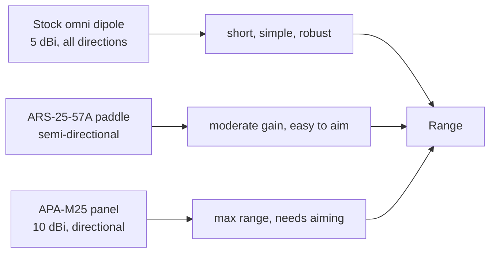

# ALFA ARS-25-57A——双频桨式天线（5/7 dBi）

> **一句话定位（One-liner）**：**ARS-25-57A** 是一款紧凑、半定向的**桨式**天线，用于 **2.4 和 5 GHz**——**2.4 GHz 上 5 dBi，5 GHz 上 7 dBi**。它是原厂偶极子与全尺寸面板天线之间适合旅行的中间选择：比棒状天线增益更高，比壁挂面板更不占地方。

## 规格总览（Spec overview）

| 项目 | 规格 |
|---|---|
| 类型 | 定向桨式天线 |
| 频段 | 2.4 GHz + 5 GHz |
| 增益 | 2.4 GHz：5 dBi ｜ 5 GHz：7 dBi |
| 接口 | RP-SMA（公头） |
| 极化 | 线性 |
| 设计 | 扁平桨叶、铰接、轻量 |
| 用途 | 便携装备、旅行、需要多一点覆盖范围的实验室 |

## 总览

「桨式」介于全向偶极子和扁平面板之间：它是一块带轻度方向性和真实增益的小扁叶——**2.4 GHz 上 5 dBi，5 GHz 上有用的 7 dBi**。这种随频段变化的增益很合理：5 GHz 比 2.4 GHz 更需要帮助，而 5 GHz 频段上的 7 dBi 正是 ARS-25-57A 的价值所在。

它的闪光点：

- **便携/渗透测试套件**——平折收纳、扛得住背包、拧到任何 RP-SMA ALFA 网卡适配器上。
- **笔记本实验站**——相同重量下比原厂偶极子覆盖更远。
- **半定向瞄准**——指向目标接入点获得一点聚焦，而不需要面板天线那种严格的瞄准纪律。

它的短板：对于*固定*的楼宇间链路，[APA-M25](/alfa-network/products/apa-m25/)（10 dBi 面板）胜过它；追求极致旅行极简，就用原厂天线。

## 概念：为什么是桨式，为什么 5/7 dBi



桨式天线是这条链中的折中节点：它给出真实的增益数字（原厂偶极子的「5 dBi」全向数字在实践中可以说名不副实），同时瞄准起来很宽容。5/7 dBi 的分配意味着最吃力的频段——5 GHz——获得更大的份额。

## 安装与连接

### 第 1 步：安装

把 ARS-25-57A 的 RP-SMA 接口拧到任何 ALFA 网卡适配器的 RP-SMA 天线端口上。手指拧紧 + 轻轻再转八分之一到四分之一圈即可。

### 第 2 步：部署

翻开桨叶，让它的平面朝向你要连接的接入点/站点。一边观察网卡适配器的信号读数，一边倾斜和旋转。

### 第 3 步：验证

```bash
iw dev wlan0 link
```

**预期输出**：一个以 dBm 为单位的 `signal:`。每次把桨叶摆动几度；保留负值最小的朝向。如果你的链路使用 5 GHz 频段，在 5 GHz 上重复。

## 进阶用法

- **监听模式瞄准**：启动 `tcpdump -i wlan0mon`，重新调整桨叶方向，直到来自目标方向的信标计数最高。
- **双天线网卡适配器**：在 AWUS036ACM/ACH 上，你可以装一根桨式天线 + 一根留在 5 GHz——但对于多频段链路，两根天线应瞄准同一频段以获得连贯的 MIMO。
- **便携野外套件**：运输时把桨叶平折；如果野外弄断接口，RP-SMA 是可更换的。

## 兼容性

| 搭配 | 结果 |
|---|---|
| 任何带 RP-SMA 天线端口的 ALFA 网卡适配器 | ✅ 直接拧上 |
| 2.4 和 5 GHz 链路 | ✅ 两个频段，分别为 5/7 dBi |
| 旅行 / 背包装备 | ✅ 尺寸和重量理想 |
| 固定长距离链路（>200 m） | ⚠️ 考虑 [APA-M25](/alfa-network/products/apa-m25/) 面板 |

## 故障排查

| 症状 | 诊断 | 修复 |
|---|---|---|
| 相比原厂天线没有增益 | 桨叶朝向错误 / 未完全插到位 | 重新对准接入点；重新插好接口 |
| 2.4 GHz 正常，5 GHz 弱 | 5 GHz 需要更精确的瞄准 | 精确倾斜；7 dBi 的 5 GHz 波瓣较窄 |
| 接口晃动 | RP-SMA 松动 | 轻轻拧紧；不要过紧 |
| 自己折回去 | 铰链摩擦磨损 | 轻微问题——靠网卡适配器自身重量保持朝向是正常的 |

## 相关资源

- [APA-M25](/alfa-network/products/apa-m25/)——固定链路的全尺寸面板
- [APA-M04](/alfa-network/products/apa-m04/)——仅 2.4 GHz 面板
- [ARS-NT5B7](/alfa-network/products/ars-nt5b7/)——工业 WiFi 7 三频偶极子
- [网卡适配器对比](/alfa-network/wifi-adapter-comparison/)
- [故障排查索引](/alfa-network/troubleshooting/)