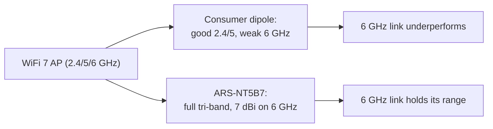

# ALFA ARS-NT5B7——WiFi 7 三频工业偶极子天线

> **一句话定位（One-liner）**：**ARS-NT5B7** 是**支持 WiFi 7 的三频偶极子**，覆盖 **2.4、5 和 6 GHz**，最高 **7 dBi**，为**工业 -40 至 +85 °C** 范围而设计。当原厂塑料偶极子扛不住工作环境时，它就是你要拧到嵌入式网关或机器人上的天线。

## 规格总览（Spec overview）

| 项目 | 规格 |
|---|---|
| 类型 | 偶极子天线（近似全向） |
| 频段 | 2.4 / 5 / **6 GHz（Wi-Fi 6E/7）** |
| 增益 | 最高 7 dBi（6 GHz 上最佳） |
| 工作温度 | **-40 °C 至 +85 °C**（工业级） |
| 接口 | 行业标准（IPEX / RP-SMA / N，视变体而定——请核对你的 SKU） |
| 设计 | 加固型偶极子，耐候材料 |
| 用途 | 嵌入式网关、工业 IoT、机器人、户外无线电、WiFi 7 |

## 总览

大多数 ALFA 天线是消费级。ARS-NT5B7 是为**严苛环境**打造的例外：它是一款触达 **6 GHz** 频段（所以 WiFi 6E 和即将到来的 **WiFi 7** 设备都能用）的三频偶极子，额定在 **-40 °C** 冷库到 **+85 °C** 机柜中持续工作。如果你的项目涉及机器人、户外网关，或任何生活在温控实验室之外的东西，这就是要选配的天线。

**6 GHz 上的 7 dBi** 是头条数字：如果天线在高频段很弱，6 GHz 频段会抵消它的覆盖优势——而这款偶极子在高频段并不弱。

它的闪光点：

- **嵌入式与工业**——消费级偶极子缺乏的热耐受性。
- **WiFi 7 / 6E 网关**——三频覆盖，不只是 2.4/5。
- **机器人**——偶极子能承受野外机器人抛给它的振动和温度波动。

它的短板：它仍然是偶极子（近似全向），不是定向面板。要聚焦的长距离链路，请记住[面板天线](/alfa-network/products/apa-m25-6e/)。

## 概念：三频与 WiFi 7 问题



WiFi 7（802.11be）通过 MLO（多链路操作）同时在三个频段上运行。一个「WiFi 7」系统的好坏取决于它最弱的一环——如果天线在 6 GHz 上垮掉，整个多链路设置都会降级。ARS-NT5B7 的设计让最新的频段成为*最强*的频段。

## 安装与连接

### 第 1 步：匹配接口

ARS-NT5B7 有多个接口变体（常见的是板载模块用的 IPEX/U.FL，或外置无线电端口用的 RP-SMA）。先把它与你的无线电匹配——不要硬插不匹配的接口。

### 第 2 步：留出净空安装

- 把偶极子**竖直安装并远离金属**——贴着金属墙的偶极子会变成它设计意图的一半。
- 对于 IPEX 变体，线缆走线要柔和弯曲（IPEX 在焊点处很脆弱；使用应力释放）。

### 第 3 步：跨频段验证

```bash
iw dev wlan0 link
iw dev wlan0 info | grep channel
```

**预期输出**：链路建立并有信号值；在 6E/7 设备上，信道行显示 **6 GHz 频率**（例如 `channel 37 (6115 MHz)`）。检查你的网关使用的每个频段的信号——三个频段都应保持合理数值。

## 进阶用法

- **工业网关**：与支持 6 GHz 的无线电模块配对，并在机柜的实际工作温度下做现场测试。
- **WiFi 7 上的多链路（MLO）设置**：三频偶极子让三条链路在一根天线上共存——无需按频段建天线阵。
- **机器人野外链路**：结合 [Unitree](/alfa-network/hardware/unitree/) 或 [Jetson](/alfa-network/hardware/jetson/) 集成，把 IPEX 引线接到机器人的无线电上。

## 兼容性

| 搭配 | 结果 |
|---|---|
| 板载 WLAN 模块（IPEX 变体） | ✅ 直接适配 |
| 带 RP-SMA 端口的 ALFA 网卡适配器（RP-SMA 变体） | ✅ 拧上即可 |
| 6 GHz / WiFi 6E / WiFi 7 无线电 | ✅ 完整三频 |
| 冷/热/工厂环境 | ✅ 额定 -40 至 +85 °C |
| 聚焦的长距离链路 | ⚠️ 这里[面板天线](/alfa-network/products/apa-m25-6e/)胜过偶极子 |

## 故障排查

| 症状 | 诊断 | 修复 |
|---|---|---|
| 6 GHz 弱，2.4/5 正常 | SKU 错误（仅 2.4/5 变体）或遮挡 | 确认 SKU 是三频；重新摆放远离金属 |
| IPEX 接口断开 | 焊点脆弱 / 无应力释放 | 轻轻重新插好；给线缆加应力释放 |
| 安装后信号下降 | 偶极子贴着机箱金属 | 留出净空重新安装（见第 2 步） |
| 实验室正常，野外不行 | 热/EMI 环境不同 | 在真实机柜内验证；确认 -40/85 °C 额定适用于你的用途 |

## 相关资源

- [APA-M25-6E](/alfa-network/products/apa-m25-6e/)——三频定向面板
- [ARS-25-57A](/alfa-network/products/ars-25-57a/)——便携双频桨式天线
- [AWUS036AXML 产品页面](/alfa-network/products/awus036axml/)——6 GHz USB 网卡适配器
- [Unitree 指南](/alfa-network/hardware/unitree/) / [Jetson 指南](/alfa-network/hardware/jetson/)——工业/机器人宿主