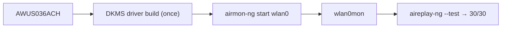

# ALFA AWUS036ACH——高功率 AC1200

> **一句话定位（One-liner）**：**AWUS036ACH** 是 ALFA 最著名的网卡适配器——一款**高功率 RTL8812AU AC1200 双频** USB 3.0 适配器，带两根 5 dBi 外置天线。如果你在 Kali 教程里见过黑色 ALFA，那很可能就是它。监听模式和数据包注入是它的拿手好戏；一次 DKMS 驱动构建是入场费。

## 规格总览（Spec overview）

| 项目 | 规格 |
|---|---|
| 芯片组 | Realtek RTL8812AU |
| Wi-Fi 等级 | AC1200（300 + 867 Mbps） |
| 接口 | USB 3.0 |
| 频段 | 2.4 + 5 GHz |
| 天线 | 2 × 外置 5 dBi，RP-SMA |
| 发射功率 | 高功率（500 mW 等级） |
| Linux 驱动 | `rtl8812au-dkms`（社区，非内核内置） |
| 监听模式 | ✅ 优秀 |
| 数据包注入 | ✅ 优秀 |

## 总览

AWUS036ACH 是让 ALFA 赢得「黑客网卡适配器」名声的那款产品。它把主力 **RTL8812AU** 无线电与真正**高功率（500 mW）前端**和两根可更换的 5 dBi 天线配对，装进你一眼就能认出的黄黑 ALFA 外壳。对课程作业而言，关键区别在于：与低价仿品不同，它的驱动背后有多年 aircrack-ng 社区打磨，所以**驱动就位后监听模式和数据包注入就能用**。

它唯一的真正「代价」是 RTL8812AU **不在 Linux 内核中**——一次 DKMS 构建就是它与即插即用的 [AWUS036ACM](/alfa-network/products/awus036acm/) 之间的差别。

## 安装与驱动

完整教程在 [RTL8812AU 驱动页面](/alfa-network/drivers/rtl8812au/)——这里是 30 秒版：

```bash
sudo apt install -y build-essential dkms git
cd /opt && sudo git clone https://github.com/aircrack-ng/rtl8812au.git
cd rtl8812au && sudo make dkms_install
sudo modprobe 8812au
```

**预期输出**：`DKMS: install completed.`，然后 `iw dev` 后出现 `Interface wlan0`。



## 进阶用法

### 监听模式 + 注入

```bash
sudo airmon-ng check kill
sudo airmon-ng start wlan0
sudo aireplay-ng --test wlan0mon
```

**预期输出**：`Injection is working!` 和 `30/30: 100%`。

### 更换天线获得更远距离

RP-SMA 端口接受任何 [ALFA 天线](/alfa-network/products/apa-m25/)——升级到面板天线或更高增益的偶极子，能提升 500 mW 无线电可触及的范围。

## 兼容性

| 平台 | 支持 | 说明 |
|---|---|---|
| Kali Linux | ✅ | DKMS 构建；aircrack-ng 仓库跟进新内核 |
| Ubuntu | ✅ | DKMS；在 LTS 上极其稳定 |
| NetHunter / Android | 🔧 | 部分内核可用；不保证 |
| Windows | ✅ | 官方驱动；即插即用 |
| macOS | ⚠️ | 需要驱动；Apple Silicon 受限 |

## 故障排查

| 症状 | 原因 | 修复 |
|---|---|---|
| DKMS 构建失败 | 新内核 vs 过旧仓库 | `cd /opt/rtl8812au && sudo git pull && sudo make dkms_install` |
| 网卡适配器只能在 managed 模式 | 内核桩模块抢占了它 | 黑名单 `rtl8812au`（见[驱动页面](/alfa-network/drivers/rtl8812au/)） |
| 注入 0/30 | 空信道 | `sudo iw wlan0mon set channel 6`；在接入点附近测试 |
| 重启后消失 | 模块未自动加载 | 把 `8812au` 加入 `/etc/modules-load.d/alfa.conf` |

## 相关资源

- [RTL8812AU 驱动页面](/alfa-network/drivers/rtl8812au/)——完整设置 + 深度故障排查
- [Kali 设置指南](/alfa-network/linux-setup-kali/)
- [AWUS036ACM](/alfa-network/products/awus036acm/)——内核内置替代款（推荐初学者）
- [网卡适配器对比](/alfa-network/wifi-adapter-comparison/)
- [兼容性矩阵](/alfa-network/linux-compatibility-matrix/)