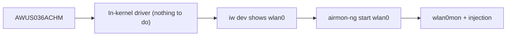

# ALFA AWUS036ACHM——预算级双频 AC433

> **一句话定位（One-liner）**：**AWUS036ACHM** 是预算级双频 ALFA——一款 **MT7610U AC433** 网卡适配器，带两根 5 dBi 天线，关键是**内核内置驱动**（自 Linux 4.19 起的 `mt76x0u`）。它是 Linux 上进入双频监听模式最便宜的方式，没有之一。

## 规格总览（Spec overview）

| 项目 | 规格 |
|---|---|
| 芯片组 | MediaTek MT7610U |
| Wi-Fi 等级 | AC433（150 + 433 Mbps） |
| 接口 | USB 2.0 |
| 频段 | 2.4 + 5 GHz |
| 天线 | 2 × 外置 5 dBi，RP-SMA |
| Linux 驱动 | `mt76x0u`——**自 4.19 起内核内置** |
| 监听模式 | ✅ 良好 |
| 数据包注入 | ✅ 良好 |

## 总览

ACHM 是 [AWUS036ACM](/alfa-network/products/awus036acm/) 的「小弟弟」。它使用 **1×1 MT7610U** 无线电，所以 AC433 的速度上限大约是 ACM 的 AC1200 的一半——但大学生真正需要的两件事，它都很有竞争力：

1. **它在内核里。** 无需 DKMS、无需编译、不会「升级后坏掉」。在 Ubuntu 或 Kali 上插上，`wlan0` 就存在。
2. **监听模式 + 注入可用**，通过标准 `mac80211` 路径，得益于 MediaTek 主线驱动。

如果你的课程作业是「捕获并分析 Wi-Fi 管理帧」或「演示数据包注入」，ACHM 以 ALFA 产品线最低的价格完成它。只有在需要双倍 5 GHz 吞吐量做重度捕获时，才改买 [ACM](/alfa-network/products/awus036acm/)。

## 安装与驱动

因为驱动在内核里，**无需安装任何东西**——参见 [MT7610U 驱动页面](/alfa-network/drivers/mt7610u/)。验证：

```bash
lsusb | grep -i mediatek
iw dev
```

**预期输出**：

```text
Bus 001 Device 005: ID 0e8d:7610 MediaTek Inc. MT7610U
phy#0
	Interface wlan0
		ifindex 3
		type managed
```



## 进阶用法

### 监听模式（无需安装）

```bash
sudo airmon-ng start wlan0
sudo aireplay-ng --test wlan0mon
```

**预期输出**：创建 `wlan0mon`；注入 `30/30: 100%`。

### 天线升级

如果你觉得原厂偶极子不够用，RP-SMA 端口接受 [ALFA 天线](/alfa-network/products/apa-m25/)——但注意 1×1 无线电无法用两根天线做 MIMO，所以为追求距离请使用单根高增益天线。

## 兼容性

| 平台 | 支持 | 说明 |
|---|---|---|
| Kali Linux | ✅ | 内核内置 `mt76x0u` |
| Ubuntu | ✅ | 20.04+ 即插即用 |
| NetHunter / Android | ✅ | 内核内置芯片组 |
| Windows | ✅ | 官方驱动 |
| Raspberry Pi / Jetson | ✅ | 内核内置 |

## 故障排查

| 症状 | 原因 | 修复 |
|---|---|---|
| 不在 `lsusb` 中 | 供电 / 线缆 | 换端口 / 带供电的集线器——[故障排查](/alfa-network/troubleshooting/) |
| 没有接口 | 驱动未加载（罕见） | `sudo modprobe mt76x0u` |
| 吞吐量约为 ACM 的一半 | 1×1 硬件极限 | 不是 bug——AC433 等级 |
| 注入失败 | 空信道 | `sudo iw wlan0mon set channel 6` |

## 相关资源

- [MT7610U 驱动页面](/alfa-network/drivers/mt7610u/)
- [Ubuntu 设置指南](/alfa-network/linux-setup-ubuntu/)和 [Kali 设置指南](/alfa-network/linux-setup-kali/)
- [AWUS036ACM](/alfa-network/products/awus036acm/)——更快的兄弟款
- [网卡适配器对比](/alfa-network/wifi-adapter-comparison/)