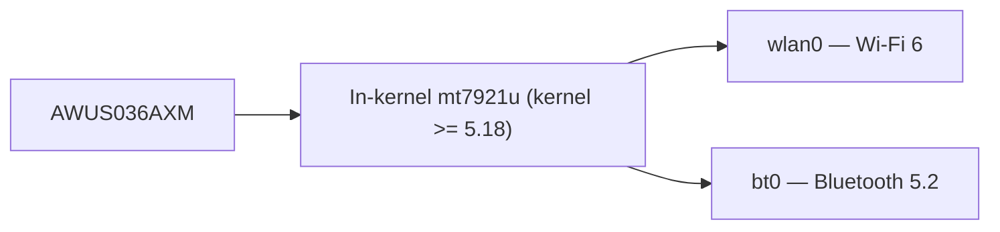

# ALFA AWUS036AXM——Wi-Fi 6 AX3000 + 蓝牙 5.2

> **一句话定位（One-liner）**：**AWUS036AXM** 是 ALFA 的旗舰 Wi-Fi 6 适配器——一款 **MT7921AUN AX3000** 双频网卡适配器，带 **蓝牙 5.2**、USB 3.2、两根天线，关键是**内核内置驱动**（自 Linux 5.18 起的 `mt7921u`）。一个适配器同时取代你的 Wi-Fi 和蓝牙。

## 规格总览（Spec overview）

| 项目 | 规格 |
|---|---|
| 芯片组 | MediaTek MT7921AUN |
| Wi-Fi 等级 | AX3000（574 + 2402 Mbps） |
| 接口 | USB 3.2 |
| 频段 | 2.4 + 5 GHz |
| 天线 | 2 × 外置 5 dBi，RP-SMA |
| 蓝牙 | **BT 5.2**（同一适配器） |
| MIMO | 2×2 |
| Linux 驱动 | `mt7921u`——**自 5.18 起内核内置** |
| 监听模式 | ✅ 良好 |

## 总览

AXM 是备受喜爱的 [AWUS036ACM](/alfa-network/products/awus036acm/) 的现代继任者——MediaTek 无线电、内核内置驱动、无 DKMS 烦恼——但带来整整一代升级：**AX3000** 速度（5 GHz 上 2.4 Gbps）、**蓝牙 5.2** 搭载在同一 USB 设备上，以及一款能更好应对拥挤环境的新无线电。

对 Linux 用户来说，吸引力与 ACM 相同：**它就是能用**。驱动在内核里（需要 5.18+，所以 Ubuntu 22.04+ 或较新的 Kali），监听模式通过标准 `mac80211` 路径可用，额外福利是你的 WiFi 和蓝牙共用一个端口。

唯一注意事项：因为 `mt7921u` 需要 5.18+ 内核，较旧的操作系统安装完全看不到它——查看[兼容性矩阵](/alfa-network/linux-compatibility-matrix/)。

## 安装与驱动

自 5.18 起内核内置——无需编译。完整细节见 [MT7921AUN 驱动页面](/alfa-network/drivers/mt7921aun/)。验证：

```bash
lsusb | grep -i mediatek
iw dev
bluetoothctl list
```

**预期输出**：`lsusb` 中有 MT7921U 行，`iw dev` 中有接口，`bluetoothctl list` 中有蓝牙控制器（BT 可能需要 `sudo modprobe btusb`）。



## 进阶用法

### 最高速连接 + BT 配对

```bash
nmcli device wifi connect "MySSID" password "my-passphrase"
bluetoothctl
power on
scan on
pair <MAC>
```

**预期输出**：Wi-Fi 已激活；你的 BT 设备显示 `Pairing successful`。

### 监听模式

```bash
sudo airmon-ng start wlan0
sudo aireplay-ng --test wlan0mon
```

**预期输出**：`wlan0mon` + 注入 `30/30: 100%`。

## 兼容性

| 平台 | 支持 | 说明 |
|---|---|---|
| Kali Linux | ✅ | 内核内置（5.18+） |
| Ubuntu | ✅ | 22.04+（内核 5.18+） |
| NetHunter / Android | ✅ | 内核内置，需要较新内核 |
| Windows | ✅ | 官方驱动，WiFi + BT |
| Raspberry Pi / Jetson（JetPack 6） | ✅ | 内核内置 |

## 故障排查

| 症状 | 原因 | 修复 |
|---|---|---|
| Ubuntu 20.04 上检测不到 | 内核 < 5.18 | 升级操作系统 / 内核 |
| 设备可见但没有 `wlan0` | 固件缺失 | `sudo apt install linux-firmware`；重新插拔 |
| 蓝牙缺失 | `btusb` 未加载 | `sudo modprobe btusb` |
| 注入 0/30 | 空信道 | `sudo iw wlan0mon set channel 6` |

## 相关资源

- [MT7921AUN 驱动页面](/alfa-network/drivers/mt7921aun/)
- [AWUS036AXML](/alfa-network/products/awus036axml/)——Wi-Fi 6E、USB-C 兄弟款
- [AWUS036AX](/alfa-network/products/awus036ax/)——更便宜的 AX1800 替代款
- [Ubuntu 设置指南](/alfa-network/linux-setup-ubuntu/) / [Kali 设置指南](/alfa-network/linux-setup-kali/)
- [网卡适配器对比](/alfa-network/wifi-adapter-comparison/)