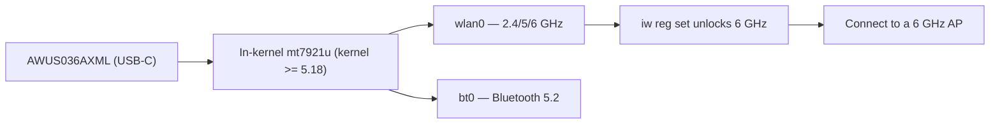

# ALFA AWUS036AXML——Wi-Fi 6E USB-C（6 GHz）

> **一句话定位（One-liner）**：**AWUS036AXML** 是 ALFA 产品线中唯一的 **Wi-Fi 6E** 网卡适配器——一款 **MT7921AUN AXE3000 三频**（2.4/5/**6 GHz**）网卡适配器，带 **USB-C**、双 5 dBi 天线和 **蓝牙 5.2**，全部基于**内核内置驱动**（自 5.18 起的 `mt7921u`）。这是学生从现代笔记本登上空旷 6 GHz 频段的方式。

## 规格总览（Spec overview）

| 项目 | 规格 |
|---|---|
| 芯片组 | MediaTek MT7921AUN |
| Wi-Fi 等级 | AXE3000（574 + 1201 + **2402 Mbps**） |
| 频段 | 2.4 + 5 + **6 GHz** |
| 接口 | **USB-C** |
| 天线 | 2 × 外置 5 dBi，RP-SMA |
| 蓝牙 | BT 5.2 |
| MIMO | 2×2 |
| Linux 驱动 | `mt7921u`——**自 5.18 起内核内置** |
| 监听模式 | ✅ 良好（现代内核上含 6 GHz） |

## 总览

AXE3000 的 **AXML** 是 ALFA 面向 6 GHz 时代的代表作。**6 GHz 频段**（5 GHz 以上的信道）是目前可用频谱中拥塞最少的——没有旧设备、没有重叠的实验室接入点——而这款网卡适配器就是你在 Linux 上触达它的方式。两个细节让它特别：

1. **它在内核里。** `mt7921u` 驱动自 5.18 起进入主线，所以在 Ubuntu 22.04+ 或较新的 Kali 上，把它插进 **USB-C 端口**，你就上了 6 GHz 频段。无需 DKMS。
2. **USB-C + 蓝牙 5.2。** 现代超极本有 USB-C 但 Wi-Fi 常常很弱；一个 AXML 用真正的无线电和真正的天线同时取代 Wi-Fi 和 BT。

天然搭档：远端的 [Wi-Fi 6E 接入点](/alfa-network/products/apa-m25-6e/)，以及解锁你所在地区信道的 [6 GHz 法规设置](/alfa-network/drivers/mt7921aun/)。

## 安装与驱动

无需编译——需要内核 5.18+。完整的 6 GHz 设置见 [MT7921AUN 驱动页面](/alfa-network/drivers/mt7921aun/)。验证：

```bash
lsusb | grep -i mediatek
iw dev
iwlist wlan0 freq | grep -E "6 GHz|Channel 1|Channel 233" | head
```

**预期输出**：MT7921U 行；一个接口；在 AXML 上，频率列表中有 **6 GHz 信道条目**。没有 6 GHz 条目？设置法规域：

```bash
sudo iw reg set TW    # your country code
sudo ip link set wlan0 down && sleep 1 && sudo ip link set wlan0 up
```



## 进阶用法

### 加入 6 GHz 网络

```bash
iw dev wlan0 info | grep channel   # confirm you are on 6 GHz
nmcli device wifi connect "My6eSSID" password "my-passphrase"
```

**预期输出**：已连接，信道行类似 `channel 37 (6115 MHz)`——证明你在 6 GHz 频段上，这里的延迟和拥塞远低于 2.4/5 GHz。

### 监听模式（含 6 GHz）

```bash
sudo airmon-ng start wlan0
sudo aireplay-ng --test wlan0mon
```

**预期输出**：`wlan0mon` + 注入 `30/30: 100%`。在 6 GHz 上，配合 6 GHz 接入点和现代内核，监听捕获同样可用——如果 6 GHz 上什么都看不到，在 5 GHz 上测试以区分驱动与环境问题。

### 用三频面板天线触达更远

AXML 的原厂偶极子够用，但[三频面板天线](/alfa-network/products/apa-m25-6e/)能把空旷的 6 GHz 频段变成真正的远距离固定链路。

## 兼容性

| 平台 | 支持 | 说明 |
|---|---|---|
| Kali Linux | ✅ | 内核内置（5.18+） |
| Ubuntu | ✅ | 22.04+ |
| NetHunter / Android | ✅ | 手机需要 5.18+ 内核 |
| Windows | ✅ | 官方驱动，Wi-Fi 6E + BT |
| Jetson（JetPack 6） | ✅ | 6 GHz 流传输——参见 [Jetson 指南](/alfa-network/hardware/jetson/) |

## 故障排查

| 症状 | 原因 | 修复 |
|---|---|---|
| 完全检测不到 | 内核 < 5.18，或 USB-C 线缆仅支持充电 | 升级内核；使用数据线 |
| 6 GHz 信道缺失 | 法规域未设置 | `sudo iw reg set <CC>`；让接口 bounce |
| 5 GHz 上监听正常，6 GHz 不行 | 早期内核 6 GHz 怪癖 / 没有 6 GHz 接入点 | 更新内核；确认范围内有 6 GHz 接入点 |
| 蓝牙缺失 | `btusb` 未加载 | `sudo modprobe btusb` |

## 相关资源

- [MT7921AUN 驱动页面](/alfa-network/drivers/mt7921aun/)
- [AWUS036AXM](/alfa-network/products/awus036axm/)——Wi-Fi 6（无 6 GHz）兄弟款
- [APA-M25-6E](/alfa-network/products/apa-m25-6e/)——这款网卡适配器的三频面板天线
- [Jetson 指南](/alfa-network/hardware/jetson/)——6 GHz 流传输用例
- [网卡适配器对比](/alfa-network/wifi-adapter-comparison/)