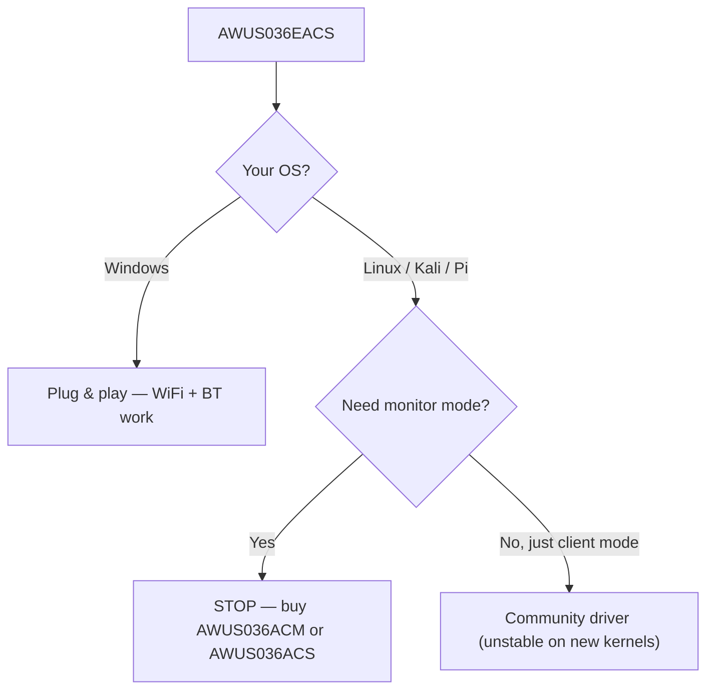

# ALFA AWUS036EACS——纳米 WiFi + 蓝牙组合

> **一句话定位（One-liner）**：**AWUS036EACS** 是 ALFA 的**纳米 WiFi + 蓝牙组合**——一款 **RTL8821CU AC600** 双频适配器，带集成 **BT 4.2**，在 **Windows 上即插即用**。先说诚实的警告：它的 Linux 驱动故事很弱，而且它**不是**监听模式网卡适配器。为 Windows 台式机买它，而不是为 Kali。

## 规格总览（Spec overview）

| 项目 | 规格 |
|---|---|
| 芯片组 | Realtek RTL8821CU |
| Wi-Fi 等级 | AC600（150 + 433 Mbps） |
| 接口 | USB 2.0 |
| 频段 | WiFi：2.4 + 5 GHz ｜ BT：2.4 GHz |
| 蓝牙 | BT 4.2 |
| 天线 | 集成 2 dBi（无外置 RP-SMA） |
| 安全 | WEP / WPA / WPA2 |
| Linux 驱动 | 无可靠驱动（见 [RTL8821CU 驱动页面](/alfa-network/drivers/rtl8821cu/)） |
| 监听模式 | ❌ 不可靠 |

## 总览

EACS 是 ALFA 安全产品线中的异类，这一点进门就要知道。它面向**不同的买家**：需要**在一个小巧不显眼的适配器里同时有 WiFi + 蓝牙**的 Windows 台式机或嵌入式工业 PC。AC600 速度和 2 dBi 集成天线使它成为「够用的互联网 + BT 键盘/鼠标」升级，而不是信号分析仪器。

尖锐的边缘在 **Linux**：RTL8821CU 没有主线驱动，社区驱动在现代内核上不稳定——监听模式和数据包注入不可靠。我们保留这款产品用于 Windows/组合用例，并向任何课程作业涉及 Kali 的人推荐 [AWUS036ACM](/alfa-network/products/awus036acm/) 或 [AWUS036ACS](/alfa-network/products/awus036acs/)。

## 安装与驱动（Windows）

在 Windows 上无需做任何事——驱动已内置：

1. 把网卡适配器插入 USB 端口。
2. Windows 自动安装 RTL8821CU 驱动。WiFi 和蓝牙都会出现在设备管理器中。

验证：

```powershell
Get-PnpDevice -PresentOnly | Where-Object { $_.Class -eq "Net" }
```

**预期输出**：列出 `802.11ac NIC` 网络适配器和一个蓝牙无线电。

## Linux？先读这个

如果你在 Linux 上，[RTL8821CU 驱动页面](/alfa-network/drivers/rtl8821cu/)是诚实的完整故事。简版：存在一个社区驱动（`brektrou/rtl8821CU`），*可能*在较旧内核上构建，但预期不稳定且**没有可靠的监听模式**。做 Linux/Kali 工作，请选另一款 ALFA。



## 兼容性

| 平台 | 支持 | 说明 |
|---|---|---|
| Windows | ✅ | 即插即用，WiFi + BT |
| Kali Linux | ❌ | 监听模式 / 注入不可靠 |
| Ubuntu | ❌ | 无稳定驱动 |
| NetHunter / Android | ❌ | 未确认 |
| Raspberry Pi | ❌ | 驱动在 ARM64 上失败 |
| macOS | ⚠️ | 受限；Apple Silicon 不支持 |

## 故障排查

| 症状 | 原因 | 修复 |
|---|---|---|
| 找不到 BT 设备（Windows） | 驱动 / 服务冲突 | 检查设备管理器；从 ALFA 支持重新安装驱动 |
| 在 Linux 上完全不能用 | 无可靠驱动 | 到此为止——改用 [Linux 友好的 ALFA](/alfa-network/wifi-adapter-comparison/) |
| 监听模式「能用」但注入失败 | RTL8821CU 驱动局限 | 不要依赖它——捕获工作请更换网卡适配器 |
| 覆盖范围短 | 集成 2 dBi 天线 | 设计使然；靠近接入点使用，不要离远 |

## 相关资源

- [RTL8821CU 驱动页面](/alfa-network/drivers/rtl8821cu/)——详细的 Linux 故事
- [AWUS036ACM](/alfa-network/products/awus036acm/)——推荐的 Linux/Kali 替代款
- [AWUS036ACS](/alfa-network/products/awus036acs/)——口袋监听模式替代款
- [网卡适配器对比](/alfa-network/wifi-adapter-comparison/)
- [兼容性矩阵](/alfa-network/linux-compatibility-matrix/)