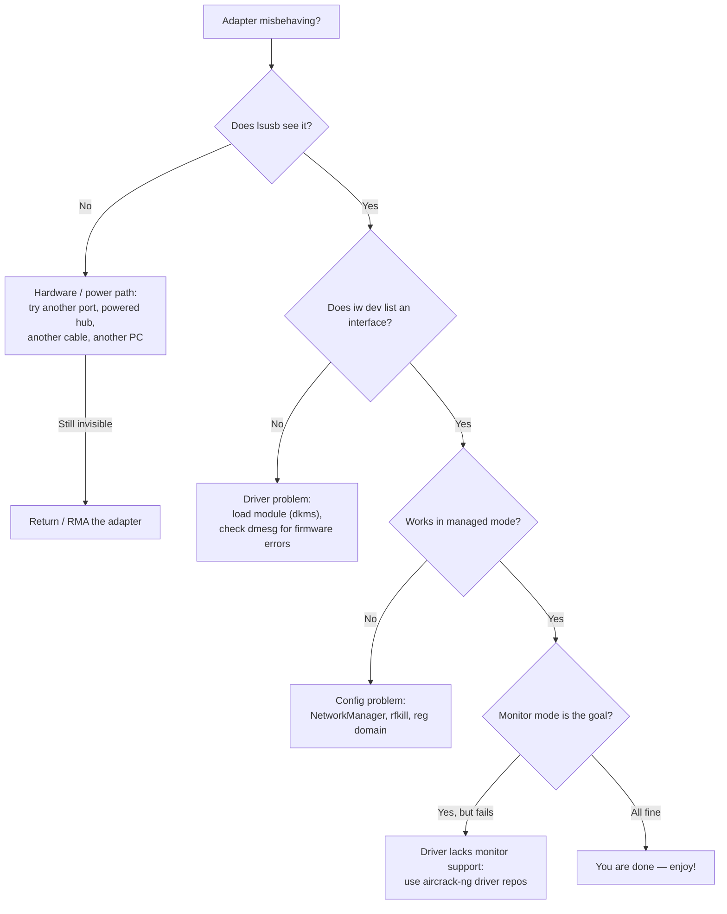

# ALFA 网卡适配器——故障排查索引

> **排查铁律（Diagnosis iron rule）**：**先查硬件 → 再查驱动程序 → 最后查配置。** 超过 80% 的「我的 ALFA 坏了」报告，最终都证明是供电问题、缺少 DKMS 重建，或内核更新的副作用——而不是网卡适配器坏了。在责怪硬件之前，先按下面的决策树排查。




## 问题分类索引

| 类别 | 典型问题 |
|---|---|
| **检测** | 网卡适配器不在 `lsusb` 中、没有接口、重启后消失 |
| **驱动程序** | DKMS 构建失败、模块未加载、`dmesg` 中出现固件错误 |
| **连接** | 无法关联、频繁掉线、链路缓慢 |
| **监听模式** | `airmon-ng` 失败、注入测试失败、捕获不到任何帧 |
| **供电** | 网卡适配器在高负载下死机、在一台电脑上正常另一台不行 |
| **法规** | 信道设置错误、发射功率被限制、「5 GHz 信道缺失」 |

**每个芯片组都有自己的深度解析页面**——请收藏你的：

| 芯片组 | 网卡适配器 | 驱动页面 |
|---|---|---|
| MT7612U | AWUS036ACM | [mt7612u](/alfa-network/drivers/mt7612u/) |
| MT7610U | AWUS036ACHM | [mt7610u](/alfa-network/drivers/mt7610u/) |
| MT7921AUN | AWUS036AXM / AWUS036AXML | [mt7921aun](/alfa-network/drivers/mt7921aun/) |
| RTL8812AU | AWUS036ACH | [rtl8812au](/alfa-network/drivers/rtl8812au/) |
| RTL8811AU | AWUS036ACS | [rtl8811au](/alfa-network/drivers/rtl8811au/) |
| RTL8832BU | AWUS036AX / AWUS036AXER | [rtl8832bu](/alfa-network/drivers/rtl8832bu/) |
| RTL8821CU | AWUS036EACS | [rtl8821cu](/alfa-network/drivers/rtl8821cu/) |

---

## 问题 1：网卡适配器完全检测不到（`lsusb` 为空）

### 症状
已插入，LED 可能亮也可能不亮，`lsusb` 中没有任何 Realtek/MediaTek 条目。

### 诊断
```bash
lsusb
dmesg | tail -30
```
在 `dmesg` 中查找 `device descriptor read/64, error -71` 或 `device not accepting address`——这是典型的供电握手失败。

### 根本原因
几乎总是 **USB 供电或线缆**——尤其是高功率型号（AWUS036AXM/AXML、AWUS036AX）接到前置面板端口或无供电的集线器上时。

### 修复
1. 尝试**机箱后置 USB 端口**（或通过转接头使用 USB-C 端口）。
2. 尝试**不同的线缆**——有些廉价 USB-C 线只支持充电。
3. 使用**带供电的 USB 集线器**。
4. 在笔记本上，拔掉其他高功率 USB 设备。
5. 如果在*两台不同的电脑*上仍然不可见，说明网卡适配器已损坏——请联系支持。

---

## 问题 2：`lsusb` 能看到，但没有 `wlanX` 接口

### 症状
`lsusb` 显示网卡适配器；`iw dev` / `ip link` 却什么都没有。

### 诊断
```bash
dmesg | grep -iE "wlan|firmware|error"
lsmod | grep -iE "mt76|8812|8811|88x2|8821"
```

### 根本原因
两种常见原因：
- **Realtek 芯片组**：DKMS 模块从未加载（或内核更新后构建失败）。
- **MediaTek Wi-Fi 6E**：内核版本低于 5.18（缺少 `mt7921u`），或固件 blob 缺失。

### 修复
- Realtek：`sudo modprobe 8812au`（匹配你的芯片组），并把它加入 `/etc/modules-load.d/alfa.conf` 以便开机自动加载。如果 `modprobe` 提示 `Module not found`，重建：`sudo dkms autoinstall`。
- MediaTek：`sudo apt install linux-firmware` 然后重启。内核太旧？升级操作系统——参见[兼容性矩阵](/alfa-network/linux-compatibility-matrix/)。

---

## 问题 3：内核更新后 DKMS 构建失败

### 症状
刚执行完 `apt upgrade` 就「网卡适配器停止工作」；`dmesg` 显示 `8812au: version magic ... should be ...`。

### 诊断
```bash
dkms status
```
如果你的模块显示 `Error!` 或出现损坏的内核版本条目，那就是问题所在。

### 根本原因
驱动程序的 DKMS 配方无法针对新内核重新构建——通常是缺少内核头文件，或仓库对全新内核来说太旧。

### 修复
1. 安装头文件：`sudo apt install linux-headers-$(uname -r)`
2. 强制重建：`sudo dkms autoinstall`
3. 仍然失败？更新驱动仓库并重新安装：
   ```bash
   cd /opt/rtl8812au && sudo git pull && sudo make dkms_install
   ```
4. 重启并再次检查 `dkms status`——它应该把你的模块列为 `installed`。

---

## 问题 4：监听模式能启动，但注入测试失败

### 症状
`airmon-ng start` 成功，`wlan0mon` 存在，但 `aireplay-ng --test` 报告 `0/30` 或 `Failed`。

### 诊断
```bash
sudo aireplay-ng --test wlan0mon
sudo iw dev wlan0mon info   # confirm it really is type monitor
```

### 根本原因
驱动程序构建时未包含正确的监听/注入支持，**或者**你所在的信道没有任何接入点在使用（注入需要一个 AP 信标来回应），**或者**射频环境是空的（隔离实验室）。

### 修复
1. 锁定一个有活跃接入点的信道：`sudo iw dev wlan0mon set channel 6`
2. 重新测试。仍然是 0/30？改用 aircrack-ng 驱动仓库重建，这些仓库默认启用监听 + VIF：
   - [rtl8812au](/alfa-network/drivers/rtl8812au/)、[rtl8811au](/alfa-network/drivers/rtl8811au/)、[rtl88x2bu](/alfa-network/drivers/rtl8832bu/)
3. 在无射频信号的区域，用手机热点在同一信道创建你自己的接入点。

---

## 问题 5：Wi-Fi 频繁掉线或速度慢

### 症状
链路连上后每隔几分钟就掉线；吞吐量远低于等级标称值。

### 诊断
```bash
iw dev wlan0 link          # signal + tx rate
iw reg get | head -20      # regulatory domain
```

### 根本原因
- **法规域**：如果 `iw reg get` 显示 `country 00`（未设置），发射功率会被限制在默认的 20 dBm。
- **省电**：激进的 USB 电源管理会限制无线电性能。
- **过热**：高功率网卡适配器持续发射。

### 修复
1. 设置你的地区：`sudo iw reg set TW`（或你的国家代码）。
2. 设置发射功率：`sudo iwconfig wlan0 txpower 30`（你所在法规域允许的最大值）。
3. 关闭省电：`sudo iwconfig wlan0 power off`。
4. AC1200+ 网卡适配器优先使用 USB 3.0 端口——USB 2.0 会限制吞吐量。

---

## 问题 6：5 GHz 信道缺失

### 症状
只能看到 2.4 GHz 网络；`iwlist wlan0 freq` 没有任何 5 GHz 条目。

### 根本原因
法规域未设置或被限制（全新安装时通常是 `country 00`），因此驱动程序拒绝使用 5 GHz 信道。

### 修复
```bash
sudo iw reg set TW    # replace with your country code
sudo ip link set wlan0 down && sudo ip link set wlan0 up
```

---

## 仍未解决？

在放弃之前，收集以下确切信息并联系我们（或[驱动项目](/alfa-network/drivers/mt7612u/)）——这是维护者帮助你所需的信息：

```bash
uname -r
lsusb
dkms status
dmesg | tail -50
iw dev
```

附上以上全部内容，再加上：你的网卡适配器型号、操作系统/内核，以及输出让你意外的确切命令。还有一件值得检查的事——如果你运行的是 Jetson、Raspberry Pi 或 Unitree 机器人，请查看[硬件集成指南](/alfa-network/hardware/jetson/)；嵌入式板卡有自己独特的供电和驱动问题。