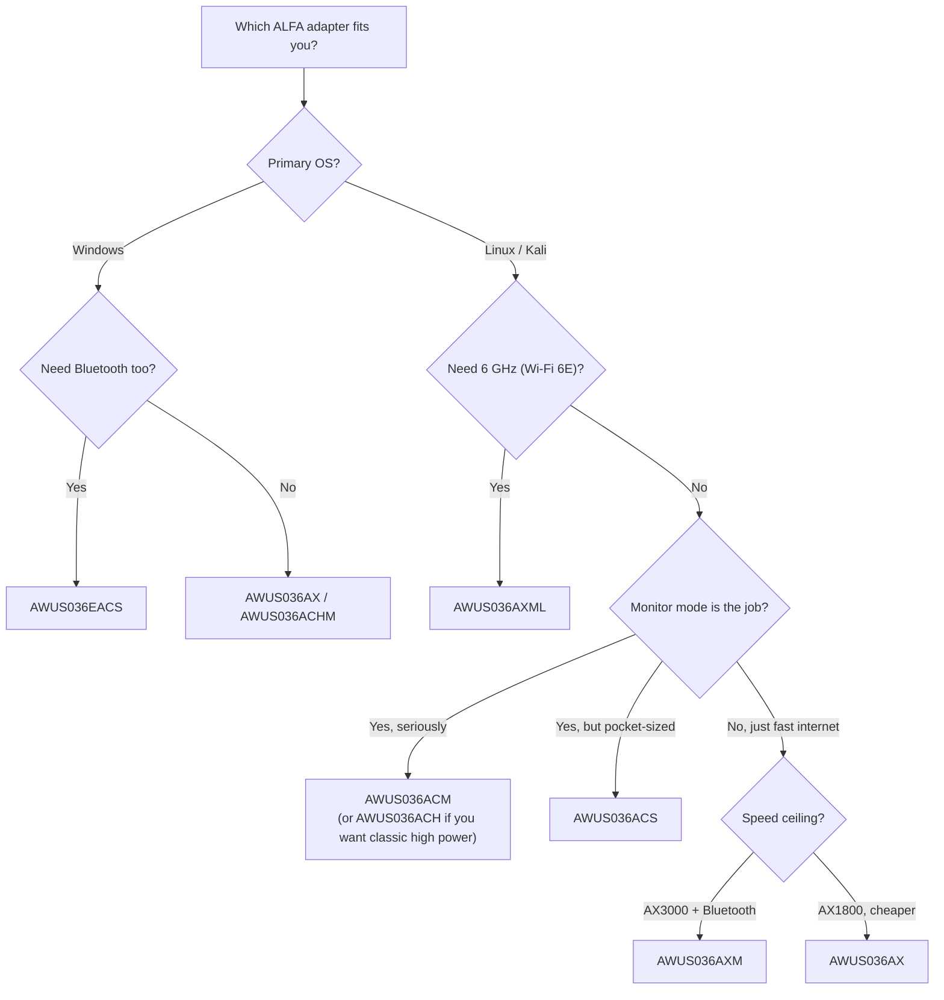

# ALFA 无线网卡对比

> **结论先行（Bottom line）**：如果你是使用 Kali Linux 做课程或实验的大学生，买 **AWUS036ACM**——它的 MediaTek MT7612U 芯片组内置于 Linux 内核，监听模式开箱即用，而且价格低于旗舰型号。如果你的项目*必须*有 Wi-Fi 6E 速度，**AWUS036AXML** 是唯一的三频选项。如果你是主要需要一个紧凑 WiFi + 蓝牙组合的 Windows 用户，**AWUS036EACS** 是你的（唯一）选择。

*💡 点击上方图片可开启高分辨率放大灯箱，清晰检视完整型号与芯片规格。*
## 完整规格对比表

九款网卡适配器，一张表。「监听模式」指把接口切换为 RFMON，以便捕获信道上的每一个数据包——这是 Wireshark、Aircrack-ng、Wifite 等工具的基本要求。

| 型号 | 芯片组 | Wi-Fi 等级 | 接口 | 频段 | 最高速度 | 监听模式（Linux） | 天线 |
|---|---|---|---|---|---|---|---|
| [AWUS036ACH](/alfa-network/products/awus036ach/) | RTL8812AU | AC1200 | USB 3.0 | 2.4 + 5 GHz | 300 + 867 Mbps | ✅ 优秀（DKMS） | 2 × 外置 5 dBi，RP-SMA |
| [AWUS036ACHM](/alfa-network/products/awus036achm/) | MT7610U | AC433 | USB 2.0 | 2.4 + 5 GHz | 150 + 433 Mbps | ✅ 良好（内核内置） | 2 × 外置 5 dBi，RP-SMA |
| [AWUS036ACM](/alfa-network/products/awus036acm/) | MT7612U | AC1200 | USB 3.0 | 2.4 + 5 GHz | 300 + 867 Mbps | ✅ 优秀（内核内置） | 2 × 外置 5 dBi，RP-SMA |
| [AWUS036ACS](/alfa-network/products/awus036acs/) | RTL8811AU | AC433 | USB 2.0 | 2.4 + 5 GHz | 150 + 433 Mbps | ✅ 良好（DKMS） | 2 × 外置 5 dBi，RP-SMA（55 mm 机身） |
| [AWUS036AX](/alfa-network/products/awus036ax/) | RTL8832BU | AX1800 | USB 3.2 | 2.4 + 5 GHz | 574 + 1201 Mbps | ✅ 良好（DKMS） | 2 × 外置 6 dBi，RP-SMA |
| [AWUS036AXER](/alfa-network/products/awus036axer/) | RTL8832BU | AX1800 | USB 3.2 | 2.4 + 5 GHz | 574 + 1201 Mbps | ✅ 良好（DKMS） | 内置（10.5 g 纳米机身） |
| [AWUS036AXM](/alfa-network/products/awus036axm/) | MT7921AUN | AX3000 | USB 3.2 | 2.4 + 5 GHz | 574 + 2402 Mbps | ✅ 良好（内核内置） | 2 × 外置 5 dBi，RP-SMA + BT 5.2 |
| [AWUS036AXML](/alfa-network/products/awus036axml/) | MT7921AUN | AXE3000 | USB-C | 2.4 + 5 + 6 GHz | 574 + 1201 + 2402 Mbps | ✅ 良好（内核内置） | 2 × 外置 5 dBi，RP-SMA + BT 5.2 |
| [AWUS036EACS](/alfa-network/products/awus036eacs/) | RTL8821CU | AC600 | USB 2.0 | 2.4 + 5 GHz | 150 + 433 Mbps | ❌ 不可靠 | 集成 2 dBi + BT 4.2 |

### 如何解读速度数字

「+」分隔两个频段：**2.4 GHz + 5 GHz**（AXE 型号再加 + 6 GHz）。「300 + 867」的网卡适配器是 **AC1200** 等级：300 Mbps 是 2.4 GHz 上限（2 个空间流 × 150 Mbps），867 Mbps 是 5 GHz 上限（2 × 433 Mbps）。实际吞吐量通常为链路速率的 50–70%——物理损耗、墙壁和 USB 总线开销吃掉了其余部分。

## 哪款适合你？

### 如果你需要 Kali / 监听模式 / 数据包注入 → AWUS036ACM

MT7612U 芯片组**自 Linux 4.19 起内置于内核**，这意味着：在任何较新的 Kali 或 Ubuntu 上插上它，`ip link` 就已经显示 `wlan0`。监听模式通过标准 `iw` 命令即可工作，数据包注入可靠。它还以两根 5 dBi 天线推动真实的 500 mW 发射功率——对实验练习来说确实有用的覆盖范围。完整工作流见 [Kali 设置指南](/alfa-network/linux-setup-kali/)。

### 如果你需要 Wi-Fi 6E（6 GHz）→ AWUS036AXML

AXML 是产品线中唯一具备 **6 GHz 频段**（AXE3000）的网卡适配器。它使用 MediaTek **MT7921AUN**，其 `mt7921u` 驱动程序自内核 5.18 起进入主线——所以同样没有 DKMS 的烦恼。它也是唯一的 USB-C 型号，是现代超极本或平板电脑的完美搭档。参见 [Wi-Fi 6E 设置说明](/alfa-network/linux-setup-ubuntu/)。

### 如果你想要纯客户端网卡适配器（快速、稳定、不做渗透测试）→ AWUS036AXM 或 AWUS036AX

AXM 是两者中更快的（AX3000，5 GHz 上 2.4 Gbps），并增加了**蓝牙 5.2**——一个适配器搞定 WiFi + BT。AX 提供 Wi-Fi 6 + WPA3，外观更经典，价格略低。两者在需要时都支持监听模式，但都不是专业嗅探的首选。

### 如果你带着笔记本旅行 / 想要口袋级网卡适配器 → AWUS036ACS 或 AWUS036AXER

ACS（55 mm 机身）和 AXER（10.5 g，内置天线）放进背包就消失不见。ACS 是预算级监听模式伴侣；AXER 是日常使用的 Wi-Fi 6 纳米款。

### 如果你是需要 WiFi + 蓝牙的 Windows 用户 → AWUS036EACS

坦白说：EACS **不建议用于 Linux**。它的 RTL8821CU 芯片组没有维护良好的开源驱动程序，监听模式也不可靠。在 Windows 上它即插即用，在一个小巧的适配器里提供 WiFi AC600 + BT 4.2——非常适合需要两者的台式机。

## 如果无法决定——买 ACM

AWUS036ACM 是社区共识之选：内核内置驱动、久经考验的监听模式 + 注入、双频、高功率，而且完全在学生预算之内。你会在[故障排查](/alfa-network/troubleshooting/)和[驱动](/alfa-network/drivers/mt7612u/)页面中到处看到它被称作「无聊但可靠的选择」——而在这个世界里，无聊意味着*它就是能用*。

下一步：在[兼容性矩阵](/alfa-network/linux-compatibility-matrix/)中核对你的操作系统，或直接进入 [Ubuntu](/alfa-network/linux-setup-ubuntu/) / [Kali](/alfa-network/linux-setup-kali/) 设置指南。