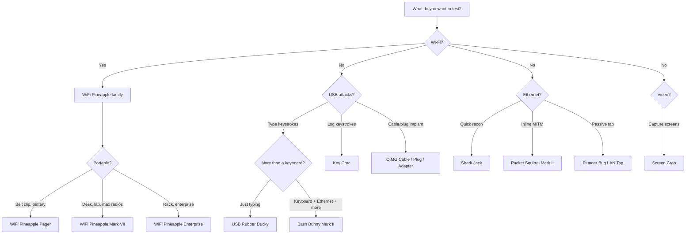

# Hak5 FAQ — 每个初学者都会问的问题

> **结论先行**：没有「最强」的 Hak5 工具，只有「最适合你目标」的工具。先搞清楚你要测什么 — Wi-Fi、USB、还是网络 — 再往下选。

---

## 1. 合法性与道德

### 拥有 Hak5 设备合法吗？
**合法。** 这些是通用计算设备 — 一块带 Wi-Fi 网卡的 Raspberry Pi 就能做到 WiFi Pineapple 的大部分功能。拥有它们在几乎所有地方都是合法的。

### 那*使用*它们合法吗？
只允许在**你拥有的系统，或你已获得书面许可测试的系统**上使用。未经授权访问在每个司法管辖区都是犯罪（在台湾，刑法妨害电脑使用罪，第 358–363 条，某些罪行最高可处五年有期徒刑）。Hak5 自己的保修条款也这么说：这些工具「仅用于授权的审计与安全分析目的」。

### 我可以用 Hak5 设备参加 CTF 或大学实验室吗？
可以 — CTF 平台和大学安全课程经常使用它们。有疑问时，**问实验室组织者或教授**你被授权测试什么，并把一切保持在提供的沙盒内。

---

## 2. 选择设备

### USB Rubber Ducky 与 Bash Bunny — 有什么区别？
[USB Rubber Ducky](/hak5/products/usb-rubber-ducky/) 是*专才*：它打字，极快且可靠。[Bash Bunny](/hak5/products/bash-bunny-mark-ii/) 是*通才*：它能打字**并且**假装成以太网适配器、串口和闪存盘 — 同时运行完整的 Linux 工具 — 全部来自一个 USB 插头。买 Ducky 学键盘注入；当你想要多向量攻击和载荷切换时买 Bunny。

### WiFi Pineapple Mark VII、Pager 还是 Enterprise？
| | Mark VII | Pager | Enterprise |
|---|---|---|---|
| 外形 | 便携 AP（USB-C 供电） | 手持、电池、2.4 吋屏幕 | 1U 机架、交流供电 |
| 频段 | 2.4 GHz 原生，5 GHz 需 MK7AC | 2.4 / 5 / 6 GHz 三频 | 2.4 / 5 GHz，5 组无线电 |
| 载荷 | 模块（PineAP 市场） | DuckyScript + Bash + Python | 模块、长期部署 |
| 最适合 | 学习与经典 PineAP | 现场作业、自动化、告警 | 严肃的多目标空域审计 |

完整对比在各产品页上：[Mark VII](/hak5/products/wifi-pineapple-mark-vii/)、[Pager](/hak5/products/wifi-pineapple-pager/)、[Enterprise](/hak5/products/wifi-pineapple-enterprise/)。

### Shark Jack 与 Shark Jack Cable？
同样的脑子，不同的供电。经典 [Shark Jack](/hak5/products/shark-jack/) 靠内置电池运行 10–15 分钟 — 适合挂钥匙圈。[Shark Jack Cable](/hak5/products/shark-jack-cable/) 由 USB-C 供电并增加串口控制台，所以能运行数小时，而且你能得到一个实时 shell。

### 什么是 Cloud C²，我需要它吗？
Cloud C²（https://cloudc2.io）是 Hak5 免费、可自托管的**命令与控制服务器**。它让你从浏览器管理设备 — WiFi Pineapples、Key Crocs、Packet Squirrels、Screen Crabs：串流键盘敲击、查看截图、远程部署载荷。第一周你不需要它；每台设备上的 Web UI 或 SSH 就够了。当设备物理上无法触达时，它就变得必不可少。

---

## 3. DuckyScript — 载荷语言

### 什么是 DuckyScript？
Hak5 用于键盘注入和设备控制的脚本语言。你会遇到的版本：

| 版本 | 使用者 | 说明 |
|---|---|---|
| 1.0（2011） | 经典 USB Rubber Ducky | `STRING`、`DELAY`、`ENTER` — 就这些 |
| 2.0（2020） | Key Croc | 解释执行：直接从 `payload.txt` 运行，用 `QUACK` 代替 `STRING` |
| 3.0（2022） | 新版 USB Rubber Ducky、Bash Bunny、O.MG、Pager | 完整语言：if/else、循环、函数、`ATTACKMODE`、键盘反射 |

### 我在哪里写载荷？
[PayloadStudio](https://payloadstudio.hak5.org) — 一个免费的浏览器 IDE。它把 DuckyScript 编译成 `inject.bin`（用于 Rubber Ducky），并为 Key Croc 和 O.MG 做解释型载荷的语法检查。它是**唯一官方支持的编码器**；旧教程里的第三方「编码器」不受支持，会产生不一致的结果。

### 为什么我的载荷没有在目标上打字？
通常是以下之一：（1）开头缺少 `DELAY`（目标操作系统还没加载 USB 栈），（2）在 PayloadStudio 里选错了键盘布局，或（3）载荷在目标应用获得焦点之前就运行了。[USB Rubber Ducky 指南](/hak5/products/usb-rubber-ducky/) 展示了每种情况的修复方法。

---

## 4. 固件与升级

### 我应该多久升级一次固件？
每当一个版本加入你需要的功能时。与手机不同，没有安全关键的自动升级 — Hak5 固件出厂即经过测试且稳定。[固件与下载](/hak5/firmware-downloads/) 页面展示了每台设备的官方升级路径。**绝不要刷第三方固件**：在某些设备上（尤其是 USB Rubber Ducky），它会让设备永久无法恢复并失去保修。

### O.MG 设备需要 O.MG Programmer 吗？
**需要。** O.MG 设备出厂时处于停用状态；通用的 [O.MG Programmer](/hak5/products/omg-programmer/) 负责激活、固件升级、自我销毁恢复和鉴识备份。一个 Programmer 覆盖所有 O.MG 设备（Cable、Plug、Adapter、UnBlocker）。

---

## 5. 实用问题

### WiFi Pineapple 能攻击 5 GHz / WPA2 / WPA3 网络吗？
[Mark VII](/hak5/products/wifi-pineapple-mark-vii/) 出厂是 2.4 GHz — 加装 **MK7AC 适配器（MT7612U 芯片组）** 可获得 5 GHz 监听与注入。[Pager](/hak5/products/wifi-pineapple-pager/) 原生包含 5 GHz 和 6 GHz。Pineapple 创建**邪恶双胞胎 / 流氓 AP**（Enterprise 型号还支持 WPA2-Enterprise）；它不「破解」WPA2 密钥 — 那是 `aircrack-ng` 这类离线攻击（你可以在笔记本上运行）的用途。

### Key Croc 会被检测到吗？
任何有决心的防御者都能找到硬件植入。[Key Croc](/hak5/products/key-croc/) 在记录键盘时 LED 关闭，并克隆键盘的硬件 ID 来伪装成普通适配器 — 但一次物理审计（或 [Malicious Cable Detector](/hak5/products/malicious-cable-detector/)！）就能发现它。

### Malicious Cable Detector 能检测 O.MG Cable 吗？
**能 — 这正是它的全部用途。** 它使用侧信道电力分析（每秒 200,000 次采样）来检测植入芯片 — 包括完全休眠的 O.MG 设备 — 这些芯片在数据线上不可见。讽刺的是，它由制造 O.MG 线的同一团队打造。

### 哪些设备与 ALFA 适配器搭配得好？
[WiFi Pineapple Mark VII](/hak5/products/wifi-pineapple-mark-vii/) 官方支持基于 MT7612U 的 ALFA 适配器（例如 AWUS036ACM）用于 5 GHz 监听 — 完整的适配器阵容和驱动程序指南见 [ALFA Network 专区](/alfa-network/)。

---

## 还有问题？

操作问题查看[故障排查索引](/hak5/troubleshooting-index/)，或者如果你还没给设备通电，读一下[快速入门](/hak5/quickstart/)。[Hak5 概览](/hak5/) 链接到每个产品页。