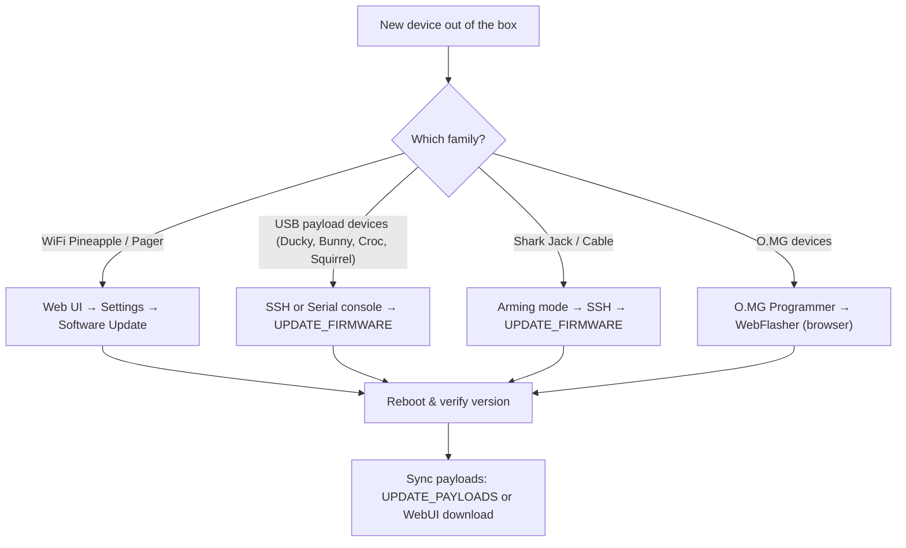

# Hak5 固件与下载 — 完整索引

> **学习目标**：读完你将能自己找到并升级任何 Hak5 设备的固件、下载 PayloadStudio 编写载荷、并从官方载荷仓库同步现成脚本。
> **适用对象**：初学者 ｜ **前置需求**：一台 Hak5 设备（任一型号）

在给你一张巨大的链接表之前，你应该先理解一台 Hak5 设备运行的两种「软件」，因为初学者总是把它们搞混：

- **固件（Firmware）** — 让硬件工作的操作系统（底层是 Linux/OpenWrt）。你很少升级它，而且只在某个你需要的功能或修复发布时才升级。
- **载荷（Payloads）** — 告诉设备*该做什么*的脚本（打这些键、跑这个扫描、抓那段流量）。你会不断更换它们。它们不是固件。

**PayloadStudio**（payloadstudio.hak5.org）是官方基于浏览器的 IDE，用于编写和编译载荷。它是*唯一*官方支持的 DuckyScript 编码器 — 旧教程让你下载 Java 或 JavaScript「编码器」的做法已经过时。PayloadStudio 完全在浏览器中运行，支持 Community（免费）和 Pro 版本。



---

## 官方固件与工具表

| 你需要什么 | 去哪里拿 | 说明 |
|---|---|---|
| **所有官方文档** | https://docs.hak5.org | 可搜索；每个产品都有自己的文档树 |
| **PayloadStudio** | https://payloadstudio.hak5.org | 所有 DuckyScript 设备的浏览器 IDE — 无需安装 |
| **WiFi Pineapple（所有型号）固件** | Web UI → *Settings → Software Update* | Pineapple 通过网络自我升级；无需手动下载 |
| **USB Rubber Ducky / Bash Bunny / Key Croc / Shark Jack / Packet Squirrel** | SSH 或串口 → `UPDATE_FIRMWARE` 辅助命令 | 见下方 SSH 章节 |
| **O.MG 设备固件** | O.MG Programmer + WebFlasher | https://o.mg.lol/setup/ — Chrome 或 Edge（WebSerial） |
| **Screen Crab / Malicious Cable Detector** | 配置驱动，无需刷固件 | 通过 MicroSD 配置文件截图/升级 |
| **Cloud C²** | https://cloudc2.io | 免费自托管的命令与控制，用于 Pineapple、Croc、Squirrel、Screen Crab |

---

## 社区载荷仓库

Hak5 维护官方 GitHub 仓库，存放社区载荷。这是在你写自己的脚本之前，看到真实可用脚本的最快方式。

| 设备 | 载荷仓库 | 里面有什么 |
|---|---|---|
| USB Rubber Ducky | https://github.com/hak5/usbrubberducky-payloads | 经典 + DuckyScript 3.0 载荷（扩展、模板） |
| Bash Bunny | https://github.com/hak5/bashbunny-payloads | switch1/2/3 载荷文件夹 |
| Key Croc | https://github.com/hak5/keycroc-payloads | 解释型 DuckyScript（无需编译）+ 语言文件 |
| Shark Jack | https://github.com/hak5/shark-payloads | 侦察、外传、访问载荷 |
| Packet Squirrel | https://github.com/hak5/packetsquirrel-payloads | 嗅探、代理、DNS 载荷 |
| WiFi Pineapple | https://github.com/hak5/wifi-pineapple-modules | 用于 PineAP 市场的模块 |
| **PayloadHub** | https://payloads.hak5.org | 可搜索、社区评分的跨设备载荷索引 |

> **不要盲目信任网上的载荷。** 你在 Hak5 设备上运行的任何脚本都会以 root 权限在 Linux 系统上执行 — 或者向目标注入键盘敲击。阅读你下载的每一个载荷。这正是专业人员在部署前会做的事。

---

## 方法 A：通过 SSH 升级固件（USB 载荷设备）

像 Bash Bunny、Shark Jack 和 Key Croc 这样的设备自带辅助命令，你可以从 shell 运行。先连接（每个设备的产品页都显示确切地址 — 例如，Shark Jack 在武装模式下监听 `172.16.24.1`）：

```bash
# Example — Shark Jack in arming mode, connected via Ethernet
ip addr add 172.16.24.2/24 dev eth0    # your machine joins the Shark's network
ssh root@172.16.24.1                    # password: hak5shark
```

预期输出：

```text
The authenticity of host '172.16.24.1' can't be established.
...
root@172.16.24.1's password:
Welcome to Shark Jack (kernel 4.x.y)
```

然后，在设备 shell 中运行升级辅助命令：

```bash
UPDATE_FIRMWARE     # check for and install firmware updates
UPDATE_PAYLOADS     # synchronise the local payload library with the remote repo
```

预期输出（固件检查）：

```text
[*] Checking for firmware updates...
[+] Firmware is up to date
```

> **为什么用辅助命令而不是 `apt upgrade`？** Hak5 刻意把升级路径锁定到经过测试的版本。在某些设备上（尤其是 USB Rubber Ducky），一次失败的固件刷写可能让设备**无法恢复** — Hak5 的保修明确排除固件刷写损坏。只使用官方升级机制。

## 方法 B：从 Web UI 升级 WiFi Pineapple

1. 连接到 Pineapple 的 AP（例如 `PineAP` 网络）并打开管理界面 — [WiFi Pineapple Mark VII 指南](/hak5/products/wifi-pineapple-mark-vii/) 显示了确切地址。
2. 进入 **Settings → Software Update**。
3. 点击 **Check for updates**，然后 **Update**。
4. 设备重启；在界面页脚验证版本。

## 方法 C：O.MG 设备（WebFlasher）

1. 把 O.MG 设备插入一台运行 **Chrome 或 Edge** 的电脑（需要 WebSerial）。
2. 打开 O.MG 设置页（https://o.mg.lol/setup/）并选择你的设备型号。
3. 按照 3 步 WebFlasher 向导操作 — 它会激活设备、安装最新固件，并（可选）先执行一次鉴识备份。
4. 或者，O.MG 固件仓库里的 Python 刷写器可以在任何操作系统上运行。

---

## 常见错误

| 错误信息 / 症状 | 原因 | 修复 |
|---|---|---|
| `ssh: Connection refused` | 设备不在武装模式 | 拨开关 / 按武装按钮；确认你的静态 IP 在设备的子网上 |
| `UPDATE_FIRMWARE: command not found` | shell 辅助命令只在固件 ≥ 1.2.0 上存在 | 从 WebUI 手动升级，或查看你确切型号的文档 |
| Pineapple「Check for updates」失败 | 没有上行连接（AP 没有互联网） | 连接以太网上行链路，或先配置客户端模式 |
| WebFlasher 显示「No device found」 | 浏览器缺少 WebSerial / 设备不在引导加载程序模式 | 使用 Chrome 或 Edge，并在向导要求之前保持 O.MG 设备未插电 |
| 载荷运行了但什么都没做 | 你把编译好的 `.bin` 复制到了期望源码的设备上，或反之 | Rubber Ducky 需要编译好的 `inject.bin`；Key Croc 直接运行解释型 `payload.txt` |

---

## 升级后：验证

```bash
# From the device shell — check the running version
cat /etc/version          # Shark Jack / Packet Squirrel
uname -a                  # any Linux-based Hak5 device
ls /root/payload/library  # payload library after UPDATE_PAYLOADS
```

预期输出：

```text
4.0.0
Linux sharkjack 4.19.0 ... # your exact kernel/version
payload1  payload2  payload3
```

还是卡住了？查看[故障排查索引](/hak5/troubleshooting-index/)或跳回[Hak5 概览](/hak5/)。