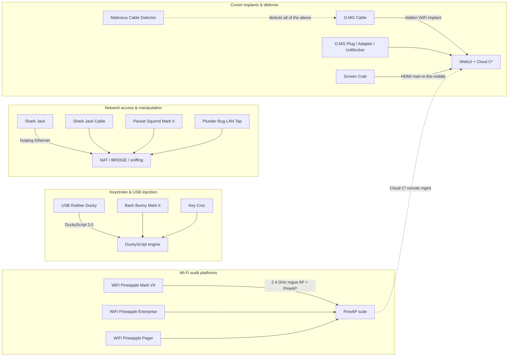

# Hak5 — 攻击性安全硬件，详解

> **一句话定位**：Hak5 是全世界最知名的「攻击型」安全硬件品牌 — 从替别人收发键盘敲击的 USB Rubber Ducky，到假装成咖啡店 Wi-Fi 的 WiFi Pineapple。本节用大学课程等级的详细度，带你一步一步认识每一台设备、怎么设置、怎么写 Payload、出了问题怎么修。

Hak5 于 2005 年以一个关于黑客与科技的播客起家，后来成长为实际上*定义了*「即插即攻」（plug-and-pwn）这一类安全硬件的公司。他们的理念很简单：**计算机对 USB 与以太网设备抱有无条件的信任 — 而这些信任边界正是你应该测试的地方。** 如果你正在学习网络安全、参加 CTF，或准备走上红队职业道路，这些工具会出现在每一个实验室、每一场会议演讲和每一份招聘启事里。

本 wiki 的这一节是你的完整学习指南：我们销售的每一款产品，都附有官方规格、适合初学者的快速入门、DuckyScript 示例，以及一个故障排查索引 — 写得让大一新生也能跟上，同时详细到在职渗透测试人员仍能发现新东西。

> **⚠️ 法律声明 — 请读一次。** 本节的所有内容仅用于**授权安全测试**：你自己的实验室、你自己的设备，或你已获得书面许可测试的网络。每个国家都有关于未经授权访问的法律（在台湾，见刑法第 358–363 条与个资法）。未经许可的黑客行为是犯罪 — 而且使用这些工具时，本页介绍的防御工具也能轻易发现你。请在你的沙盒里玩。

---

## 本 wiki 的组织方式

| 页面 | 你会找到什么 |
|---|---|
| [快速入门](/hak5/quickstart/) | 任何 Hak5 设备的前 15 分钟 — 武装模式、第一个载荷、第一次扫描 |
| [固件与下载](/hak5/firmware-downloads/) | 官方固件、PayloadStudio，以及所有载荷仓库，一张表搞定 |
| [FAQ](/hak5/faq/) | 「我需要哪台设备？」以及每个初学者都会问的问题 |
| [故障排查](/hak5/troubleshooting-index/) | LED 颜色含义、SSH 连接失败、无法运行的载荷 |
| **产品**（下方） | 全部 17 台设备的深入介绍 |

---

## Hak5 生态一览

Hak5 设备共享三个设计理念。学会一个，就全都会了：

1. **载荷优先于配置** — 你不是「编程」硬件，而是把脚本文件丢进去。
2. **武装模式** — 一个开关、按钮或按键序列，把设备变成普通的闪存盘 / Web UI，让你能安全地加载载荷。
3. **战利品文件夹** — 捕获的数据（键盘敲击、扫描结果、截图）会落在 `loot` 目录里，之后可以取走。

---

## 产品目录

### Wi-Fi 审计平台（流氓接入点）

| 设备 | 一句话 | 难度 | 页面 |
|---|---|---|---|
| **WiFi Pineapple Mark VII** | 搭载 PineAP 套件的经典双频流氓 AP — 让「邪恶双胞胎」家喻户晓的工具 | 入门 | [完整指南](/hak5/products/wifi-pineapple-mark-vii/) |
| **WiFi Pineapple Enterprise** | 1U 机架怪兽，5 组双频无线电，用于重型、多目标空域审计 | 进阶 | [完整指南](/hak5/products/wifi-pineapple-enterprise/) |
| **WiFi Pineapple Pager** | 二十周年旗舰：三频（2.4/5/6 GHz）、2.4 吋屏幕、DuckyScript 载荷 — 完全独立，无需笔记本 | 中级 | [完整指南](/hak5/products/wifi-pineapple-pager/) |

### 键盘注入与键盘记录器

| 设备 | 一句话 | 难度 | 页面 |
|---|---|---|---|
| **USB Rubber Ducky** | 键盘注入之王：一支以每秒 1,000 字速度打字的 USB 随身碟 | 入门 | [完整指南](/hak5/products/usb-rubber-ducky/) |
| **Bash Bunny Mark II** | 多向量 USB 攻击平台：键盘 + 以太网 + 串口 + 存储，同时进行，配四核大脑 | 中级 | [完整指南](/hak5/products/bash-bunny-mark-ii/) |
| **Key Croc** | 伪装成键盘转接头的硬件键盘记录器，当你打出关键词时*还会*发动攻击 | 中级 | [完整指南](/hak5/products/key-croc/) |

### 网络接入与操控

| 设备 | 一句话 | 难度 | 页面 |
|---|---|---|---|
| **Shark Jack** | 口袋大小的网络侦察盒：插入任何以太网口，几秒内得到扫描结果 | 入门 | [完整指南](/hak5/products/shark-jack/) |
| **Shark Jack Cable** | 同一台盒子，改用 USB-C 供电并带串口控制台 — 只要有电就能一直跑 | 入门 | [完整指南](/hak5/products/shark-jack-cable/) |
| **Packet Squirrel Mark II** | 内联以太网中间人：嗅探、代理、重定向 DNS，或隔离设备 — 拨一下开关就行 | 中级 | [完整指南](/hak5/products/packet-squirrel-mark-ii/) |
| **Plunder Bug LAN Tap** | 带 USB-C 的被动/主动以太网分流器 — 口袋里的 Wireshark | 入门 | [完整指南](/hak5/products/plunder-bug-lan-tap/) |

### 隐蔽植入（O.MG 家族）

| 设备 | 一句话 | 难度 | 页面 |
|---|---|---|---|
| **O.MG Cable** | 藏有隐藏 Wi-Fi 植入芯片的恶意 USB 线 — 价值 2 万美元的国家级攻击，现在就在你桌上 | 进阶 | [完整指南](/hak5/products/omg-cable/) |
| **O.MG Plug** | 同款植入芯片，装进钥匙圈 USB 插头 | 进阶 | [完整指南](/hak5/products/omg-plug/) |
| **O.MG Adapter** | 植入芯片装进 USB-A 转 C 转接头 — 也能插进手机和平板 | 进阶 | [完整指南](/hak5/products/omg-adapter/) |
| **O.MG UnBlocker** | 植入芯片藏在「安全」USB 数据阻断器里 — 防御者的工具，被武器化 | 进阶 | [完整指南](/hak5/products/omg-unblocker/) |
| **O.MG Programmer** | 激活并升级所有 O.MG 设备的通用编程器 | 中级 | [完整指南](/hak5/products/omg-programmer/) |

### 视频与防御

| 设备 | 一句话 | 难度 | 页面 |
|---|---|---|---|
| **Screen Crab** | 隐蔽的 HDMI 中间人，静默截图或录制任何显示器画面 | 中级 | [完整指南](/hak5/products/screen-crab/) |
| **Malicious Cable Detector** | 唯一能检测所有已知恶意 USB 线的消费级工具 — 包括 O.MG 自家的 | 入门 | [完整指南](/hak5/products/malicious-cable-detector/) |

---

## 你应该从哪里开始？

对这一切还很陌生？这里有一条建议的学习路径：

1. **先读[快速入门](/hak5/quickstart/)** — 它解释了武装模式、载荷和战利品，这三个概念是所有其他内容的基础。
2. **从 USB Rubber Ducky 开始** — 它是看到载荷执行最便宜、最安全、也最有教学意义的方式。你只需要自己的电脑和记事本。
3. **搭一个实验室** — 一台闲置路由器、一台旧笔记本，或一台你自己的虚拟机。[ALFA Network 专区](/alfa-network/) 解释了如何把 USB Wi-Fi 适配器与 Kali Linux 搭配使用进行监听模式，WiFi Pineapple 也很喜欢这样。
4. **升级到 WiFi Pineapple Mark VII** — 邪恶双胞胎攻击是无线安全领域最「哇」的演示，[Pineapple 指南](/hak5/products/wifi-pineapple-mark-vii/) 会一步步带你走完。
5. **当出问题时** — 先看[故障排查索引](/hak5/troubleshooting-index/)；80% 的初学者问题都出在同样的四个原因。

> **你可能会问：** *「我需要把这些全买下来才能学吗？」* 不需要。这些概念 — HID 注入、流氓 AP、网络分流 — 直接适用于你已经拥有的免费工具：一块 2 美元的 Arduino 就能打字，`hostapd` 能伪造 AP，`tcpdump` 能嗅探。Hak5 硬件只是把它们打包成足够可靠、能用于专业项目的东西。从一台设备和自己搭的实验室开始吧。