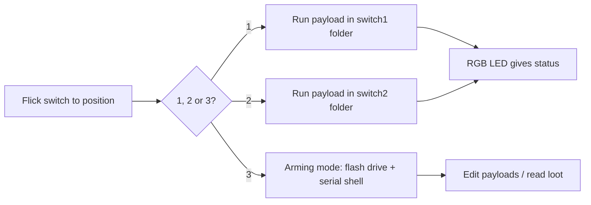

# Bash Bunny Mark II — 完整指南

> **一句话定位**：Bash Bunny Mark II 是 USB Rubber Ducky 的「全家桶」——同一支 USB 插进去，它同时可以是键盘、网卡、串口和随身碟，还能跑完整 Linux 工具。一颗四核 ARM 心脏配上 8GB 桌面级 SSD，插上后 7 秒完成渗透。

如果说 USB Rubber Ducky 是专才，那 Bash Bunny 就是**插进 USB 的瑞士军刀**。它同时模拟*多种*受信任的设备类型 — 这很重要，因为一台绝不会让流氓「键盘」靠近网络的机器，会乐意把 DHCP 租约交给一个「USB 以太网适配器」，并把 root shell 交给一个「串口控制台」。

Mark II 用四核 CPU、桌面级 SSD、翻倍的内存，以及用于远程触发和地理围栏的蓝牙 LE 升级了原版。它是物理社会工程项目的顶梁柱。

> **⚠️ 仅限授权测试。** 对你不拥有的机器进行多向量攻击是违法的。在你自己的实验室里工作，或获得书面许可。

---

## 规格一览

| 项目 | 规格 |
|---|---|
| CPU | 四核 ARM Cortex-A7 @ 最高 1.3 GHz |
| 存储 | 8 GB NAND SSD（桌面级，快速） |
| 扩展 | MicroSD XC（用于大规模外传，最高 2 TB） |
| 无线 | 蓝牙 LE（远程触发、地理围栏） |
| 攻击接口 | HID 键盘 + USB 以太网 + 串口 + USB 存储（同时） |
| 操作系统 | Debian Linux，带 root shell（预装 nmap、responder、impacket、metasploit） |
| 开关 | 3 段式模式选择器 |
| 指示灯 | 1× RGB LED |
| 控制台 | 专用串口控制台（root 终端）+ Cloud C² |
| 官方文档 | https://docs.hak5.org/bash-bunny |

## 3 段式开关

位置 3（最靠近 USB 插头）是**武装模式** — Bunny 显示为闪存盘 + 串口控制台，让你加载载荷。位置 1 和 2 会自动运行各自文件夹里存储的载荷。

```
USB plug ── switch positions ──>
   position 1: auto-run /payloads/switch1/
   position 2: auto-run /payloads/switch2/
   position 3: ARMING MODE (flash drive + serial)
```



---

## 快速入门 — 第一个载荷

### 第 1 步 — 武装 Bunny
把开关拨到**位置 3**，插进你的电脑。会出现两样东西：一个**闪存盘**（载荷区域）和一个**串口控制台**。

### 第 2 步 — 投放载荷
浏览磁盘，把你的脚本放进：

```
/payloads/switch1/payload.txt
```

针对 Windows 目标最简单的「证明它能用」载荷：

```bash
LED R                # red = running
ATTACKMODE HID STORAGE
DELAY 2000
GUI r
DELAY 500
STRING cmd
ENTER
DELAY 800
STRING echo pwned by Bash Bunny
ENTER
LED G                # green = done
```

> Bash Bunny 载荷是 **Bash** 脚本（名字里的「Bash」就是这么来的），使用 Hak5 的 `ATTACKMODE`、`LED` 和辅助命令。你可以把纯 Bash（运行 `nmap`、复制文件）与 DuckyScript 风格的 HID 注入混在一起。

### 第 3 步 — 部署
1. 弹出，拨到**位置 1**，拔掉。
2. 插进目标（你的实验室机器）。观察 LED 变红，然后变绿。
3. `cmd` 打开并打印 `pwned by Bash Bunny`。

### 第 4 步 — 串口控制台（武装模式）
拨到位置 3，连接串口控制台，获得一个 root shell 来管理文件和载荷：

```text
Username: root
Password: hak5bunny
# ls /root/loot/
```

---

## 多向量攻击 — 为什么它强大

一条 Bash Bunny 就能完成过去需要好几条线才能做的事：

| 攻击向量 | Bunny 怎么做 |
|---|---|
| 键盘注入 | HID 模式向目标打字 |
| 网络接入 | **USB 以太网**模式 — 目标给你一个 IP；你现在就*在*网络上了 |
| 数据外传 | 切换到**存储**复制文件；或通过 USB-以太网链路推出去 |
| 串口 | 模拟串口设备以触达嵌入式/控制台机器 |
| 实时工具 | 完整 Debian：`nmap`、`responder`、`impacket`、`metasploit` 就在设备上 |
| 蓝牙触发 | 通过 BLE 远程触发或地理围栏一个载荷 |

**示例 — 抓取一个文件并外传它：**

```bash
LED R
ATTACKMODE HID STORAGE
DELAY 2000
GUI r
DELAY 500
STRING powershell -c "copy C:\Users\Public\secret.txt X:\"
ENTER
DELAY 3000
LED G
```

这会输入一条 shell 命令，把文件复制到 Bunny 自己的存储盘上，完成后变绿。（用你自己的机器和你自己的文件练习！）

---

## 进阶

| 能力 | 怎么做 |
|---|---|
| 载荷切换 | 2 个自动运行开关位置 + 武装 = 无需编辑即可运行不同载荷 |
| 远程/地理围栏 | BLE：当你物理接近时触发载荷，或离开某个区域时自我销毁 |
| Root Linux shell | 带渗透工具的完整 Debian；直接进入 `nmap`/`metasploit` |
| Cloud C² 管理 | 通过 Hak5 Cloud C² 远程管理载荷/设备 |
| 大规模外传 | 2 TB MicroSD，用于复制数 GB 的战利品 |
| `GET_SWITCH_POSITION` | 载荷可以读取自己处于哪个开关位置并分支 |

---

## 故障排查

| 症状 | 原因 | 修复 |
|---|---|---|
| 位置 3 没有闪存盘 | 开关没有完全拨到武装位置 | 把开关完全推到位置 3；拔出再重新插入 |
| LED 闪红灯 | 载荷错误 | 连接串口控制台，运行载荷，读取错误 |
| 按键错误 / 什么都没打 | 布局或缺少 DELAY | 加 `LED` + `DELAY`，并针对正确的键盘布局 |
| 只有 HID 能用，没有以太网 | ATTACKMODE 没有包含 ETHERNET | 在载荷里用 `ATTACKMODE HID ETHERNET` |
| 连不上串口 | 驱动程序/波特率不对 | 使用 Hak5 USB 线和文档化的串口设置（见产品文档） |

---

## 相关资源

- [USB Rubber Ducky](/hak5/products/usb-rubber-ducky/) — 纯键盘注入，DuckyScript 基础
- [Key Croc](/hak5/products/key-croc/) — 键盘记录 + 解释型 DuckyScript
- [Packet Squirrel Mark II](/hak5/products/packet-squirrel-mark-ii/) — 以太网侧的操控
- [固件与下载](/hak5/firmware-downloads/) — Bash Bunny 载荷仓库与固件
- [故障排查索引](/hak5/troubleshooting-index/)
- [Hak5 概览](/hak5/)