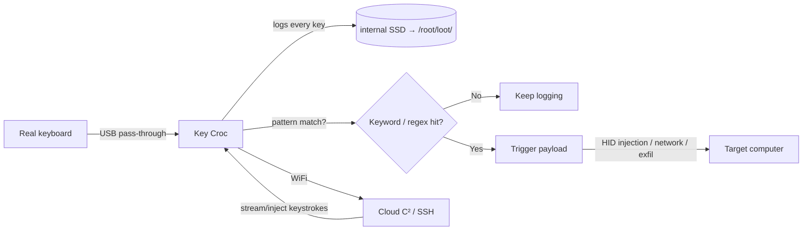

# Key Croc — 完整指南

> **一句话定位**：Key Croc 是一台伪装成键盘转接头的「智能型硬件键盘侧录器」——它记录你打下的每个字，而且当你打出特定关键词（例如「密码」、「password」）时，它会自动触发预载的攻击载荷。

Key Croc 看起来像一个无害的 USB 键盘直通转接头。串在键盘和电脑之间，它会悄悄地把**每一次键盘敲击**记录到内部存储。但它远不止是一个记录器：利用**模式匹配**，它监视键盘敲击流中感兴趣的字词（一个关键词或正则表达式），一旦匹配就触发预载的**攻击载荷** — 甚至克隆键盘的硬件 ID，让它与普通转接头无法区分。

它运行 DuckyScript **2.0**，这是*解释型*的 — 载荷直接从 `payload.txt` 源码运行，无需编译。结合 WiFi + Cloud C²，操作员可以从任何地方查看键盘敲击、注入键盘敲击、管理载荷。

> **⚠️ 仅限授权测试。** 键盘记录是整个目录里最侵犯隐私的攻击。只针对你自己的系统部署，或获得明确、书面的授权。

---

## 规格一览

| 项目 | 规格 |
|---|---|
| CPU | 四核 ARM Cortex-A7 @ 1.2 GHz |
| 存储 | 8 GB 桌面级 SSD |
| 接口 | USB-A（主机侧）+ USB-A（键盘侧）+ 串口控制台 |
| 无线 | 集成 2.4 GHz Wi-Fi 天线（802.11 b/g/n） |
| 操作系统 | Debian Linux，root shell + SSH |
| 载荷语言 | DuckyScript 2.0（解释型），外加 Bash |
| 键盘记录 | 开箱即用，零配置 — 记录到 `/root/loot/keystrokes.log` |
| Cloud C² | 支持 — 串流/注入键盘敲击、管理载荷、外传战利品 |
| 隐身 | 记录时 LED 关闭；克隆键盘硬件 ID |
| 官方文档 | https://docs.hak5.org/key-croc |

## 结构

| 部件 | 用途 |
|---|---|
| USB-A（主机侧） | 插入目标电脑 |
| USB-A（键盘侧） | 真实键盘插在这里（直通） |
| 隐藏武装按钮 | 插入时按下 → 变成闪存盘 |
| RGB LED | 记录键盘时关闭（隐身）；设置/攻击时点亮 |
| 串口控制台 | 用于高级操作的完整 root shell |

---

## 数据流



---

## 快速入门 — 30 秒开始记录键盘

### 第 1 步 — 无需配置
Key Croc 开箱即记录。只需：

1. 把**主机**侧插进目标电脑。
2. 把真实键盘插进**键盘**侧。
3. 打字。每一次敲击都会记录到 `/root/loot/keystrokes.log`。

### 第 2 步 — 读取战利品
插入时按住**隐藏武装按钮**（或按住后重新连接），把 Croc 变成闪存盘，然后读取日志：

```text
2026-08-21 14:31:02  user typed: root
2026-08-21 14:31:05  user typed: P@ssw0rd
2026-08-21 14:31:10  user typed: https://yupitek.com
```

### 第 3 步 — SSH 进入（武装模式）
把你的电脑网卡设为 `172.16.0.0/24`，然后：

```bash
ip addr add 172.16.0.2/24 dev eth0
# browse to http://172.16.0.1  (web UI)  or
ssh root@172.16.0.1        # password: hak5croc
```

从这里你可以控制 WiFi、Cloud C² 和载荷。

---

## 模式匹配载荷 — 杀手级功能

不只是记录，告诉 Croc 在看到某些东西时*行动*：

```text
QUACK STRING hello       # DuckyScript 2.0 drops the classic STRING for QUACK
```

**示例 — 打出关键词时触发：**

```text
MATCH_STRING password
QUACK STRING (recorded)
```

当受害者打出「password」（即使有退格修正的笔误），Croc 会：
1. 触发匹配的载荷。
2. 可以保存匹配*之前*或*之后*打出的键盘敲击。
3. 触发载荷 — 它可以注入 HID 键盘敲击、在网络中横向移动，或通知 Cloud C²。

**示例 — 匹配时通知 Cloud C²：**

```text
MATCH_REGEX (api[_-]?key|secret|token)
CLOUD_C2 "Keyword of interest typed!"
```

> **你可能会问：** *「有退格它怎么还能匹配？」* Croc 实时解码键盘敲击流，所以它理解的是打出的*结果*（处理退格），而不是原始按键。这就是为什么它的语言文件是整体预生成的，能精确解码整个键盘。

---

## 攻击模式

| 模式 | 模拟什么 | 用于 |
|---|---|---|
| HID | 键盘 | 直通 + 键盘注入 |
| Ethernet | USB 网卡 | 获得目标网络访问，绕过外围防火墙 |
| Storage | 闪存盘 | 武装、文件传输 |
| Serial | 串口设备 | 对控制台/嵌入式系统的巧妙攻击 |

单个载荷可以组合模式 — Croc 可以同时记录*并*横向进入网络。

---

## 进阶

| 能力 | 怎么做 |
|---|---|
| Cloud C² 实时视图 | 实时串流键盘敲击；从浏览器注入你自己的 |
| 远程 root shell | Cloud C² 或 SSH → 带 `nmap`、`responder`、`impacket`、`metasploit` 的完整 Debian |
| 网络横向移动 | 模拟 USB 以太网 → 攻击者在网络内获得立足点 |
| 正则触发 | `MATCH_REGEX` 匹配模式，而不只是固定关键词 |
| WiFi | 2.4 GHz 天线，即使藏在目标桌下也能连接 C²/网络 |
| 解释型载荷 | 把 `payload.txt` 直接放进正确的文件夹 — 无需编译 |

---

## 故障排查

| 症状 | 原因 | 修复 |
|---|---|---|
| 没有记录到键盘敲击 | 键盘没有正确直通，或处于载荷模式 | 重新插好键盘；检查武装与记录状态 |
| 找不到武装按钮 | 它是隐藏的 | 用回形针；插入时按下 |
| `QUACK` 不被识别 | 在 2.0 设备上用了 DuckyScript 3.0 命令 | Key Croc 是 DuckyScript 2.0 — 用 `QUACK`，不是 `STRING` |
| Web UI/SSH 无法访问 | 子网不对 | 把网卡设为 `172.16.0.0/24` 并使用 `172.16.0.1` |
| Cloud C² 连不上 | WiFi 未配置 | 在武装模式配置里设置 WiFi；指向你的 C² 服务器 |

---

## 相关资源

- [USB Rubber Ducky](/hak5/products/usb-rubber-ducky/) — DuckyScript 3.0（编译型）概念
- [Bash Bunny Mark II](/hak5/products/bash-bunny-mark-ii/) — 多向量 USB 攻击
- [Malicious Cable Detector](/hak5/products/malicious-cable-detector/) — 能发现这类记录器的防御工具
- [固件与下载](/hak5/firmware-downloads/) — keycroc 载荷仓库与固件
- [故障排查索引](/hak5/troubleshooting-index/)
- [Hak5 概览](/hak5/)