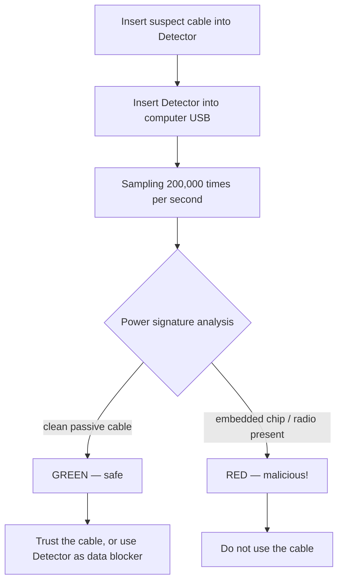

# Malicious Cable Detector — 完整指南

> **一句话定位**：Malicious Cable Detector 是目前市面上唯一能检测「所有已知恶意 USB 线材」的防御型小工具——包括 O.MG Cable 家族——它用每秒 20 万次的侧信道电力分析找出藏在线材里的植入芯片。同时它也是一颗数据阻断器，能安全充电。

这是 Hak5 目录里罕见的*防御*工具 — 而且它由制造 O.MG 恶意线的同一团队打造。这正是重点：制造最好隐身植入物的人，最清楚怎么找到它们。

为什么需要它？大多数恶意线可以通过寻找 USB 数据线上的异常信号来发现。但 O.MG 线在载荷触发前**在数据线上不可见**。更糟的是，它们物理上看起来正常。要抓住休眠的植入物，你必须看植入物藏不了的地方：**功耗**。Detector 每秒采样一条线的功耗 200,000 次，分析它的「行为指纹」，寻找嵌入式微控制器/无线电的特征电气签名。

> **诚实的局限：** 它能检测*所有已知的*商用恶意线和共享同一电气家族的专业消费者设计。没有工具能保证抓住定制的国家级植入物 — 但对企业出行、会议和事件响应来说，它是实用的防御。

---

## 规格一览

| 项目 | 规格 |
|---|---|
| 检测方法 | 侧信道电力分析 |
| 分析速率 | 每秒 200,000 次采样 |
| 接口 | USB-A（接电脑）+ USB-A（被测线） |
| 附加功能 | USB 数据阻断器（安全充电，数据被阻断） |
| 指示灯 | LED 活动灯 |
| 电源 | 总线供电（无电池） |
| 可改装性 | 6 针 ISP 接头 + 焊桥（Arduino IDE 改装、串口输出、数据阻断/直通选择） |
| 尺寸 / 重量 | 约 17 × 9 × 1 cm，约 13 g |
| 官方文档 | https://docs.hak5.org |

---

## 检测如何运作



| 信号 | Detector 读到什么 |
|---|---|
| 纯被动线 | 无嵌入式电子 → 干净的功耗 → **安全** |
| 基本恶意线 | 数据线上有活动 → 轻松抓住 |
| **O.MG / 休眠植入物** | 数据线不活动，但功耗出卖了隐藏芯片 → **抓住** |

---

## 快速入门 — 一分钟内测试一条线

### 第 1 步 — 连接
1. 把可疑 USB 线插进 **Detector 的**线侧端口。
2. 把 **Detector** 插进你电脑的 USB 端口。
3. 等几秒让电力稳定。

### 第 2 步 — 读取 LED
检查 LED 活动灯：

| LED | 含义 |
|---|---|
| 绿色 / 干净 | 未检测到植入物 — 线可以安全使用 |
| 红色 / 警告 | 检测到植入物 — **不要使用这条线** |

### 第 3 步 — 根据结果行动
- **安全：** 继续使用这条线，或让它穿过 Detector 同时充当数据阻断器。
- **不安全：** 标记这条线供调查 / 销毁它，并向你的安全团队记录事件。

> **你可能会问：** *「它能检测休眠状态的 O.MG 线吗？」* **能 — 这是它的招牌能力。** 因为 O.MG 线藏在数据线上，Detector 的电力分析方法就是专门设计来看到它们的，即使完全休眠。

---

## 用作数据阻断器

Detector 兼作**USB 数据阻断器（USB 保险套）**用于安全充电：

- 向你的设备通过电力。
- **阻断数据线**，所以恶意端口无法外传或植入。
- 焊桥让你在数据阻断和数据直通行为之间选择（硬件改装）。

---

## 进阶 / 改装

| 能力 | 怎么做 |
|---|---|
| 固件改装 | 6 针 ISP 接头 — 用标准廉价编程器通过 Arduino IDE 编程 |
| 串口输出 | 通过焊桥启用，用于调试/数据流 |
| 数据阻断 vs 直通 | 焊桥可选行为 |
| 事件响应套件 | 搭配标签机，在审计期间标记好线 vs 坏线 |

---

## 实操：审计你的桌面

一个使用 Detector 的具体「线材卫生」例行程序：

```text
1. For each cable on your desk / travel bag:
   a. Plug it into the Detector → computer.
   b. Read the LED.
   c. Safe → label GREEN and return to use.
   d. Unsafe → label RED, quarantine, and report.
2. For conference/freebie cables: test every single one before use.
3. For travel: test your own cables before each trip (implants can be swapped).
```

---

## 故障排查

| 症状 | 原因 | 修复 |
|---|---|---|
| 完全没有 LED | Detector 没收到电 | 确保牢固插在有电的 USB 端口 |
| 编织线上误报 | 异常屏蔽短暂改变功耗 | 重新测试；保持几秒让电力稳定 |
| 数据意外直通 | 焊桥设为直通 | 把焊桥改为数据阻断（见文档） |
| 线插不到位 | 与笨重连接器的机械配合问题 | 用标准外形线 / 转接头；牢固重新插好 |
| 想要视频/照片证据 | — | 录制 LED 读数；照片对事件报告很有用 |

---

## 相关资源

- [O.MG Cable](/hak5/products/omg-cable/) — 这个 Detector 就是为找到它而造的植入物
- [O.MG UnBlocker](/hak5/products/omg-unblocker/) — *带*植入物的数据阻断器（测试你的！）
- [Key Croc](/hak5/products/key-croc/) — 在可疑端口上要检查的键盘记录器转接头
- [固件与下载](/hak5/firmware-downloads/) — 文档与升级信息
- [故障排查索引](/hak5/troubleshooting-index/)
- [Hak5 概览](/hak5/)