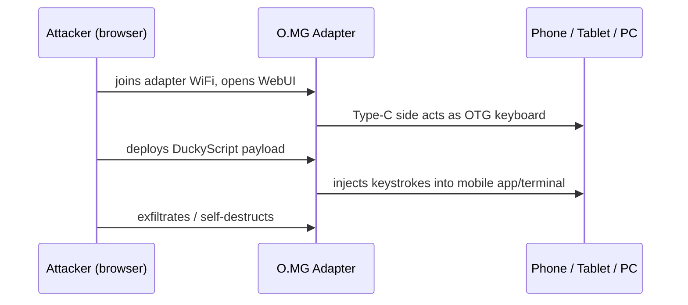

# O.MG Adapter — 完整指南

> **一句话定位**：O.MG Adapter 把无线植入芯片藏在一颗「USB-A 转 USB-C 转接头」里——你今天可能刚刚用它帮平板充电，却不知道它能通过 Wi-Fi 被控制。它特别的地方是：Type-C 这一端能对**手机与平板**执行键盘注入。

O.MG 家族把植入物藏在日常 USB 物品里。**Adapter** 选择了最常见的旅行配件：每个人都带着给现代设备充电的 USB-A 转 USB-C 小转接头。因为 Type-C 端是*活动*端，它表现得像一个 **OTG 转接头** — 把它插进手机或平板的 Type-C 口，你就能向移动设备部署载荷，而不只是电脑。

当它不传输载荷时，Adapter 会通过正常的 USB 2.0 数据，同时植入物保持不可检测。这是把 O.MG 能力带进移动优先世界的低调方式。

> **⚠️ 仅限授权测试 — 出厂停用。** 只在你拥有的设备上测试，或获得书面许可。搭配 [Malicious Cable Detector](/hak5/products/malicious-cable-detector/) 了解防御侧。

---

## 规格一览

| 项目 | 规格 |
|---|---|
| 外形 | USB-A（主机）→ USB-C（活动/攻击侧）转接头 |
| 植入物 | 支持 Wi-Fi 的无线 HID 芯片（WebUI + 802.11 无线电） |
| 载荷语言 | DuckyScript 3.0（Elite）/ 2.0（Basic） |
| 移动设备 | OTG 活动 Type-C 侧 — 向手机和平板注入 |
| 激活 | 必须通过 [O.MG Programmer](/hak5/products/omg-programmer/) — 出厂停用 |
| 特色功能 | 自我销毁、地理围栏、Wi-Fi 触发、伪造身份、数据直通 |
| 官方文档 | https://docs.hak5.org/omg-cable |

---

## 为什么这个转接头重要 — 移动攻击



| 场景 | 为什么用 Adapter |
|---|---|
| 手机/平板渗透测试 | Type-C OTG 能在 USB-A 设备做不到的地方注入 |
| 充电站社会工程 | 每个人都会拿起 A 转 C 转接头 |
| 移动优先项目 | 现代目标就是智能手机 |
| 电脑 + 移动覆盖 | 同一个转接头两者都能用 |

---

## 快速入门（3 步激活）

1. **激活：** 把 Adapter 插进 [O.MG Programmer](/hak5/products/omg-programmer/)，插进 Chrome/Edge 机器，打开 WebFlasher（https://o.mg.lol/setup/），3 步向导。
2. **连接：** 从浏览器加入 Adapter 的 Wi-Fi；打开它的 WebUI。
3. **部署：** 把 **Type-C** 端插进目标（手机、平板或 PC），然后触发载荷 — 它通过 OTG HID 链路注入。

```text
REM On an Android test device, open a terminal app and type
DELAY 1500
STRING echo hello from O.MG adapter
ENTER
```

---

## 进阶与隐身

| 功能 | 作用 |
|---|---|
| OTG 活动 Type-C | 向智能手机/平板部署载荷（使用 Type-C 侧） |
| 数据直通 | 休眠时正常 USB 2.0 数据；植入物不可见 |
| 可伪造身份 | 克隆 VID/PID / 扩展 USB ID / MAC |
| 自我销毁 / 地理围栏 / Wi-Fi 触发 | 标准 O.MG 安全控制 |
| 加密 C²（Elite） | 从任何地方通过加密隧道远程控制 |
| 硬件键盘记录器（Elite） | FullSpeed USB 键盘记录器附加组件，带额外存储 |

---

## 故障排查

| 症状 | 原因 | 修复 |
|---|---|---|
| 无 WebUI | 未激活 | 通过 Programmer 激活 |
| 手机收不到键盘敲击 | 用错端 / OTG 模式 | 在移动设备上用 Type-C 侧（活动）；在 PC 上用 USB-A |
| WebFlasher 检测不到 | 浏览器 / 引导加载程序 | Chrome 或 Edge（WebSerial）；提示前保持未插电 |
| 数据能过但无法攻击 | 休眠 / 载荷未触发 | 通过 WebUI 或 Wi-Fi 信标触发 |

---

## 相关资源

- [O.MG Cable](/hak5/products/omg-cable/) / [O.MG Plug](/hak5/products/omg-plug/) — 兄弟植入物
- [O.MG UnBlocker](/hak5/products/omg-unblocker/) — 植入物在数据阻断器里
- [O.MG Programmer](/hak5/products/omg-programmer/) — 激活与升级
- [Malicious Cable Detector](/hak5/products/malicious-cable-detector/) — 检测
- [固件与下载](/hak5/firmware-downloads/) — O.MG 固件与 WebFlasher
- [故障排查索引](/hak5/troubleshooting-index/)
- [Hak5 概览](/hak5/)