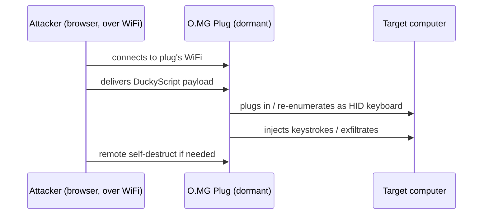

# O.MG Plug — 完整指南

> **一句话定位**：O.MG Plug 把 O.MG 的无线植入芯片塞进一支「钥匙圈 USB 随身碟」外型的插头——挂在钥匙上完全不起眼，一旦插进目标的 USB 孔，就能通过 Wi-Fi 远程注入按键、执行 DuckyScript 载荷。

[O.MG Cable](/hak5/products/omg-cable/) 把植入物藏在一条线里。**O.MG Plug** 把完全相同的植入物藏在更不起眼的东西里：一个看起来像廉价 U 盘 / 手机充电块的钥匙圈 USB 插头。它是「留在桌上，希望有人插上它」的社会工程工具。

同样的能力，不同的伪装。因为它是插头而不是线，携带更容易，塞进目标的 USB 口也更容易 — 经典的「捡到一支 U 盘，好奇心毁了安全态势」场景。

> **⚠️ 仅限授权测试 — 出厂停用。** 只在你自己的实验室或获得明确授权时使用。防御见 [Malicious Cable Detector](/hak5/products/malicious-cable-detector/)。

---

## 规格一览

| 项目 | 规格 |
|---|---|
| 外形 | 钥匙圈 USB 插头（看起来像 U 盘） |
| 植入物 | 支持 Wi-Fi 的无线 HID 芯片（WebUI + 802.11 无线电） |
| 载荷语言 | DuckyScript 3.0（Elite）/ 2.0（Basic） |
| 激活 | 必须通过 [O.MG Programmer](/hak5/products/omg-programmer/) — 出厂停用 |
| 触发 | Wi-Fi — 远程信标触发、地理围栏 |
| 特色功能 | 自我销毁、地理围栏、伪造 VID/PID/MAC、WebUI 控制 |
| 官方文档 | https://docs.hak5.org/omg-cable |

> Plug 的硬件等级（Basic/Elite）与 O.MG Cable 相同 — 完整的 Basic vs Elite 对比表（槽位、速度、键盘记录器、隐身链路、加密 C²）见 [O.MG Cable 页面](/hak5/products/omg-cable/)。

---

## 用例与攻击流程

O.MG 家族的缩略版，用于插头：



| 场景 | 为什么 Plug 合适 |
|---|---|
| USB 丢弃 / 「捡到一支 U 盘」 | 看起来像无辜的 U 盘 |
| 钥匙圈携带 | 永远随身，永远可否认 |
| 摆渡式社会工程 | 伪装成留在桌上的充电块 |
| 红队演示 | 教团队可移动介质攻击如何运作 |

---

## 快速入门（3 步激活）

1. **激活：** 把 Plug 插进 [O.MG Programmer](/hak5/products/omg-programmer/)，把 Programmer 插进 Chrome/Edge 机器，打开 WebFlasher（https://o.mg.lol/setup/），按 3 步向导操作。
2. **连接：** 激活后，从浏览器加入 Plug 的 Wi-Fi 并打开它的 WebUI。
3. **部署：** 点击一个 DuckyScript 载荷的 **Run** — Plug 会向它插着的任何东西注入。

```text
REM Proof-of-concept — open notepad, type a message
DELAY 1000
GUI r
DELAY 500
STRING notepad
ENTER
DELAY 800
STRING Hello from an O.MG Plug!
ENTER
```

---

## 隐身与进阶

| 功能 | 作用 |
|---|---|
| 端口隐身 | 载荷部署前保持休眠 — 不枚举、无日志 |
| 可伪造身份 | 克隆 VID/PID / 扩展 USB ID / MAC |
| 自我销毁 | 远程清除 → 失效；可通过 Programmer 恢复 |
| 地理围栏 | 基于位置触发或自我销毁 |
| Wi-Fi 触发 | 用单个信标远程触发载荷 |
| 批量固件（Elite） | Programmer 可以刷写多台设备用于批量部署 |

---

## 故障排查

| 症状 | 原因 | 修复 |
|---|---|---|
| 无 WebUI / 休眠 | 未激活 | 通过 Programmer 激活 |
| WebFlasher 看不到它 | 浏览器不对 / 不在引导加载程序模式 | Chrome 或 Edge（WebSerial）；提示前保持未插电 |
| 作为 U 盘看起来「不对劲」 | 载荷武装时枚举为 HID | 只有你触发时才枚举 — 休眠时预期正常 |
| 载荷不打字 | 布局不匹配 | 加载正确的键盘布局 / 使用正确的 DuckyScript 版本 |

---

## 相关资源

- [O.MG Cable](/hak5/products/omg-cable/) — 同款植入物，伪装成线
- [O.MG Adapter](/hak5/products/omg-adapter/) — 植入物在 USB-A 转 C 转接头里
- [O.MG UnBlocker](/hak5/products/omg-unblocker/) — 植入物在数据阻断器里
- [O.MG Programmer](/hak5/products/omg-programmer/) — 激活与升级
- [Malicious Cable Detector](/hak5/products/malicious-cable-detector/) — 检测
- [固件与下载](/hak5/firmware-downloads/) — O.MG 固件与 WebFlasher
- [故障排查索引](/hak5/troubleshooting-index/)
- [Hak5 概览](/hak5/)