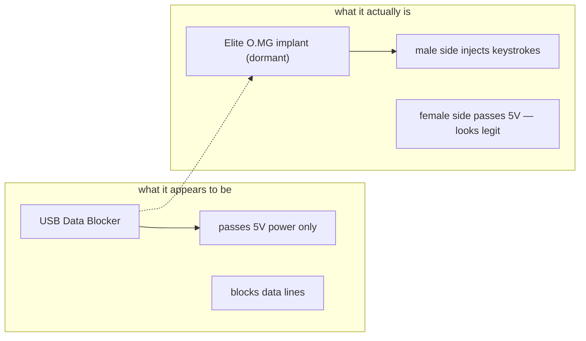

# O.MG UnBlocker — 完整指南

> **一句话定位**：O.MG UnBlocker 把无线植入芯片藏进一颗「安全 USB 数据阻断器（USB 保险套）」里——那个人人都相信最安全的设备，其实是颗随时能被 Wi-Fi 遥控的攻击端点。

有一种众所周知的防御硬件：**USB 数据阻断器**（「USB 保险套」）。它只通过电力并阻断数据线，所以你可以安全地从未知端口充电。它是旅行者和高管的推荐首选。O.MG UnBlocker 把这种信任武器化：它看起来、用起来都完全像一个数据阻断器，但里面藏着一颗休眠的 O.MG 无线植入物。

**公**端是活动攻击侧 — 插进目标时，它可以传输载荷。**母**端像真正的阻断器一样向下游通过 5V 电力，所以骗局成立。自定义标签以匹配你的目标环境，获得最大可信度。它包含 Elite 系列植入物，提供业界领先的速度和未来的固件能力。

> **⚠️ 仅限授权测试 — 出厂停用。** 这是整个目录里最具欺骗性的工具，直指人们无条件信任的*防御*小工具。只在你自己的系统上和授权项目内测试它。

---

## 规格一览

| 项目 | 规格 |
|---|---|
| 外形 | USB 数据阻断器外观（3 种颜色；自定义标签/标志） |
| 植入物 | Elite 系列 O.MG 无线 HID 芯片，触发前保持休眠 |
| 端口 | USB-A 公（活动攻击侧）+ USB-A 母（5V 电力直通） |
| 载荷语言 | DuckyScript 3.0（Elite） |
| 注入速度 | 最高 890 键/秒 |
| 载荷槽位 | 最多 200（带额外存储） |
| 键盘映射 | 内置 192 种全局键盘映射 |
| 激活 | 必须通过 [O.MG Programmer](/hak5/products/omg-programmer/) — 出厂停用 |
| 特色功能 | 自我销毁、地理围栏、Wi-Fi 触发、伪造 ID、端口隐身、WebUI 内置 IDE |
| 官方文档 | https://docs.hak5.org/omg-cable |

---

## 骗局，详解



| 场景 | 为什么用 UnBlocker |
|---|---|
| 受信任设备社会工程 | 每个人都会把手机插进「安全」数据阻断器 |
| 高管出行 | 预先放在受信任充电器旁边 — 最没人怀疑的设备 |
| 蓝队培训 | 演示即使是「安全」硬件也可能被攻陷 |
| 红队诱饵 | 自定义标签/标志以匹配目标环境 |

---

## 快速入门（3 步激活 + 使用）

1. **激活：** 插进 [O.MG Programmer](/hak5/products/omg-programmer/)，插进 Chrome/Edge 机器，打开 WebFlasher（https://o.mg.lol/setup/），3 步向导。
2. **连接：** 从浏览器加入 UnBlocker 的 Wi-Fi；打开它的 WebUI（含内置 IDE）。
3. **部署：** 把**公**端插进目标；从 WebUI 触发 DuckyScript 载荷。

```text
REM Proof-of-concept — open notepad and type
DELAY 1000
GUI r
DELAY 500
STRING notepad
ENTER
DELAY 800
STRING Hello from an O.MG UnBlocker!
ENTER
```

WebUI 的内置 IDE 在你构建载荷时提供实时反馈（语法高亮、错误捕获）。

---

## 隐身与进阶

| 功能 | 作用 |
|---|---|
| 端口隐身 | 载荷部署前保持休眠 — 不枚举、无日志 |
| 可伪造身份 | 克隆 VID/PID / 扩展 USB ID / MAC |
| 全局键盘映射 | 192 种布局，攻击世界各地的机器 |
| 自我销毁 | 远程清除 → 失效；可通过 Programmer 恢复 |
| 地理围栏 | 设备离开范围时触发/自我销毁 |
| Wi-Fi 触发 | 远程单信标载荷触发 |
| 加密 C²（Elite） | 从任何地方远程控制；可禁用板载 WebUI |
| HIDX StealthLink | 双向隧道 目标 ↔ O.MG ↔ 控制 |

---

## 故障排查

| 症状 | 原因 | 修复 |
|---|---|---|
| 无 WebUI / 惰性 | 未激活 | 通过 Programmer 激活 |
| 只有「安全」行为 | 休眠 — 尚未被触发 | 通过 WebUI / Wi-Fi 信标触发 |
| WebFlasher 检测不到 | 浏览器 / 引导加载程序 | Chrome 或 Edge（WebSerial）；提示时连接设备 |
| 载荷慢 | DuckyScript 版本不对 | 在最新固件上对 Elite 植入物使用 DuckyScript 3.0 |
| 意外自我销毁 | 地理围栏/规则在范围外触发 | 用 Programmer 恢复；收紧地理围栏范围 |

---

## 相关资源

- [O.MG Cable](/hak5/products/omg-cable/) / [O.MG Plug](/hak5/products/omg-plug/) / [O.MG Adapter](/hak5/products/omg-adapter/) — O.MG 家族
- [O.MG Programmer](/hak5/products/omg-programmer/) — 激活与升级
- [Malicious Cable Detector](/hak5/products/malicious-cable-detector/) — 能抓住它的工具
- [USB Rubber Ducky](/hak5/products/usb-rubber-ducky/) — DuckyScript 参考
- [固件与下载](/hak5/firmware-downloads/) — O.MG 固件与 WebFlasher
- [故障排查索引](/hak5/troubleshooting-index/)
- [Hak5 概览](/hak5/)