# Packet Squirrel Mark II — 完整指南

> **一句话定位**：Packet Squirrel Mark II 是一部「夹在网络中间的小盒子」——把目标设备接上 Target 口、把真正的网络接上 Network 口，它就位于流量路径上，能嗅探、改写、重导甚至切断流量。三向拨杆一掰就换一套载荷。

[Shark Jack](/hak5/products/shark-jack/) 是跳*到*一个网络上扫描它，而 **Packet Squirrel** 则坐*在*一条网络链路*里面*，成为中间人。它是演示（和防御）内联拦截的完美方式：把它插在设备和它的网络之间，拨一下开关，它就捕获、代理、重定向或隔离那台设备的流量。

Mark II 运行 DuckyScript、Bash 和 Python 载荷，并加入 VPN 支持（WireGuard）、动态代理、DNS 操控和 Cloud C²。红队喜欢它来投放静默分流器，蓝队喜欢它来精确理解内联 MITM 的工作原理。

> **⚠️ 仅限授权测试。** 拦截你不拥有的流量是违法的。只在你自己的设备和网络上使用 Squirrel。

---

## 规格一览

| 项目 | 规格 |
|---|---|
| 端口 | 2× 以太网（Target + Network）+ USB 2.0 主机 |
| 电源 | USB-C（仅 0.2 A） |
| 接口 | 内联二层 / 三层设备在中间 |
| 载荷 | DuckyScript + Bash + Python |
| 网络 | NAT、BRIDGE、TRANSPARENT、JAIL、ISOLATE 模式 |
| 操控 | 动态代理、killport、killstream、spoof-DNS、DNS 沉洞、数据包捕获 |
| VPN | NAT/BRIDGE 模式下支持 WireGuard |
| 武装/配置 | Web UI + SSH 在 `172.16.32.1` |
| 尺寸 / 重量 | 50 × 40 × 15 mm，24 g |
| 官方文档 | https://docs.hak5.org/packet-squirrel-mk-ii |

## 结构

| 部件 | 用途 |
|---|---|
| **Target** 以太网口（左上） | 你想监视/操控的设备 |
| **Network** 以太网口（右上） | 真正的网络 / 上行链路 |
| 3 段式开关 | 选择运行哪个载荷 |
| USB-C | 供电 |
| USB 2.0 主机 | 存储 / 额外接口 |

---

## 网络模式（核心所在）

Squirrel 的行为由载荷通过 `NETMODE` 命令设置。90% 的学习都发生在这里：

| 模式 | 作用 | 隐身性 | VPN/C² |
|---|---|---|---|
| `NAT` | 作为自己的路由器把 Target 路由到 Network（DHCP 172.16.32.X） | 低 | ✅ |
| `BRIDGE` | 透明二层桥接（Target 从网络获取 IP） | 中 | ✅ |
| `TRANSPARENT` | 与桥接相同但**哪里都不可见**（没有自己的 IP） | 最高 | ❌ |
| `JAIL` | 断开 Target 与网络的连接；Squirrel 保留网络访问 | — | ✅ |
| `ISOLATE` | 断开 Target *并*把 Squirrel 也踢下网 | — | ❌ |

```mermaid
%% name: hak5-product-packet-squirrel-mark-ii-inline
flowchart LR
    T[Target device] -->|Target port| S[Packet Squirrel]
    S -->|Network port| N[Real network / router]
    style S fill:#333,stroke:#fff
    subgraph inline["Traffic path — Squirrel is in the middle"]
        T
        S
        N
    end
    S -.->|"sniff / proxy / DNS / jail"| A[Loot + observations]
```



> **你可能会问：** *「我该用哪个模式？」* 学习时，**NAT** 最容易（你控制 DHCP）。要真正的隐身，**TRANSPARENT** 不留痕迹 — 但你会失去 VPN/C²。按「安静」还是「连通」哪个更重要来选择。

---

## 快速入门 — 第一次捕获

### 第 1 步 — 接线
1. **Network** 口 → 你的路由器/交换机。
2. **Target** 口 → 你想监视的设备（你的测试笔记本！）。
3. 用 USB-C 供电。

### 第 2 步 — 武装模式
把开关放到**武装**位置。把你的网卡设为 `172.16.32.0/24`，然后浏览到 Web UI（或 SSH）：

```
http://172.16.32.1
```

设置管理员密码，然后就能加载或编辑载荷。

### 第 3 步 — 运行嗅探载荷
把一个数据包捕获载荷放到某个开关位置，拨过去，观察设备的流量：

```bash
# From the Squirrel shell (arming mode / SSH)
tcpdump -i eth0 -w /root/loot/capture.pcap
```

然后在笔记本上用 Wireshark 打开 `.pcap` 进行分析。

---

## 载荷思路与命令

| 目标 | 命令 / 载荷 |
|---|---|
| 嗅探到文件 | `tcpdump -i eth0 -w /root/loot/capture.pcap` |
| 阻断一个 TCP 端口 | `killport 80`（TCP RST 注入） |
| 按内容切断 TCP 流 | `killstream "secret"` |
| 伪造 DNS 应答 | `spoofdns example.com 1.2.3.4` |
| 沉洞所有 DNS | `DNS SINKHOLE`（重定向选定的域名） |
| 改写流量 | `DYNAMIC PROXY`（记录/修改客户端-服务器数据） |
| 大按钮网络开关 | `GATEKEEPER` — 按下按钮切断链路 |

```text
REM Example payload — capture traffic and sinkhole known-bad domains
NETMODE BRIDGE
LED R
DNS SINKHOLE bad-domain.example.com
tcpdump -i eth0 -w /root/loot/capture.pcap &
LED G
```

---

## 进阶

| 能力 | 怎么做 |
|---|---|
| WireGuard VPN | 在 NAT/BRIDGE 模式下加密 Squirrel 的网络路径 |
| Cloud C² | 远程管理载荷 + 卸载战利品 |
| Python 载荷 | 用完整 Python 编写更多逻辑 |
| 后台命令 | 运行长任务，然后从 shell 交互 |
| 流量检测（蓝队） | 用 JAIL + 过滤器在项目中途隔离被攻陷的设备 |
| USB 主机扩展 | 挂载存储以扩大战利品容量 |

---

## 故障排查

| 症状 | 原因 | 修复 |
|---|---|---|
| TRANSPARENT 下 Target 没有 IP | 由网络分配 IP — 需要有真实上行链路 | 验证 Network 口链路；或改用 NAT 获得独立 DHCP |
| 经过 Squirrel 的互联网变慢 | NAT 模式在改写 | NAT 下属正常；用 BRIDGE/TRANSPARENT 保留 IP |
| Web UI 无法访问 | 子网不对 | 网卡设为 `172.16.32.0/24`，浏览 `172.16.32.1` |
| killport/killstream 无效 | 目标使用不同的端口/模式 | 匹配确切端口；检查你固件的载荷语法 |
| 载荷不自动运行 | 开关位置与载荷文件夹映射不对 | 验证哪个开关位置运行哪个载荷 |

---

## 相关资源

- [Shark Jack](/hak5/products/shark-jack/) — 跳*到*网络上（vs 坐*在*里面）
- [Plunder Bug LAN Tap](/hak5/products/plunder-bug-lan-tap/) — 仅被动嗅探的替代方案
- [WiFi Pineapple Mark VII](/hak5/products/wifi-pineapple-mark-vii/) — 无线侧的 MITM
- [固件与下载](/hak5/firmware-downloads/) — packetsquirrel 载荷仓库与固件
- [故障排查索引](/hak5/troubleshooting-index/)
- [Hak5 概览](/hak5/)