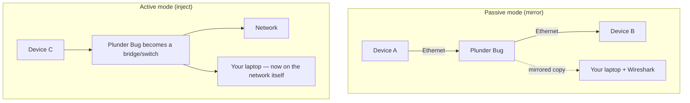

# Plunder Bug LAN Tap — 完整指南

> **一句话定位**：Plunder Bug 是一台口袋大小的「以太网窃听器」——把两条网线穿过它，它把流量镜像给你的电脑，你用 Wireshark 就能看穿这条线上的所有数据包。USB-C 供电，Windows / Mac / Linux / Android 都能用。

Plunder Bug 是 Hak5 物理访问工具包的网络侧：一个微型 LAN 分流器，坐落在以太网链路上，把流量镜像到你的分析电脑。它有两种**模式**：

- **被动模式** — 把被分流链路上的流量静默镜像到你的笔记本。
- **主动模式** — 把你的分析设备*注入*网络（它变成一个简单的交换机/主机）用于主动扫描。

因为它由 USB-C 供电，采用 ASIX AX88772C 芯片组，它通过微型跨平台脚本在多个平台上工作 — 甚至可以用一个 Android root 应用做现场移动捕获。它与 **Wireshark** 完美搭配用于分析。

> **⚠️ 仅限授权测试。** 分流你不拥有的网络链路是违法的。只在你自己的实验室网络上使用，或获得书面许可。

---

## 规格一览

| 项目 | 规格 |
|---|---|
| 网络接口 | 2× 10/100BASE-T 快速以太网，自动协商（最高 100 Mbps） |
| USB 接口 | USB-C（分流 + 供电，5V，20–300 mA 电流） |
| USB 以太网芯片组 | ASIX AX88772C |
| 模式 | 被动（镜像流量）/ 主动（注入网络） |
| 分析软件 | Wireshark 及其他开源分析器 |
| 移动支持 | Android root 应用，用于现场 pcap 捕获 |
| 官方文档 | https://docs.hak5.org/plunder-bug |

## 结构

| 部件 | 用途 |
|---|---|
| 以太网口 A | 被分流链路的一侧 |
| 以太网口 B | 被分流链路的另一侧 |
| USB-C 端口 | 连接到你的分析电脑（供电 + 数据） |

---

## 被动 vs 主动 — 两种人格



| 模式 | 会发生什么 | 最适合 |
|---|---|---|
| **被动** | A↔B 的流量镜像到你的笔记本；链路继续工作 | 隐蔽的「这条线上有什么？」嗅探 |
| **主动** | 你的笔记本通过 Bug 加入网络 | 主动扫描、ARP 工作、服务发现 |

---

## 快速入门 — 用 Wireshark 嗅探

### 第 1 步 — 接线
1. 把一端以太网接到一台设备/交换机（实验室网络！）。
2. 把另一端以太网接到第二台设备。
3. 把 **USB-C** 侧插进你的笔记本。

### 第 2 步 — 加载连接脚本
Hak5 提供跨平台连接脚本。在 Linux 上：

```bash
# Run Hak5's provided setup script, or configure manually:
sudo ip link set dev usb0 up
sudo dhclient usb0            # get an IP for active mode
```

被动捕获时，接口会自动出现（例如 `usb0` / Windows 或 macOS 上的新以太网适配器）。

### 第 3 步 — 在 Wireshark 里捕获
在新接口上启动 Wireshark 并捕获：

```text
$ wireshark                      # or tcpdump -i usb0 -w capture.pcap
```

实时观看被分流链路上的流量。

### 第 4 步 — 在模式之间切换
按你操作系统的模式切换说明切换被动/主动（设备附带 Windows / Mac / Linux 脚本）。

---

## 实操：在你自己的实验室看它工作

要证明被动捕获有效，生成一些流量：

```bash
# From a device on the tapped link, ping something
ping -c 3 8.8.8.8
```

在 Wireshark 里你应该看到 ICMP 回显请求/应答穿过链路。这就是你的分流器在干活。

---

## 进阶

| 能力 | 怎么做 |
|---|---|
| 被动镜像 | 你的笔记本不需要 IP — 只嗅探镜像帧 |
| 主动注入 | 把你的笔记本带上网络做主动侦察 |
| 移动 pcap | Android root 应用在路上捕获 `.pcap` |
| 协议分析 | 把捕获喂给 Wireshark / tcpdump |
| 简单交换机用途 | 串联起来桥接一个网段而不做分析 |

---

## 故障排查

| 症状 | 原因 | 修复 |
|---|---|---|
| Wireshark 里没有流量 | 接口不对 / 链路不活动 | 验证新接口名（`ip link`）；确认以太网链路亮灯 |
| 主动模式下笔记本拿不到 IP | DHCP 没到达 | 设置匹配网段的手动 IP |
| Windows 缺驱动 | ASIX 驱动未安装 | 安装 ASIX AX88772C 驱动，或使用随附脚本 |
| Android 看不到它 | 应用需要 root + OTG | 用 Android root 应用；启用 USB OTG |
| 一侧无链路 | 线或端口故障 | 独立交换/测试两端以太网 |

---

## 相关资源

- [Shark Jack](/hak5/products/shark-jack/) — 主动网络侦察，无需分流器
- [Packet Squirrel Mark II](/hak5/products/packet-squirrel-mark-ii/) — 内联操控 vs 被动镜像
- [Screen Crab](/hak5/products/screen-crab/) — 把分流器换成视频
- [ALFA Network](/alfa-network/) — 用于无线捕获的 Wi-Fi 适配器
- [故障排查索引](/hak5/troubleshooting-index/)
- [Hak5 概览](/hak5/)