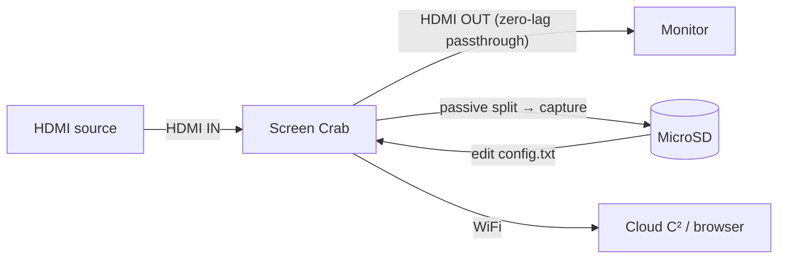

# Screen Crab — 完整指南

> **一句话定位**：Screen Crab 是一台「藏在 HDMI 线中间的隐形监视器」——把它夹在电脑与屏幕（或游戏机与电视）之间，它零延迟地把画面截图或录影存进 MicroSD，还能通过 Wi-Fi 串流到 Cloud C²。系统管理员、渗透测试与想「看到别人看到什么」的人最爱它。

Screen Crab 是第一款为渗透测试人员打造的 HDMI **中间人**设备。它不拦截网络流量 — 它拦截*视频信号本身*。因为它被动地分路 HDMI 信号（数据路径中无重新编码），输出显示器看到的是**零延迟、零中断**，而 Crab 悄悄捕获第二份副本。

它简单得令人放松警惕：内联接上、USB 供电，开箱就开始把截图存到 MicroSD 卡。编辑 `config.txt` 文件改变间隔、启用视频，或连接 Wi-Fi + [Cloud C²](/hak5/firmware-downloads/) 从浏览器实时观看屏幕。

> **⚠️ 仅限授权测试。** 未经同意捕获别人的屏幕是违法的（台湾：刑法第三一五条之一妨害秘密罪等）。只在你自己的机器/显示器上使用，或获得明确授权。

---

## 规格一览

| 项目 | 规格 |
|---|---|
| 接口 | 2× 全尺寸 HDMI（IN / OUT）+ USB-C（供电）+ MicroSD |
| 标准 | HDMI 1.4 / DVI 1.0；802.11 b/g/n（WiFi，2.4 GHz） |
| 分辨率 | 大多数 16:9 格式最高 1920×1080（Full HD 1080p），自动升/降采样 |
| 捕获模式 | 间隔截图，或全动态视频（MPEG-4，2 / 4 / 16 Mbps） |
| 存储 | MicroSD（支持 SDXC）；循环录制覆盖最旧文件 |
| 延迟 | 零 — 被动信号分路器，输出无延迟 |
| WiFi | RP-SMA 偶极天线，用于 Cloud C² 串流 |
| 电源 | USB 5V 1A（5 W） |
| 尺寸 | 105 × 51 × 21 mm |
| 官方文档 | https://docs.hak5.org/screen-crab |

## 结构

| 部件 | 用途 |
|---|---|
| HDMI **IN** | 来自源（电脑 / 游戏机） |
| HDMI **OUT** | 到显示器 / 电视（直通，零延迟） |
| USB-C | 供电 |
| MicroSD 插槽 | 截图 / 视频存储 |
| WiFi 天线（RP-SMA） | Cloud C² 串流 |
| RGB LED + 按钮 | 状态（隐身时禁用 LED） |

---

## 安装与数据流



1. 把源连接到 Crab 的 **HDMI IN**。
2. 把显示器连接到 Crab 的 **HDMI OUT**（正常运行，无延迟）。
3. 用 USB-C 供电。截图开始按默认间隔保存到 MicroSD。

---

## 快速入门 — 2 分钟完成第一次捕获

### 第 1 步 — 插入 MicroSD 卡
任何 MicroSD 都行；SDXC 提供数月的存储。Crab 首次启动时自动生成 `config.txt`。

### 第 2 步 — 内联接线
- **HDMI IN** ← 你的电脑。
- **HDMI OUT** → 你的显示器。
- **USB-C** → 供电。

预期结果：显示器工作得和以前完全一样（无延迟），MicroSD 开始收集截图。

### 第 3 步 — 读取捕获
弹出 MicroSD 并浏览：

```text
/root/
  loot/
    2026-08-21-1430/screenshot_001.jpg
    2026-08-21-1430/screenshot_002.jpg
    ...
  config.txt
```

### 第 4 步 — 启用视频
编辑 MicroSD 根目录的 `config.txt`：

```text
# Capture mode: image or video
capture_mode = video
# MPEG4 quality: 2, 4, or 16 Mbps
bitrate = 4
# Seconds between captures
interval = 30
```

安全移除 MicroSD，重新插入，断电重启。Crab 现在录制 MPEG-4 视频。

---

## Cloud C² — 从任何地方观看

要远程串流屏幕/视频：

1. 编辑 `config.txt` 并添加你的 Wi-Fi 网络：

```text
wifi_ssid = OfficeWiFi
wifi_pass = hunter2example
```

2. 把你的 [Cloud C²](/hak5/firmware-downloads/) 设备文件添加到 MicroSD。
3. 启动。Crab 连接 Wi-Fi 并向 C² 注册 — 你现在可以从浏览器串流截图和下载捕获。

> **你可能会问：** *「零延迟 — 怎么做到的？」* Crab 在 HDMI 路径上使用**被动视频信号分路器**。源的信号原样镜像到显示器；一份副本馈给捕获硬件。原始路径中没有任何东西被重新编码，所以没有额外延迟。这也是它如此不可见的原因。

---

## 进阶

| 能力 | 怎么做 |
|---|---|
| 循环录制 | 持续捕获删除最旧文件腾出空间（永远不会满） |
| 间隔截图 | 可配置的 `interval`（秒） |
| 多码率 | 2 / 4 / 16 Mbps MPEG-4 质量档 |
| 隐身 LED | 为隐蔽操作禁用 RGB LED |
| 分辨率处理 | 从大多数源自动升/降采样到 1080p |
| 远程管理 | Cloud C²：更改设置、下载捕获、实时查看 |

---

## 故障排查

| 症状 | 原因 | 修复 |
|---|---|---|
| 没有保存截图 | MicroSD 未插好 / 写保护 | 重新插好；检查锁开关；用已知良好的卡测试 |
| 插入 Crab 时显示器闪烁 | 供电 / HDMI 协商 | 验证 5V/1A USB 供电；重新插好 HDMI 连接 |
| 视频卡顿 | 码率对场景太低 | 提高到 16 Mbps |
| Cloud C² 从不连接 | Wi-Fi 凭据错误 / 没有设备文件 | 重新检查 `config.txt`；把 C² 设备文件复制到卡上 |
| 找不到 config.txt | 卡还没启动过一次 | 插入卡，启动一次，它会自动生成配置 |

---

## 相关资源

- [固件与下载](/hak5/firmware-downloads/) — Cloud C² 服务器设置
- [Key Croc](/hak5/products/key-croc/) — 键盘级拦截（互补：按键*和*屏幕）
- [Packet Squirrel Mark II](/hak5/products/packet-squirrel-mark-ii/) — 网络侧拦截
- [故障排查索引](/hak5/troubleshooting-index/)
- [Hak5 概览](/hak5/)