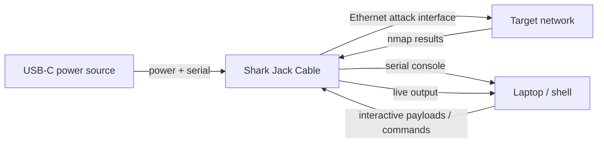

# Shark Jack Cable — 完整指南

> **一句话定位**：Shark Jack Cable 是 Shark Jack 的「长时间供电版」——改用 USB-C 供电，还多了一条专属串口，侦察能跑好几个小时，而且不必抽卡就能直接开一个 live shell 看结果。

经典 [Shark Jack](/hak5/products/shark-jack/) 受限于它 10–15 分钟的电池。**Cable 版**修复了限制前代产品的唯一一件事：供电。用任何 USB-C 电源（笔记本、充电宝、充电器）供电，它就能按你需要的时间维持网络侦察。

额外的回报是一条**专用 USB-C 串口控制台**。在经典 Shark Jack 上，你要拨到武装模式、把线移到笔记本上、SSH 进去。Cable 版给你一个*通过串口*的实时 shell — 你可以实时观看扫描进度、与载荷交互，而且永远不用把设备从网络上拿下来。

> **⚠️ 仅限授权测试。** 在你不拥有的网络上进行长时间侦察是违法的。在你自己的实验室里使用。

---

## 规格一览

| 项目 | 规格 |
|---|---|
| 攻击接口 | 快速以太网（RJ45） |
| 电源 | USB-C（只要有电就能一直运行） |
| 相对经典的额外功能 | 专用 USB-C 串口控制台（实时 shell） |
| 操作系统 | Linux，root shell，DuckyScript/Bash 载荷 |
| 默认载荷 | nmap 扫描 → `/root/loot/` |
| 武装地址 | `172.16.24.1`（通过 SSH） |
| 默认凭据 | `root` / `hak5shark` |
| 官方文档 | https://docs.hak5.org/shark-jack |

## 经典 vs Cable — 改了什么

| | Shark Jack | Shark Jack Cable |
|---|---|---|
| 电源 | 内置电池（约 10–15 分钟） | USB-C（有电就无限） |
| 串口控制台 | 无 | **有 — 通过 USB-C 的实时 shell** |
| 运行时间 | 短，挂钥匙圈 | 长，持续项目 |
| 最适合 | 快速、便携侦察 | 扩展监控 + 交互式工作 |



---

## 快速入门

### 第 1 步 — 连接
1. 把 **USB-C** 端插进电源 / 你的笔记本 — 这既供电又给你串口控制台。
2. 把 **以太网** 端插进目标网络（你的实验室）。

### 第 2 步 — 选择模式
- **攻击模式：** 拨开关；默认 nmap 载荷运行并记录到 `/root/loot/`。
- **武装模式：** 拨到另一个位置；通过串口连接，立即得到一个 root shell。

### 第 3 步 — 通过串口的实时 shell
与经典版不同，你不需要额外的 SSH 跳转就能看到结果。连接 USB-C 串口控制台并实时交互：

```bash
# Typical: open the serial console (exact device depends on your OS)
screen /dev/ttyACM0 115200
```

预期输出 — 设备 shell：

```text
Welcome to Shark Jack (kernel 4.x.y)
# 
```

### 第 4 步 — 加载载荷与取走战利品
从 shell 里：

```bash
cat /root/loot/scan/*.txt      # read scan results
UPDATE_PAYLOADS                 # sync community payload library
```

预期输出：

```text
Nmap scan report for 192.168.1.20
PORT     STATE SERVICE
22/tcp   open  ssh
445/tcp  open  microsoft-ds
```

---

## 串口控制台命令

Cable 版自带有用的 shell 命令（固件 1.2.0+）：

| 命令 | 作用 |
|---|---|
| `HELP` | 列出所有 Shark Jack 辅助命令 |
| `ACTIVATE` / `ACTIVATE_PAYLOAD` | 运行选定的载荷 |
| `LIST` / `LIST_PAYLOADS` | 列出本地载荷库 |
| `UPDATE_PAYLOADS` | 与远程仓库同步载荷库 |
| `UPDATE_FIRMWARE` | 检查并安装固件升级 |
| `SERIAL_WRITE` | 直接写入串口控制台 |
| `LED` | 配置 LED |

---

## 进阶

| 能力 | 怎么做 |
|---|---|
| 长时间被动侦察 | 用充电宝供电，全天监控一个网络 |
| 实时载荷开发 | 串口 shell → 编辑载荷 → `ACTIVATE`，无需重新接线 |
| 交互式 nmap | 实时观看扫描串流到串口控制台 |
| 通过网络外传 | 载荷通过以太网链路把战利品推出去 |
| `NETMODE` 控制 | 每个载荷可设 DHCP 客户端/服务器/桥接 |

---

## 故障排查

| 症状 | 原因 | 修复 |
|---|---|---|
| 串口控制台什么都不显示 | 串口速度不对 / 设备节点不对 | 使用文档化的波特率（115200）和正确的 `/dev/tty*` |
| 无电 / 无串口 | USB-C 没接好 | 确保 USB-C 同时承载电力和数据 |
| 有以太网链路但没有扫描 | 载荷缺失 | 重新武装并 `UPDATE_PAYLOADS` / 放置 `payload.sh` |
| 读不到战利品 | 路径不对 | 战利品按载荷存放在 `/root/loot/` |

---

## 相关资源

- [Shark Jack](/hak5/products/shark-jack/) — 电池供电的原版
- [Packet Squirrel Mark II](/hak5/products/packet-squirrel-mark-ii/) — 内联以太网 MITM
- [Plunder Bug LAN Tap](/hak5/products/plunder-bug-lan-tap/) — 被动嗅探
- [固件与下载](/hak5/firmware-downloads/) — 载荷仓库与固件
- [故障排查索引](/hak5/troubleshooting-index/)
- [Hak5 概览](/hak5/)