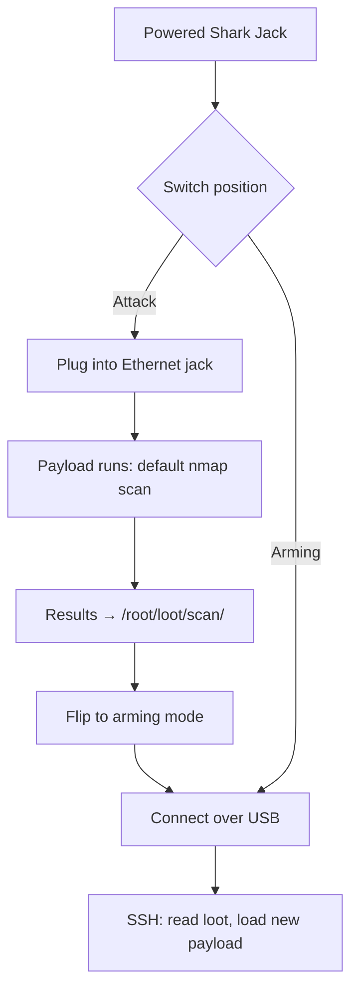

# Shark Jack — 完整指南

> **一句话定位**：Shark Jack 是一台口袋大小的网络侦察机——往人家的以太网孔一插，60 秒内告诉你这个网段有谁、开了些什么服务。充一次电能跑 10–15 分钟，最适合挂在钥匙圈上的临时审计。

Shark Jack 把一台完整的 Linux 电脑和一个 nmap 扫描器塞进一个能挂在钥匙圈上的东西里。它践行 Hak5 的「热插拔攻击，遇见局域网」哲学：物理接触一个活动的以太网口，就足以获得情报立足点。

出厂时它已经很危险了 — 把开关拨到**攻击模式**，它会运行预装的 nmap 扫描，把结果存进战利品。拨回**武装模式**，你 SSH 进去取走发现或加载自定义载荷。

> **⚠️ 仅限授权测试。** 接入你不拥有的网络是违法的。在你自己的交换机/实验室网络上练习。

---

## 规格一览

| 项目 | 规格 |
|---|---|
| 攻击接口 | 快速以太网（RJ45）— 直接插入网络 |
| 电源 | 内置电池（每次充电可运行 10–15 分钟），通过 USB |
| 操作系统 | Linux，带 root shell；运行由 Bash 驱动的 DuckyScript 载荷 |
| 默认载荷 | nmap 扫描 → 结果保存到 `/root/loot/` |
| 武装访问 | SSH 在 `172.16.24.1`（武装模式下静态 IP） |
| 默认凭据 | `root` / `hak5shark` |
| 反馈 | 多色 RGB LED |
| 开关 | 拨动开关：攻击模式 vs 武装模式 |
| 官方文档 | https://docs.hak5.org/shark-jack |

## 结构

| 部件 | 用途 |
|---|---|
| RJ45 以太网口 | 攻击接口 — 进入目标网络 |
| USB 端口 | 供电/充电 + 连接 |
| 拨动开关 | 攻击模式（运行载荷）↔ 武装模式（SSH/配置） |
| RGB LED | 启动 / 充电 / 模式 / 错误状态 |
| 钥匙圈环 | 随身携带 |

---

## 运行模式

| 模式 | 会发生什么 | 如何进入 |
|---|---|---|
| **攻击模式** | 运行选定的载荷（默认：nmap 扫描） | 拨开关，插入以太网 |
| **武装模式** | SSH 服务器在 `172.16.24.1`；加载载荷、读取战利品 | 拨开关，通过 USB 连接 |



---

## 快速入门 — 60 秒内完成第一次侦察

### 第 1 步 — 攻击
1. 给 Shark Jack 充满电。
2. 把开关拨到**攻击模式**。
3. 把它插进**你的实验室**里任何活动的以太网口。
4. 等大约 60 秒。LED 会告诉你正在发生什么（见[故障排查](/hak5/troubleshooting-index/)）。

### 第 2 步 — 武装与战利品回收
1. 把开关拨到**武装模式**，从网络拔出，通过 USB 连接到你的电脑。
2. 你电脑的以太网必须在 Shark 的子网上：

```bash
ip addr add 172.16.24.2/24 dev eth0     # your NIC joins 172.16.24.0/24
ssh root@172.16.24.1                     # password: hak5shark
```

预期输出：

```text
root@172.16.24.1's password:
Welcome to Shark Jack
# ls /root/loot/
scan
# ls /root/loot/scan/
2026-08-21-1430-network-scan.txt
# cat /root/loot/scan/2026-08-21-1430-network-scan.txt
Nmap scan report for 192.168.1.10
Host is up (0.0034s latency).
PORT     STATE    SERVICE
22/tcp   open     ssh
80/tcp   open     http
443/tcp  open     https
```

这就是你的第一次侦察：主机、开放端口、服务 — 足够规划后续行动（或向你的蓝队报告）。

---

## 自定义载荷

默认扫描只是一个模板。用你自己的 Bash 载荷替换它：

1. 如上所述 SSH 进入（武装模式）。
2. 编辑 `/root/payload/payload.sh`（这就是攻击模式下运行的东西）。

```bash
#!/bin/bash
# Arming-mode file: /root/payload/payload.sh
NETMODE DHCP_CLIENT
LED R
sleep 5
nmap -sV -p- --open ${SUBNET}.0/24 -oN /root/loot/full-scan.txt
LED G
```

> `${SUBNET}` 占位符和 `NETMODE` 辅助命令来自 Hak5 的载荷框架 — 你的载荷决定 Shark 是 DHCP 客户端、服务器等。完整参考见载荷文档。

3. 或者从社区仓库拉取现成载荷（`UPDATE_PAYLOADS`，见[固件与下载](/hak5/firmware-downloads/)）。

---

## LED 参考

| LED | 含义 |
|---|---|
| 绿色（闪烁） | 启动中 |
| 蓝色（闪烁） | 充电中 |
| 蓝色（常亮） | 已充满 |
| 黄色（闪烁） | 武装模式 — SSH 服务器运行中 |
| 红色（闪烁） | 错误 — 未找到载荷 |
| （载荷定义） | 载荷运行时你自己的 `LED` 颜色 |

---

## 进阶

| 能力 | 怎么做 |
|---|---|
| `NETMODE` 选项 | `DHCP_CLIENT`（获取 IP）、`DHCP_SERVER`（分配 IP）、`BRIDGE`、`OFF` — 取决于项目 |
| SMB/HTTP 外传 | 载荷可以通过网络把战利品推出设备 |
| 自动化扫描 | 安排扫描；战利品跨部署累积 |
| 远程载荷库 | `UPDATE_PAYLOADS` 从社区仓库同步 |
| Root Linux 工具 | `nmap`、`tcpdump`、`curl`、脚本 — 完整 Bash |

---

## 故障排查

| 症状 | 原因 | 修复 |
|---|---|---|
| 红色闪烁 LED | 未找到载荷 | 重新武装；把 `payload.sh` 放进 `/root/payload/` |
| 无法 SSH | 你的网卡不在 `172.16.24.0/24` | `ip addr add 172.16.24.2/24 dev eth0`（或等效命令） |
| 扫描中途电池耗尽 | 10–15 分钟运行时间 | 先充满电；长时间运行用 Cable 版 |
| 扫描太慢 / 输出巨大 | `-p-` 全端口 | 用有针对性的端口列表加快侦察 |
| DHCP 模式失败 | 没有上游 DHCP 服务器 | 在有服务器的环境用 `NETMODE DHCP_CLIENT`，或静态配置 |

---

## 相关资源

- [Shark Jack Cable](/hak5/products/shark-jack-cable/) — 同一台盒子，USB-C 供电 + 串口控制台，运行更久
- [Packet Squirrel Mark II](/hak5/products/packet-squirrel-mark-ii/) — 内联以太网操控
- [Plunder Bug LAN Tap](/hak5/products/plunder-bug-lan-tap/) — 被动/主动嗅探
- [固件与下载](/hak5/firmware-downloads/) — shark 载荷仓库与固件
- [故障排查索引](/hak5/troubleshooting-index/)
- [Hak5 概览](/hak5/)