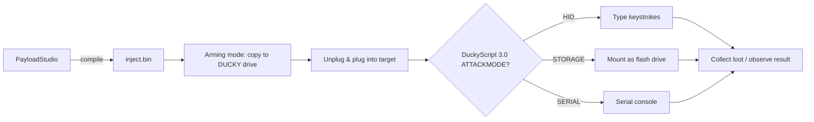

# USB Rubber Ducky — 完整指南

> **一句话定位**：USB Rubber Ducky 是一支「会自己打键盘」的随身碟 — 插入 USB 孔后，它以每秒数百次的速度把预录好的按键输进电脑，10 秒内做完一个人工要花五分钟的动作。这是所有 Hak5 设备里最适合初学者入门的机器。

当你插入任何 USB 键盘时，电脑会立刻信任它 — 没有密码，没有「你确定吗？」的提示。USB Rubber Ducky 利用的正是这种信任。它向操作系统呈现为一个普通键盘（一个 **HID 设备**，Human Interface Device，人机接口设备），然后以人类永远跟不上的速度重放一段按键脚本。

Ducky 只做**一件事，而且做得极好**：键盘注入。它不需要漏洞利用代码或漏洞 — 它只是*打字*。这使它成为学习 HID 攻击的完美教学工具，也是所有其他 Hak5 载荷设备的基础。

> **⚠️ 仅限授权测试。** 只在你自己的电脑、实验室里你自己的机器上使用 Ducky，或获得明确许可。向别人的电脑注入键盘敲击是违法的（台湾：刑法第 358–363 条）。

---

## 规格一览

| 项目 | 规格 |
|---|---|
| 用途 | 键盘注入（HID 攻击） |
| 语言 | DuckyScript 1.0（经典）和 3.0（完整语言） |
| 脚本存储 | MicroSD 卡（随附；保留小卡以获得最快启动） |
| 输出 | `DUCKY` 盘上的编译版 `inject.bin` |
| 注入模式 | HID、Storage、Serial、Ethernet（各种攻击模式） |
| 接口 | USB-A（插入任何 USB 主机） |
| 反馈 | 单按钮（默认：退出到武装/存储模式） |
| 编码器 | PayloadStudio（官方、基于浏览器）— 唯一支持的编译器 |
| 官方文档 | https://docs.hak5.org/hak5-usb-rubber-ducky |

## 结构

| 部件 | 用途 |
|---|---|
| USB-A 插头 | 「键盘」那一端 — 插入目标 |
| MicroSD 插槽 | 存放 `inject.bin` 和载荷脚本 |
| 按钮 | 载荷期间/之后，默认返回存储（武装）模式 |
| 可翻转 USB-A 头 | 两种方向（标准与反向连接器） |

---

## DuckyScript — 这门语言

DuckyScript 简单得令人意外。经典脚本只是 `STRING`（打这些字）+ `DELAY`（等待）。3.0 版加入了真正的编程能力：`if`/`else`、`while` 循环、函数，以及 `ATTACKMODE` 控制。

### 「Hello, World!」载荷

```text
REM This is a comment — type into whatever application is focused
DELAY 1000
STRING Hello from my USB Rubber Ducky!
ENTER
```

会发生什么：Ducky 等待 1 秒，然后向当前活动的窗口输入 `Hello from my USB Rubber Ducky!` 并按下 Enter。

### 控制流示例（DuckyScript 3.0）

```text
ATTACKMODE HID
DELAY 1000
GUI r
DELAY 500
STRING notepad
ENTER
DELAY 800
REM Only type if the window title changed (keystroke reflection)
VAR $os = GET_SYSTEM_ID
IF ($os == "WINDOWS") THEN
    STRING Running on Windows!
    ENTER
ELSE
    STRING Running on something else.
    ENTER
END_IF
```

> **你可能会问：** *「『向当前聚焦的窗口打字』不是很脆弱吗？」* 是的 — 所以真正的载荷会*先打开一个应用程序*（这里用 `GUI r` → `notepad`），然后再打字。注入之前，永远先控制好自己的焦点。

---

## 快速入门 — 你的第一个载荷，5 分钟

### 第 1 步 — 在 PayloadStudio 里写载荷
1. 打开 https://payloadstudio.hak5.org（Community 版免费）。
2. 粘贴上面的 Hello World 脚本。
3. 选择你的**目标键盘布局**（默认 US）。**这很重要** — 用错误的布局注入，打出来的键会乱掉。
4. 点击 **Generate Payload**。PayloadStudio 会把它编译成 `inject.bin`。

### 第 2 步 — 武装 Ducky
把 Ducky 插进你的电脑。它会挂载成一个叫 **`DUCKY`** 的闪存盘 — 这就是武装模式。

### 第 3 步 — 复制载荷
把 `inject.bin` 复制到 `DUCKY` 盘的**根目录**，替换现有文件。安全弹出，拔掉。

### 第 4 步 — 部署
1. 在目标机器（你自己的笔记本，在你的实验室里）上打开**记事本**。
2. 插上 Ducky。
3. 看 — 它会输入 `Hello from my USB Rubber Ducky!` 并按下 Enter。

```bash
# On Linux, verify the Ducky enumerates as a keyboard when armed:
lsusb | grep -i ducky
# Expected: Bus 001 Device 00X: ID .... Hak5 LLC USB Rubber Ducky
```

---

## 攻击模式（ATTACKMODE）

Ducky 可以呈现为不止一个键盘。`ATTACKMODE` 选择设备人格：

| ATTACKMODE | Ducky 假装成 | 用于 |
|---|---|---|
| `HID` | 键盘 | 键盘注入（未指定时的默认） |
| `HID STORAGE` | 键盘 + 闪存盘 | 注入*并*保持可访问的存储 |
| `STORAGE` | 闪存盘 | 仅武装 / 文件传输 |
| `SERIAL` | 串口设备 | 与串口控制台通信 |
| `HID SERIAL` | 键盘 + 串口 | 向串口连接的机器注入 |

一个常见模式 — 注入，然后转入存储模式以便取走战利品：

```text
ATTACKMODE HID STORAGE
DELAY 2000
...payload keystrokes...
ATTACKMODE STORAGE
```



---

## 键盘布局 — 经典的坑

Ducky 不是打出「字母 A」— 它按下 US 键盘上 A 的*物理按键*，然后重现那次按键。用 US 布局的载荷在德文或法文键盘上打字，你会得到完全不同的字符。

**规则：** 用*目标机器*的键盘布局编译，而不是你自己的。在生成之前在 PayloadStudio 里设置。

| 症状 | 原因 |
|---|---|
| `@` 变成 `"` | 载荷按 US 编译，目标是 UK/德文 |
| 数字变成符号 | 移位行上的布局不匹配 |
| 什么都没打出来 | 缺少 `DELAY`（操作系统 HID 栈未就绪）或攻击模式错误 |

---

## 进阶

| 技巧 | 怎么做 |
|---|---|
| 键盘反射 | 读取目标状态/窗口标题并分支（`IF` 配合系统查询） |
| 鼠标注入 | 移动光标 / 点击 — 对纯 GUI 目标很有用 |
| 抖动与随机化 | 加入类人的延迟以规避按键时序检测 |
| 载荷库 | 从社区仓库放入脚本（见[固件与下载](/hak5/firmware-downloads/)） |
| HID+以太网组合 | 在兼容固件上，同时充当键盘 + 攻击者自己的网络接口 |
| 恢复 | 按住按钮，从失控的载荷重新进入存储模式 |

> **实验室专业提示：** 永远先拿你自己的一次性虚拟机测试新载荷。真实载荷里的一个笔误会把乱码打进真实机器 — 而一个流氓 `ATTACKMODE ETHERNET` 在不支持的主机上可能毁掉整个会话。在沙盒里练习。

---

## 故障排查

| 症状 | 原因 | 修复 |
|---|---|---|
| 屏幕上什么都没出现 | 开头没有 `DELAY`；操作系统 USB 栈未就绪 | 把 `DELAY 1000` 作为第一行 |
| 打出的字符不对 | 键盘布局不匹配 | 在 PayloadStudio 里用目标的布局重新编译 |
| 载荷只运行了一次 | 旧的 `inject.bin` 覆盖了你的 | 把你的 `.bin` 再复制到盘根目录 |
| 回不到武装模式 | 载荷覆盖了按钮默认行为 | 按按钮；如果没有 `BUTTON_DEF`，默认行为会把你带回存储模式。见文档 |
| 按钮行为异常 | 载荷使用了 `BUTTON_DEF` | 检查你的载荷；示例脚本可能重映射了按钮 |
| 固件刷写警告 | 第三方固件 | **绝不刷写** — Ducky 的架构设计就是不需要它；刷写会失去保修并可能变砖 |

> **严重警告：** 不要刷写 USB Rubber Ducky。它出厂就是围绕 PayloadStudio 设计的，所以你永远不需要刷。旧版/第三方固件可能让它永久无法恢复。永远只使用官方升级 — 见[固件与下载](/hak5/firmware-downloads/)。

---

## 相关资源

- [Bash Bunny Mark II](/hak5/products/bash-bunny-mark-ii/) — 多向量兄弟（键盘 + 以太网 + 更多）
- [Key Croc](/hak5/products/key-croc/) — 解释型 DuckyScript 2.0，外加键盘记录
- [WiFi Pineapple Pager](/hak5/products/wifi-pineapple-pager/) — 无线手持设备上的 DuckyScript 3.0
- [O.MG Cable](/hak5/products/omg-cable/) — 从一条线里通过 Wi-Fi 跑 DuckyScript
- [固件与下载](/hak5/firmware-downloads/) — PayloadStudio 和载荷仓库
- [故障排查索引](/hak5/troubleshooting-index/)
- [Hak5 概览](/hak5/)