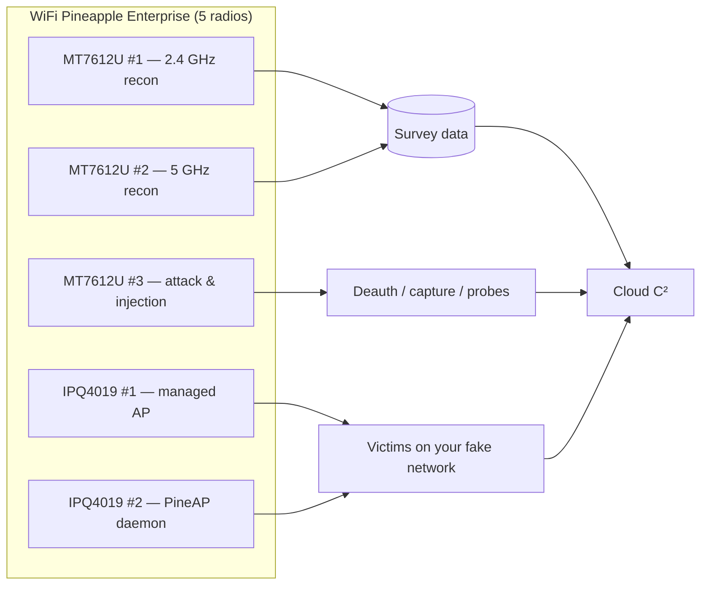
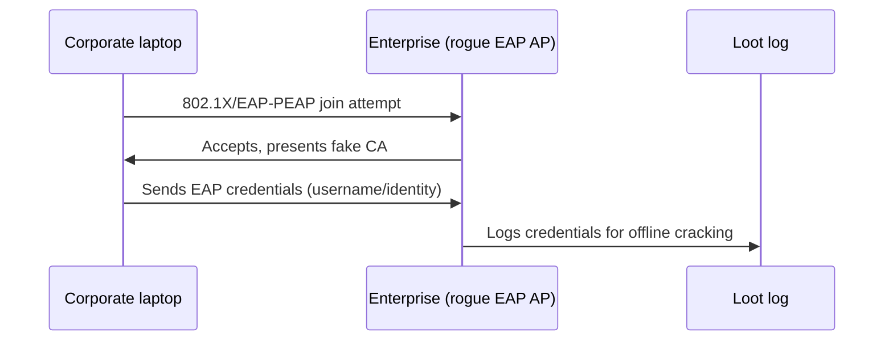

# WiFi Pineapple Enterprise — 完整指南

> **一句话定位**：WiFi Pineapple Enterprise 是 Pineapple 家族的重型炮台 — 一台 1U 机架式主机、五组双频无线电、双千兆网络口，专门做长时间、大范围的企业无线审计。给进阶研究生、实验室、红队与需要 24/7 部署的人。

Mark VII 教你流氓 AP 的基础。**Enterprise** 是当「一个任务一组无线电」不够用时你会得到的东西：五组双频无线电（2.4 + 5 GHz）让你*同时*运行攻击、监听和服务角色，而不用来回切换接口。它是严肃实验室、校园安全课程，或需要一次性审计整个空域的红队行动的 Pineapple。

如果你是学生：你*不需要*一台来学习 — [Mark VII](/hak5/products/wifi-pineapple-mark-vii/) 教你同样的 PineAP 概念。但如果你的实验室需要模拟企业部署 — 包括 **WPA2-Enterprise** 流氓 AP — 就是这台盒子。

> **⚠️ 仅限授权测试。** 5 无线电流氓 AP 是极其强大的工具。只在你拥有的网络或你获得明确书面授权测试的网络上使用。

---

## 规格一览

| 项目 | 规格 |
|---|---|
| SoC | 四核 ARM Cortex-A7 @ 717 MHz |
| 无线电 | 5× 双频：2× Qualcomm IPQ4019（2.4/5 GHz）+ 3× MediaTek MT7612U（2.4/5 GHz） |
| 标准 | 802.11ac Wave 2（a/b/g/n/ac/p）、MU-MIMO、TxBF |
| 峰值无线电速度 | IPQ4019：1.733 Gbps ・ MT7612U：866 Mbps |
| 内存 / 存储 | 1 GB DDR3L RAM / 4 GB eMMC |
| 以太网 | 2× 千兆 RJ45（802.3ab）+ USB-C 3.0（ASIX 以太网） |
| 天线 | 8× 高增益 RP-SMA（4× 2:2 MIMO 对） |
| 电源 | 交流 100–240 V（墙插电源，无电池） |
| 外形 | 160 × 244 × 41 mm（1U 机架式） |
| 工作温度 | −25 °C 至 +50 °C |
| 官方文档 | https://docs.hak5.org/wifi-pineapple-enterprise |

## 结构

| 部件 | 用途 |
|---|---|
| 8× RP-SMA 天线端口 | 四组 2:2 MIMO 无线电对 |
| 2× 千兆 RJ45 | WAN/上行 + 管理或额外 LAN 段 |
| USB-C 3.0 端口 | 以太网控制台/管理接口（ASIX 芯片组） |
| 4× RGB LED | 每组无线电和状态反馈 |
| 交流输入 | 100–240 V 电源 |

---

## 为什么是五组无线电？角色表

| 无线电 | 项目中的典型角色 |
|---|---|
| IPQ4019 Radio 0 | 服务你自己的*受管* AP（看起来合法） |
| IPQ4019 Radio 1 | PineAP 守护进程 — 引诱和管理受害者 |
| MT7612U #1 | 持续侦察（2.4 GHz 扫描） |
| MT7612U #2 | 持续侦察（5 GHz 扫描） |
| MT7612U #3 | 攻击接口 — 去认证、注入、按需扫描 |

用 Mark VII 你必须让一组无线电在任务之间分时共享；Enterprise 给每个任务分配一组无线电，所以什么都不会互相干扰。



---

## 快速入门 — 首次部署

### 第 1 步 — 上架、装天线、通电
装进 1U 槽位（或放在架子上），拧上 8 根天线，接上交流电源。启动期间 LED 会循环。

### 第 2 步 — 管理访问
两个选项：
- **Wi-Fi：** 加入 Pineapple 的默认 AP（SSID `PineAP`，密码 `pineapplesareyummy`）。
- **有线：** 把笔记本插进千兆口；DHCP 给你一个地址；浏览到 `http://172.16.42.1:1471`。

立即设置管理员密码（Settings → Password）。

### 第 3 步 — 上行链路
把千兆口 1 接到实验室的交换机/路由器以联网。在仪表盘验证上行（Settings → Network）。

### 第 4 步 — 验证所有无线电
在 **Settings** 里，确认全部 5 组无线电都出现且能分配角色。预期：无线电接口 `wlan0`–`wlan4` 都在，每组都能进入监听模式。

```text
$ ssh root@172.16.42.1
# iw dev | grep Interface
Interface wlan0 (managed)
Interface wlan1 (managed)
Interface wlan2 (managed)
Interface wlan3 (managed)
Interface wlan4 (managed)
```

---

## 招牌功能：WPA2-Enterprise 流氓 AP

Enterprise 自带内置的 **Enterprise（WPA-EAP）流氓 AP** 标签 — 模拟企业 802.1X 网络的攻击：

1. 打开 **Settings → Enterprise**。
2. 填写 RADIUS/EAP 配置；界面会**为你生成证书**。
3. 把 SSID 设成企业风格的名字（仅限测试实验室！）。
4. 广播。加入的客户端会把凭据交给*你的* RADIUS 服务器 — 在战利品中收集，供离线分析。



> **道德现实检查：** 这是一项*实验室*技能。用你自己的测试域凭据练习。在真实组织上收集凭据在每个司法管辖区都是严重犯罪。

---

## 进阶

| 能力 | 说明 |
|---|---|
| 多目标项目 | 把 MT7612U 无线电分配到不同信道集；同时攻击 2.4 + 5 GHz 受害者 |
| 长期部署 | 交流供电 + 4 GB eMMC + 千兆上行 = 数天的捕获 |
| Cloud C² 管理 | 远程管理、战利品卸载和定时载荷（https://cloudc2.io） |
| 规模化数据包捕获 | 捕获到 eMMC/USB；卸载 `.pcap` 文件供 Wireshark 分析 |
| 802.11p（车载） | 标准列表包含 `p` — 研究功能，不是主要用例 |
| 通过 USB 加更多无线电 | 额外 MT7612U 适配器插入 USB 3.0 主机，覆盖更广 |

---

## 兼容性说明 — 适配器

Enterprise 的 3 组 MT7612U 无线电是内置的，所以 5 GHz 工作不需要外置适配器（不像 Mark VII）。如果你用 USB 无线电扩展，坚持用基于 MT7612U 的型号 — 兼容适配器指南见 [ALFA Network](/alfa-network/)，例如 AWUS036ACM 等 ALFA 等效型号。

---

## 故障排查

| 症状 | 原因 | 修复 |
|---|---|---|
| 只看到 3 组无线电 | 天线松动或无线电在配置中被禁用 | 重新装好全部 8 根天线；检查 Settings → Network 的无线电启用状态 |
| 通过以太网无法访问界面 | 笔记本拿到了 APIPA 地址 | 先用 Wi-Fi 管理 AP；然后修复 DHCP |
| Enterprise 标签缺失 | 固件低于 Enterprise 发布版本 | 从 Web UI 升级固件 |
| 客户端加入但战利品里没有凭据 | 跳过了 EAP 配置 / 证书步骤 | 重新运行 Enterprise 标签向导；确认证书已生成 |
| 高温警告 | 机架通风 | Enterprise 额定 −25 至 +50 °C，但在机架里需要气流 |

---

## 相关资源

- [WiFi Pineapple Mark VII](/hak5/products/wifi-pineapple-mark-vii/) — 便携 Pineapple，同样的 PineAP 引擎
- [WiFi Pineapple Pager](/hak5/products/wifi-pineapple-pager/) — 三频手持设备
- [ALFA Network](/alfa-network/) — MT7612U 适配器和 Kali 驱动程序指南
- [固件与下载](/hak5/firmware-downloads/) — 升级路径
- [故障排查索引](/hak5/troubleshooting-index/)
- [Hak5 概览](/hak5/)