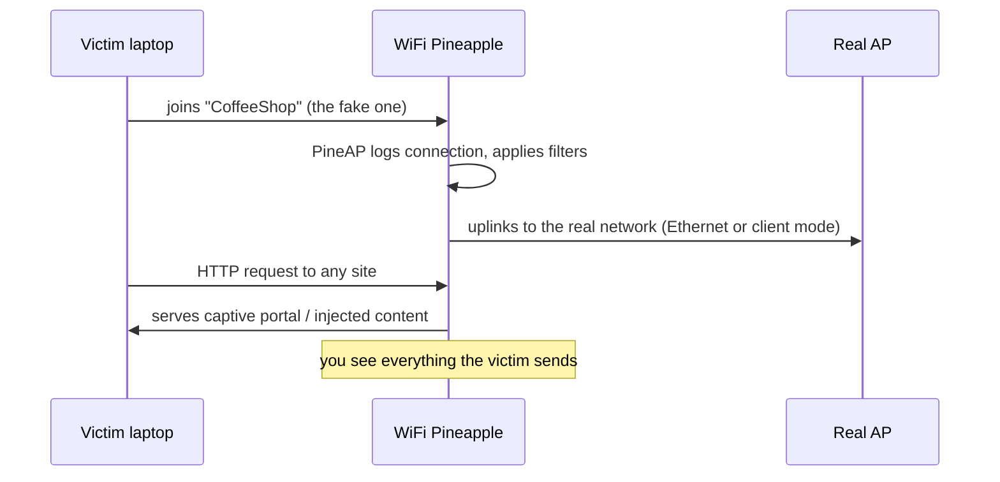

# WiFi Pineapple Mark VII — 完整指南

> **一句话定位**：WiFi Pineapple Mark VII 是一台「会自己开 Wi-Fi 来钓鱼」的无线攻击平台 — 它假装成你信任的无线网络，再用 PineAP 引擎接管受害者的连接。给想学 Wi-Fi 渗透测试、邪恶双胞胎攻击的大学生与 CTF 玩家。

如果 Wi-Fi 渗透测试有一个吉祥物，那就是 WiFi Pineapple。Mark VII 是让**流氓接入点（邪恶双胞胎）**攻击出名的设备的当前世代：它广播自己的网络，*看起来*像合法的，引诱受害者加入，然后给你对他们流量的完全可见性与控制 — 全部来自一个浏览器界面。

如果你正在学习无线安全，Mark VII 就是该买的设备：它便携（USB-C 供电）、便宜，而且 PineAP 套件是学习适用于任何现代流氓 AP 工具的 Wi-Fi 攻击概念的行业标准方式。

> **⚠️ 仅限授权测试。** 只对*你自己的*网络、你自己的设备，或获得书面许可后运行 Pineapple。在别人的网络上广播假的「免费 Wi-Fi」是违法的（台湾：刑法第 358–363 条；另见电信法）。

---

## 规格一览

| 项目 | 规格 |
|---|---|
| 无线 | 2.4 GHz 802.11 b/g/n，3 组专用角色无线电（MediaTek MT7601U + MT7610U）；5 GHz 802.11ac 需可选 MK7AC 适配器（MT7612U） |
| SoC / RAM / 存储 | 单核 MIPS 网络 SoC / 256 MB RAM / 2 GB eMMC |
| 天线 | 3× 高增益 RP-SMA（外置、可更换） |
| 端口 | USB-C（供电 + 以太网）、USB 2.0 主机 |
| 电源 | USB-C 5V 2A（10 W） |
| 指示灯 | 单颗 RGB LED |
| 尺寸 | 107 × 93 × 21 mm |
| 操作系统 / UI | 基于 OpenWrt 的固件，浏览器管理界面在 1471 端口 |
| 官方文档 | https://docs.hak5.org/wifi-pineapple |

## 结构

| 部件 | 用途 |
|---|---|
| 3× RP-SMA 天线端口 | 用于 AP / 客户端 / 监听角色的无线电 |
| USB-C 端口 | 供电 AND 以太网上行（一条线，两个任务） |
| USB 2.0 主机端口 | 插入 MK7AC 5 GHz 适配器或 USB 驱动器 |
| RGB LED | 启动、升级和状态反馈 |
| 复位针孔 | 恢复出厂设置 / 恢复 |

---

## 你能用它做什么

| 用例 | 怎么做 |
|---|---|
| 邪恶双胞胎 / 流氓 AP | 广播克隆的 SSID；受害者连接到你而不是真正的 AP |
| 中间人 | PineAP 从真正的 AP 捕获客户端；他们的流量经过你 |
| 侦察 | 被动调查附近的 AP 和客户端（2.4 GHz 原生；5 GHz 需 MK7AC） |
| 强制门户 | 托管一个假登录页面模块并收集凭据 |
| WPA/WPA2 企业测试 | 流氓 RADIUS 风格企业 AP（自固件 1.1.0 起支持） |
| 自动化项目 | PineAP 市场里的模块（pmkid 攻击、握手捕获等） |



---

## 快速入门 — 10 分钟首次启动

### 第 1 步 — 开机
把 USB-C 线插进 5V/2A 充电器（或你的电脑）。等 LED 稳定。

### 第 2 步 — 加入它的网络
在笔记本上找 Pineapple 的默认 Wi-Fi：SSID `PineAP`，密码 `pineapplesareyummy`。

### 第 3 步 — 打开管理界面
浏览到：

```
http://172.16.42.1:1471
```

预期结果 — WiFi Pineapple 仪表盘。**第一件事：** 在 **Settings → Password** 设置你的管理员密码。

### 第 4 步 — 升级固件并连接上行链路
1. 在 **Settings → Software Update**，点击 **Check for updates**，然后 **Update**。
2. 要联网：把以太网线插进 USB-C **Ethernet** 口（必要时用随附的 USB-C 适配器），或配置客户端模式 Wi-Fi 上行。
3. 验证仪表盘页脚显示新版本。

### 第 5 步 — 运行你的第一次侦察
1. 在界面里打开 **Recon**。
2. 把接口设为内部无线电（`wlan1` 是 2.4 GHz 监听无线电）。
3. 点击 **Scan**。几秒内你会看到附近的 AP 和客户端填充列表 — Pineapple 在*被动*监听。

```text
[+] Scanning for wireless networks...
[+] Found 12 APs, 23 clients
    CoffeeShop (2.4 GHz, WPA2)
    Home-5G (5 GHz — visible only with MK7AC attached)
    ...
```

---

## PineAP — 核心引擎

PineAP 是让 Pineapple 区别于无聊路由器的东西。四个面板，四个任务：

| 面板 | 任务 | 典型用途 |
|---|---|---|
| **PineAP** | 引擎：响应探测请求、去认证、冒充 | 打开「PineAP Daemon」+「Beacon Response」引诱客户端 |
| **Recon** | 被动 AP/客户端发现 | 攻击前调查空域 |
| **Modules** | 现成工具市场 | 握手捕获、PMKID、强制门户、DNS 欺骗 |
| **Client** | 管理已连接的受害者 | 看谁加入了，观察他们的流量 |

**经典实验室演示 — 去认证 + 邪恶双胞胎：**

1. 在 **Recon** 里找一个你拥有的目标 AP。
2. 在 **PineAP** 里启用 *PineAP Daemon* 和 *Beacon Response*；把 *SSID* 设为与目标一致。
3. 从 **Client** 页面（或一个模块）向目标的客户端发送去认证帧。
4. 受害者重新连接 — 连到*你的*克隆。打开 **Client** 面板看他们出现。

> **你可能会问：** *「为什么受害者会加入假 AP？」* 因为客户端会不断发送针对它们记住的网络的**探测请求**（「Home-5G？」），而 PineAP 守护进程会用匹配的信标应答每一个探测。你的克隆看起来一模一样，所以客户端选了它。这就是全部把戏 — 而且它有效是因为 Wi-Fi 客户端*会广播自己的历史*。

---

## 上 5 GHz（MK7AC 适配器）

Mark VII 的内部无线电是 2.4 GHz。要 5 GHz 监听和注入，把 **MK7AC**（MediaTek MT7612U）插到 USB 2.0 主机端口：

1. 插入 MK7AC 并重启。
2. 在 **Settings** 里，把 *Recon Wireless Interface* 设为新适配器的接口（`wlan3`）。
3. Recon 现在同时扫描 2.4 GHz **和** 5 GHz。

兼容适配器（Hak5 确认）：MK7AC、**ALFA AWUS036ACM**（MT7612U）和 EP-AC1605 V1。其他芯片组*可能*能用但不保证 — 为了可靠性坚持用 MT7612U。完整的适配器目录和 Kali 驱动程序指南见 [ALFA Network 专区](/alfa-network/)。

---

## 进阶

| 技巧 | 从哪里开始 |
|---|---|
| 客户端隔离 / 过滤 | PineAP → Filters：阻止特定客户端连接真正的 AP |
| 强制门户钓鱼 | 从市场安装强制门户模块；在战利品中收集 POST 的凭据 |
| WPA 握手捕获 | 握手捕获模块保存 `.cap` 文件 — 在笔记本上离线破解 |
| WPA2-Enterprise 流氓 AP | Settings → Enterprise 标签：生成 EAP 配置和证书，然后广播 |
| Cloud C² 远程操作 | 搭配免费自托管的 Cloud C² 服务器远程管理 Pineapple（https://cloudc2.io） |
| 工具 USB 挂载 | USB 主机端口接受存储；轻松把战利品移出设备 |

---

## 故障排查

| 症状 | 原因 | 修复 |
|---|---|---|
| `PineAP` SSID 不可见 | 还在启动（最多 60 秒） | 等待；检查 LED。红灯 = 错误 → 通过有线连接查看日志 |
| 管理界面打不开 | 你不在 `172.16.42.0/24` 网络上 | 忘记其他网络；确认你已加入 `PineAP`；重试 `172.16.42.1:1471` |
| 仪表盘没有互联网 | 未配置上行链路 | 把 USB-C 以太网接到真实网络；或配置客户端模式 Wi-Fi |
| Recon 里缺 5 GHz 设备 | 没有接 MK7AC | 加适配器；在 Settings 里设置 *Recon Wireless Interface* |
| 模块装不上 | 没有互联网上行 | 先修好上行；模块从市场下载 |
| 忘记密码 | — | 用复位针孔恢复出厂设置并设置新密码 |

---

## 相关资源

- [WiFi Pineapple Enterprise](/hak5/products/wifi-pineapple-enterprise/) — 机架式、5 无线电的大哥
- [WiFi Pineapple Pager](/hak5/products/wifi-pineapple-pager/) — 三频、DuckyScript 驱动的手持设备
- [ALFA Network](/alfa-network/) — 用于 5 GHz Pineapple 工作的 MT7612U 适配器
- [固件与下载](/hak5/firmware-downloads/) — 升级路径和模块仓库
- [故障排查索引](/hak5/troubleshooting-index/) — LED 与连接诊断
- [Hak5 概览](/hak5/)