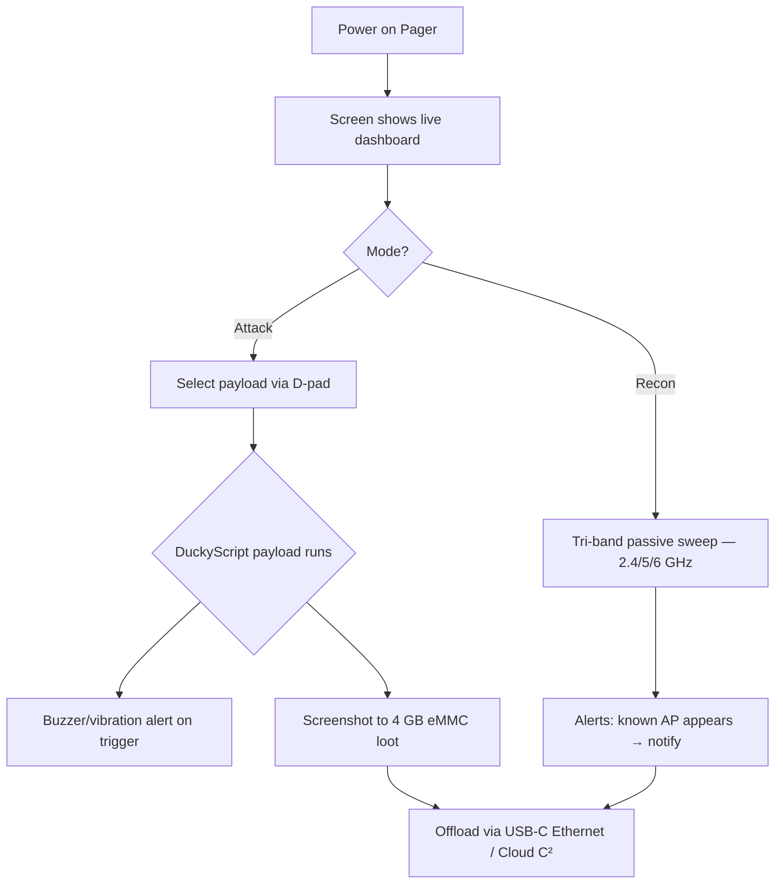

# WiFi Pineapple Pager — 完整指南

> **一句话定位**：WiFi Pineapple Pager 是 Hak5 二十周年的旗舰 — 把整台 Pineapple 塞进口袋，2.4 吋屏幕、三频无线电（2.4/5/6 GHz）、还有 DuckyScript 驱动的载荷系统，完全不需要电脑就能出任务。

Pager 回答了每个 Pineapple 用户最终都会问的问题：*「如果我不需要笔记本就能运行它呢？」* 它是一台独立的 Linux 手持设备，带全彩屏幕、四个 RGB D-pad 按钮、蜂鸣器、振动马达，以及第八代 PineAP 引擎 — 能三频侦察、邪恶双胞胎攻击和自动化 DuckyScript 载荷，全部靠夹在腰带上的 2000 mAh 电池。

它是「90 年代复古寻呼机」的外观配上现代渗透测试的大脑 — 对学生来说，它是有史以来最容易上手的 Pineapple，因为**屏幕会告诉你正在发生什么**，而不是一个神秘的 LED。

> **⚠️ 仅限授权测试。** 口袋大小的流氓 AP 仍然是流氓 AP。只在你自己的网络上测试。

---

## 规格一览

| 项目 | 规格 |
|---|---|
| CPU | 580 MHz MIPS 24K 路由器级芯片 |
| 无线（主） | 双 PHY 2T2R 802.11 a/b/g/n/ac/ax |
| 无线（次） | 单 PHY 2T2R 802.11 b/g/n |
| 频段 | 三频：2.4 GHz / 5 GHz / 6 GHz |
| 蓝牙 | 蓝牙 5.2 + BLE 4.2 |
| 显示 | 2.4 吋 LED 背光 TFT，480×222 px（221 PPI），16 位色 |
| 内存 / 存储 | 256 MB DDR2 RAM / 128 MB SPI 闪存 / 4 GB eMMC |
| 电池 | 2000 mAh LiPo（可维护、BMS、LED 充电指示灯） |
| 端口 | USB-C（充电 + 集成以太网）、USB 2.0（扩展） |
| 指示灯 | 4× RGB LED、PWM 蜂鸣器、振动马达、RTC |
| 操作系统 / 载荷 | 基于 OpenWrt 的 Linux；DuckyScript + Bash + Python |
| 官方文档 | https://docs.hak5.org/wifi-pineapple-pager |

## 结构

| 部件 | 用途 |
|---|---|
| 2.4 吋彩屏 | 实时仪表盘：侦察结果、载荷状态、菜单 |
| 4 向 D-pad + A/B 按钮（RGB） | 浏览菜单、触发载荷、获得触觉反馈 |
| USB-C 端口 | 充电 AND 以太网适配器（主机访问 Pager 的局域网） |
| USB 2.0 端口 | 硬件改装：GPS、额外无线电、自定义模块 |
| 腰带夹 | 现场作业 — 免提部署 |
| 扬声器 + 振动 | 实时告警：「目标 AP 出现」、「载荷已匹配」 |

---

## 它与其他 Pineapple 有什么不同

| | Mark VII | Pager |
|---|---|---|
| 需要笔记本 | 是（1471 端口的 Web UI） | **不需要 — 屏幕 + 按钮都在机身上** |
| 频段 | 2.4 GHz（+5 GHz 需 MK7AC） | **开箱即 2.4 / 5 / 6 GHz** |
| 载荷引擎 | 仅模块 | **DuckyScript + Bash + Python** |
| 反馈 | RGB LED | **屏幕、蜂鸣器、振动、RGB** |
| 电源 | USB-C（有线） | **电池 — 真正便携** |



---

## 快速入门 — 首次启动

### 第 1 步 — 充电
把 Pager 插到 USB-C。充电 LED 显示进度；屏幕亮起。

### 第 2 步 — 开机与首个仪表盘
按电源按钮。约 30 秒内屏幕显示主菜单：**Recon**、**PineAP**、**Payloads**、**Settings**。

### 第 3 步 — 设置时区与密码
- **Settings → System** → 时区（RTC 即使关机也能保持时间戳正确）。
- **Settings → Security** → 为 Web/SSH 访问设置管理员密码。

### 第 4 步 — 运行你的第一次侦察
1. D-pad 到 **Recon** → **Start Scan**。
2. 看屏幕填充：2.4 GHz 和 5 GHz 上的 AP 与客户端（6 GHz 需要在 Settings → Network → 6 GHz 里打开 — 默认关闭是有充分理由的：范围短、客户端少）。

预期屏幕输出：

```text
Scanning...
  [2.4G] CoffeeShop      WPA2   ch 6
  [5G]   Home-5G         WPA3   ch 36
  [2.4G] Office-Guest    OPEN   ch 11   ← interesting
Clients: 23   APs: 12
```

### 第 5 步 — 触发你的第一个载荷
1. **Payloads → Library** → 选一个内置示例（例如「AP Alert」）。
2. 按 **A** 把它设为默认。
3. 载荷会在触发条件满足时自动运行 — 蜂鸣器鸣叫，屏幕闪烁显示匹配。

> **你可能会问：** *「我为什么要一个只会提醒我的载荷？」* 因为那是红队工作流的核心：把 Pager 放在目标区域，让它被动侦察，当特定 AP/客户端模式出现时得到**通知** — 然后决定是否行动。Pager 是*传感器和触发器*设备，不只是攻击盒子。

---

## 载荷 — Pineapple 上的 DuckyScript

Pager 运行与 [USB Rubber Ducky](/hak5/products/usb-rubber-ducky/) 相同的 DuckyScript 家族，但为无线扩展：载荷可以检查空域、按事件分支、控制蜂鸣器/显示。Payload Studio v1.5+ 支持 Pager 载荷（Community 与 Pro）。

```text
REM Example: alert when a specific SSID appears
WAIT_FOR_EVENT ssid "CoffeeShop"
BUZZER 3
DISPLAY "Target AP detected!"
```

```text
REM Example: capture handshakes on a schedule
BEGIN_PAYLOAD
SET_TIME 2 30
REPEAT_FOREVER
    RECON SCAN 60
    IF handshake_found THEN
        BUZZER 2
        SAVE_LOOT "handshake.pcap"
    END_IF
END_PAYLOAD
```

> 这些示例说明的是*概念* — 确切的命令名随每个固件版本发布。始终查看 Pager 文档（https://docs.hak5.org/wifi-pineapple-pager）获取当前命令集。

---

## 进阶

| 能力 | 怎么做 |
|---|---|
| 流氓 AP / 邪恶双胞胎 | **PineAP** 菜单 — 克隆 SSID、信标响应引诱、去认证 |
| WPA3-Enterprise 测试 | 三频无线电覆盖最新的企业认证；搭配 [Enterprise](/hak5/products/wifi-pineapple-enterprise/) 标签概念 |
| 自动化现场侦察 | 载荷计划：扫描 → 保存战利品 → 通知，免提 |
| 自定义硬件改装 | USB 2.0 端口 + root Linux：GPS 模块、SDR 无线电，随你发挥 |
| 远程管理 | **Virtual Pager** Web 界面 — 从浏览器看屏幕、按按钮 |
| Cloud C² | 远程卸载战利品和管理载荷 |
| 主机访问 | USB-C 以太网适配器让电脑直接局域网访问 Pager |

---

## 故障排查

| 症状 | 原因 | 修复 |
|---|---|---|
| 6 GHz AP 从不出现在 Recon | 6 GHz 默认关闭 | Settings → Network → 启用 6 GHz（预期范围更短） |
| 屏幕变暗 / 无蜂鸣 | 省电模式或告警被静音 | 检查 Settings → Display / Audio |
| 载荷不触发 | 触发模式不匹配 | 在载荷编辑器里重新检查 SSID/BSSID 匹配 |
| 扫描时电池掉得快 | 持续三频扫描很耗电 | 只用 2.4+5 GHz，或安排载荷计划 |
| 连不上 Virtual Pager | Pager 与你的浏览器不在同一网络 | 通过 USB-C 以太网连接，或加入 Pager 的热点 |

---

## 相关资源

- [WiFi Pineapple Mark VII](/hak5/products/wifi-pineapple-mark-vii/) — 经典 Web UI Pineapple
- [WiFi Pineapple Enterprise](/hak5/products/wifi-pineapple-enterprise/) — 5 无线电机架怪兽
- [USB Rubber Ducky](/hak5/products/usb-rubber-ducky/) — DuckyScript 3.0 语言参考概念
- [固件与下载](/hak5/firmware-downloads/) — PayloadStudio 与固件
- [故障排查索引](/hak5/troubleshooting-index/)
- [Hak5 概览](/hak5/)