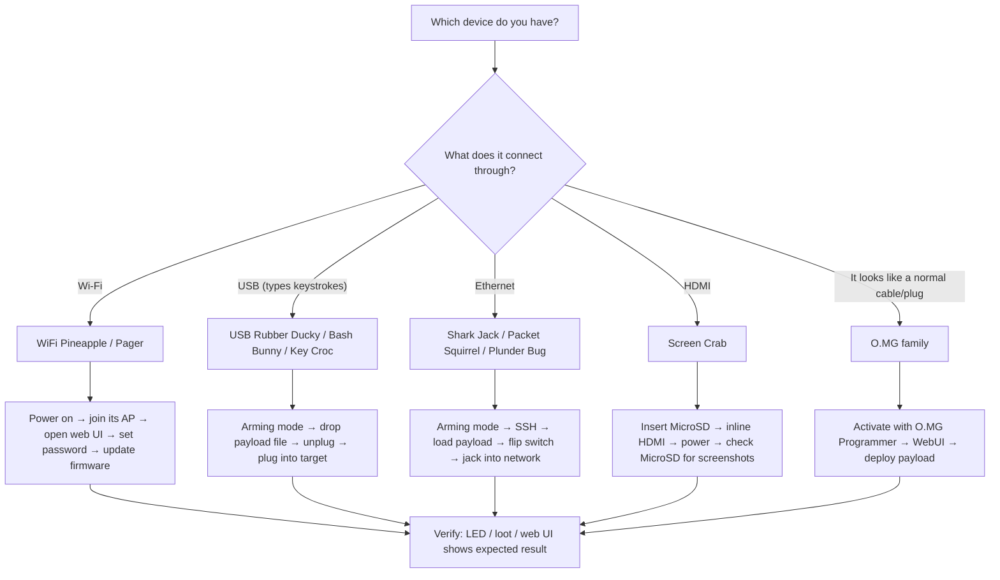

# Hak5 快速入门 — 你的前 15 分钟

> **学习目标**：读完你将能为任一台 Hak5 设备完成首次启动 — 进入武装模式（arming mode）、加载第一个载荷（Payload）、并回收第一批战利品（loot，窃取/收集到的数据）。
> **适用对象**：初学者（完全没碰过 Hak5 也可以）｜ **前置需求**：一台 Hak5 设备、一台电脑、一条 USB 线（或 Wi-Fi）。

每台 Hak5 设备都说着同样的三个词，让我们一次学会 — 它们会让下面每个快速入门都变得轻而易举：

1. **武装模式（Arming mode）** — 一个开关位置、隐藏按钮或默认按键序列，把设备变成无害且可编辑的东西（闪存盘、Web UI 或 SSH 服务器）。*你在这里加载载荷。*
2. **载荷（Payload）** — 当设备「武装」进入*攻击模式*时运行的脚本。它只是一个文本文件（或编译后的 `.bin`）。
3. **战利品（Loot）** — 结果存放的地方（键盘敲击、扫描、截图）。几乎总是一个 `loot/` 文件夹。



---

## 0. 开始之前 — 搭建你的实验室

你需要一个安全的地方来测试。黄金法则：

- 只在你**拥有的设备**上测试：一台旧笔记本、一台闲置路由器、你自己的虚拟机。
- 备好一个**USB 键盘和显示器**，以防某个载荷把机器锁死。
- 做 Wi-Fi 工作时，在 Kali Linux 上带监听模式的 [ALFA 适配器](/alfa-network/) 是嗅探你自己 Pineapple 流量的绝佳搭档。

检查清单：

- [ ] Hak5 设备（任意型号）+ 它的 USB 线 / 电源
- [ ] 一台带网页浏览器和 SSH 客户端的电脑
- [ ] 一个你拥有的目标（旧笔记本、虚拟机、闲置路由器）
- [ ] （Wi-Fi 设备）一个你控制的 2.4 GHz 网络

---

## 1. WiFi Pineapple 家族（Mark VII / Enterprise / Pager）

Pineapple 是一个**流氓接入点**：它广播自己的 Wi-Fi，让你能从浏览器管理它并运行 PineAP 套件。

1. 开机（[Mark VII](/hak5/products/wifi-pineapple-mark-vii/) 用 USB-C，[Enterprise](/hak5/products/wifi-pineapple-enterprise/) 用交流电，[Pager](/hak5/products/wifi-pineapple-pager/) 用电池）。
2. 在笔记本上加入 Pineapple 的 Wi-Fi。Mark VII 默认：SSID `PineAP`，密码 `pineapplesareyummy`。
3. 在浏览器打开管理界面：`http://172.16.42.1:1471`。
4. 立即设置**管理员密码**（Settings → Password）。升级固件（Settings → Software Update）。
5. 如果你想让模块更新，连接一个互联网上行链路。

预期输出 — 浏览器显示 Pineapple 仪表盘，带有 **Recon**、**PineAP**、**Modules** 和 **Client** 面板。

> **初学者陷阱：** 如果看不到 `PineAP` SSID，设备还在启动 — 等 30–60 秒。完整步骤和 5 GHz 升级路径在 [Mark VII 产品页](/hak5/products/wifi-pineapple-mark-vii/)。

---

## 2. USB 键盘设备（USB Rubber Ducky / Bash Bunny / Key Croc）

这些设备假装自己是键盘。三者的流程完全相同：**武装 → 投放载荷 → 部署**。

### 2.1 USB Rubber Ducky — Hello, World!

1. 把 [USB Rubber Ducky](/hak5/products/usb-rubber-ducky/) 插进电脑。它会挂载成一个叫 `DUCKY` 的闪存盘 — 这就是**武装模式**。
2. 在 PayloadStudio（https://payloadstudio.hak5.org）里写一个载荷，然后点击 **Generate Payload**。你会得到一个编译好的 `inject.bin`。
3. 把 `inject.bin` 复制到 `DUCKY` 盘的根目录，替换现有文件。
4. 拔掉。在目标机器（你自己的机器！）上打开记事本。插上 Ducky。看它打字。

```text
REM This is a DuckyScript payload — type into whatever app is focused
DELAY 1000
STRING Hello from my first payload!
ENTER
```

预期结果 — `Hello from my first payload!` 出现在记事本里。

### 2.2 Bash Bunny — 切换到载荷

[Bash Bunny](/hak5/products/bash-bunny-mark-ii/) 有一个 3 段式开关。位置 3（最靠近 USB 插头）是**武装模式** — Bunny 会显示为闪存盘和串口控制台。把 `payload.txt` 放进 `/payloads/switch1/`，然后拨到位置 1 重新插上。

### 2.3 Key Croc — 零配置键盘记录

[Key Croc](/hak5/products/key-croc/) **开箱即用**记录键盘敲击：把它串在键盘和电脑之间，它就会记录到 `/root/loot/keystrokes.log`，无需任何设置。按下隐藏的武装按钮，把它变成闪存盘读取战利品。

---

## 3. 网络设备（Shark Jack / Packet Squirrel / Plunder Bug）

### 3.1 Shark Jack — 60 秒内完成第一次扫描

[Shark Jack](/hak5/products/shark-jack/) 出厂时已预装**nmap 侦察载荷**。只需：

1. 把开关拨到**攻击模式**。
2. 把它插进任何以太网口（你自己的交换机，在你的实验室里！）。
3. 观察 RGB LED。等大约 60 秒。
4. 拨回**武装模式**，通过 USB 插进电脑，SSH 进去收集战利品。

```bash
# From your computer — your NIC must be on the Shark's subnet
ip addr add 172.16.24.2/24 dev eth0
ssh root@172.16.24.1          # password: hak5shark
cat /root/loot/scan/*.txt     # read the nmap results
```

预期输出 — 网络上发现的主机、开放端口和服务列表。

### 3.2 Packet Squirrel — 内联中间人

[Packet Squirrel Mark II](/hak5/products/packet-squirrel-mark-ii/) 位于目标和网络**之间**。把 *Network* 口接到你的路由器，*Target* 口接到你想监视的设备，用 USB-C 供电，然后用开关选择载荷。武装模式（开关位置会给你 Web UI）在 `172.16.32.1`。

### 3.3 Plunder Bug — 用 Wireshark 嗅探

[Plunder Bug](/hak5/products/plunder-bug-lan-tap/) 是一个 USB-C 局域网分流器：把它内联接在一对以太网线上，把 USB-C 端插进笔记本，运行跨平台连接脚本，然后在 Wireshark 里捕获。

---

## 4. Screen Crab — 2 分钟出截图

1. 把 MicroSD 卡插入 [Screen Crab](/hak5/products/screen-crab/)。
2. 把 Screen Crab **内联**：HDMI 源（例如电脑）→ Screen Crab → 显示器。
3. 用 USB-C 供电。无需配置 — 它会按默认间隔把截图存到 MicroSD 卡。
4. 弹出 MicroSD 浏览捕获内容；编辑 `config.txt` 改变间隔、启用视频，或添加 Wi-Fi + [Cloud C²](/hak5/firmware-downloads/)。

---

## 5. O.MG 设备 — 先激活

O.MG 设备（Cable / Plug / Adapter / UnBlocker）出于法律原因出厂时**处于停用状态**。它们必须先用 [O.MG Programmer](/hak5/products/omg-programmer/) 激活才能运行：

1. 把 O.MG 设备插进 Programmer，再把 Programmer 插进一台运行 **Chrome 或 Edge** 的电脑。
2. 打开 WebFlasher（https://o.mg.lol/setup/）并按照 3 步向导操作。
3. 激活后，设备会广播自己的 Wi-Fi；加入它并打开 WebUI 部署你的第一个 DuckyScript 载荷。完整细节见 [O.MG Cable 页面](/hak5/products/omg-cable/)。

---

## 6. 确认你准备好了

| 检查项 | 方法 | 成功的样子 |
|---|---|---|
| 设备被枚举 | `lsusb`（Linux）/ 设备管理器（Windows） | 能看到带厂商名的 Hak5 设备 |
| 战利品已收集 | SSH 后 `ls /root/loot/`，或打开 MicroSD | 存在带时间戳的文件 |
| Web UI 可访问 | 浏览器访问设备 IP | 仪表盘正常渲染 |
| 载荷已执行 | 观察目标（记事本、日志文件） | 出现预期的键盘敲击 / 文件 |

---

## 常见的首次运行错误

| 症状 | 原因 | 修复 |
|---|---|---|
| 找不到设备的 Wi-Fi | 还在启动，或型号不对 | 等 60 秒；查看[故障排查索引](/hak5/troubleshooting-index/) |
| 闪存盘不挂载 | 设备在攻击模式，不是武装模式 | 拨开关 / 按武装按钮 / 查你型号的文档 |
| SSH 被拒绝 | 子网不对或设备不在武装模式 | 在设备网段设置静态 IP（例如 `172.16.24.2/24`） |
| 载荷什么都没打出来 | 键盘布局错误或开头没有 `DELAY` | 用目标的布局编译；先加 `DELAY 1000` |
| O.MG 不显示 WebUI | 设备未激活 | 先用 O.MG Programmer 激活 |

现在你武装好了 — 字面意义上的。下一步：从[产品目录](/hak5/)里选一台设备深入。需要确切的固件或载荷链接？[固件与下载](/hak5/firmware-downloads/) 页面应有尽有。