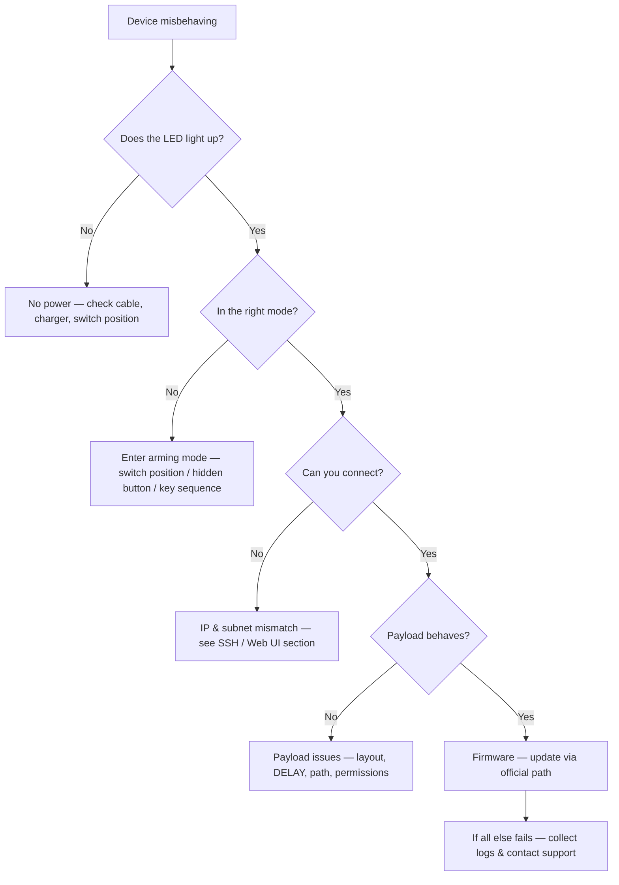

# Hak5 故障排查索引

> **排查铁律**：先确认电源与模式 → 再查 LED 状态 → 然后验证连接（SSH/Web UI）→ 最后检查载荷与固件。照这个顺序走，90% 的问题五分钟内解决。



---

## 问题分类

| 类别 | 典型症状 | 跳转到 |
|---|---|---|
| 电源与启动 | 无 LED、无 Wi-Fi、设备无响应 | [电源与启动](#power--boot) |
| 武装模式 | 闪存盘 / Web UI / SSH 不出现 | [武装模式问题](#arming-mode-problems) |
| 连接 | SSH 被拒绝、Web UI 无法访问、IP 错误 | [SSH 与 Web UI 连接](#ssh--web-ui-connection) |
| 载荷 | 什么都不打、扫描无战利品、脚本错误 | [载荷问题](#payload-problems) |
| Wi-Fi | Pineapple AP 不可见、无互联网上行 | [Wi-Fi 问题](#wi-fi-issues) |

---

## LED 参考 — 灯的含义

### WiFi Pineapple Mark VII（单颗 RGB LED）

| LED | 含义 |
|---|---|
| 绿色常亮 | 已启动，健康 |
| 蓝色闪烁 | 启动 / 固件升级进行中 |
| 红色闪烁 | 错误 — 查看 Web UI 日志 |

### Bash Bunny（RGB LED — 颜色表示*阶段*）

| LED | 含义 |
|---|---|
| 琥珀色常亮 | 武装模式（开关位置 3） |
| 红 → 绿闪烁 | 载荷运行中 |
| 绿色常亮 | 载荷成功完成 |
| 红色闪烁 | 载荷出错 — 检查 `payload.txt` |

### Shark Jack / Shark Jack Cable

| LED | 含义 |
|---|---|
| 绿色（闪烁） | 启动中 |
| 蓝色（闪烁） | 充电中 |
| 蓝色（常亮） | 已充满 |
| 黄色（闪烁） | 武装模式 — SSH 服务器运行中 |
| 红色（闪烁） | 错误 — 未找到载荷 |

### Key Croc

| LED | 含义 |
|---|---|
| 记录键盘时关闭 | 隐身模式 — 这是正常的！ |
| 常亮（各种颜色） | 配置 / 攻击模式活动 |

> **每台设备都不同 —** 上面的颜色代码对应当前固件。有疑问时，官方各设备文档（从每个[产品页](/hak5/)链接）包含你固件版本的权威图例。

---

## 电源与启动

### 设备毫无生命迹象
**诊断**：LED 完全熄灭了吗？检查线材和电源。

| 原因 | 修复 |
|---|---|
| 电池没电（Shark Jack / Pager） | 用 USB-C 充电；Shark Jack 充满约需 30 分钟 |
| 电源适配器不对 | Mark VII 需要 5V/2A USB-C；Enterprise 需要它的交流适配器 |
| 开关位置不对 | 有些设备（Bash Bunny）不是所有位置都会启动载荷 — 先拨到武装模式 |

### 设备循环重启
**原因：** 通常是损坏的载荷或一次失败的升级。**修复：** 进入武装模式（它会绕过载荷执行），把载荷换成已知良好的一个，或使用[固件与下载](/hak5/firmware-downloads/)页面的官方方法重新刷写固件。

---

## 武装模式问题

### 设备挂载成磁盘，但没有 `payloads` 文件夹
**诊断**：`lsusb` 或文件管理器能看到设备，但目录结构不对。
**原因：** 你看的是 *loot/配置* 分区而不是载荷区域，或者设备是布局不同的型号。
**修复：** 在你型号的产品页上查看确切的分区布局（例如 [Bash Bunny](/hak5/products/bash-bunny-mark-ii/) 使用 `/payloads/switch1|2|3/`；[Shark Jack](/hak5/products/shark-jack/) 通过 SSH 暴露 `/root/payload/`，而不是磁盘）。

### Bash Bunny 开关不触发武装模式
**原因：** 开关位置混淆。位置 3（最靠近 USB 插头）是武装。**修复：** 拨到位置 3，拔出再重新插入。

### Key Croc 武装按钮「不存在」
**原因：** 武装按钮是**隐藏的** — 一个针孔大小的按钮，必须在插入时按下（或用回形针）。**修复：** 见 [Key Croc 指南](/hak5/products/key-croc/) 了解确切技巧。

---

## SSH 与 Web UI 连接 {#ssh--web-ui-connection}

### `ssh: Connection refused` / 页面打不开
**诊断步骤 1 — 你在正确的网络上吗？**

```bash
# Shark Jack in arming mode expects your machine on 172.16.24.0/24:
ip addr add 172.16.24.2/24 dev eth0
ping 172.16.24.1
```

预期输出：

```text
64 bytes from 172.16.24.1: icmp_seq=1 ttl=64 time=0.4 ms
```

如果 ping 失败，你不在设备的子网上 — 先修复你的 IP。

| 设备 | 武装地址 | 凭据 |
|---|---|---|
| Shark Jack | `172.16.24.1` | `root` / `hak5shark` |
| Packet Squirrel | `172.16.32.1`（Web UI） | `root` / `hak5squirrel` |
| WiFi Pineapple | `172.16.42.1:1471`（Web UI） | 首次启动时设置的管理员密码 |
| Bash Bunny | USB 串口控制台（无 IP） | `root` / `hak5bunny` |
| Key Croc | `172.16.0.1`（Web UI，武装模式） | `root` / `hak5croc` |

> **不确定你型号的地址？** 查看它的产品页 — [17 个产品指南](/hak5/)中的每一个都列出了确切的管理地址。

### 我能 SSH 但 shell 很小 / 工具缺失
**原因：** 你在设备受限的启动 shell 上，而不是完整的 Linux 环境。**修复：** 运行 `exec bash`，或通过你型号页面上的文档化命令启动完整 shell（例如 Key Croc 和 Shark Jack 暴露完整的 Debian root，带 `nmap`、`tcpdump` 等）。

---

## 载荷问题

### 键盘敲击打到错误的应用程序 / 什么都没打
| 原因 | 修复 |
|---|---|
| 载荷开头没有 `DELAY` | 添加 `DELAY 1000`（或更长）— 目标操作系统必须初始化 USB HID |
| PayloadStudio 里键盘布局错误 | 用目标的布局重新编译（例如 `German`、`French`） |
| 目标应用没有焦点 | 设计载荷先打开记事本/终端（`GUI r` 等） |
| 载荷为错误的设备编译 | Key Croc 运行解释型 `payload.txt`；Rubber Ducky 需要编译好的 `inject.bin` |

### 载荷运行了但战利品文件夹是空的
**原因：** 载荷的输出路径不存在，或载荷写入不同的目录。**修复：** 从载荷文档验证路径（Shark Jack 上是 `/root/loot/`；Key Croc 上是 `/root/loot/keystrokes.log`），并给脚本一点时间 — 扫描需要时间。

### Bash Bunny LED 闪红灯
**原因：** 载荷返回了错误。**修复：** 在武装模式下连接串口控制台并读取输出：

```text
LED R
GET SWITCH_POSITION
```

查看错误行，修复脚本，重新部署。

---

## Wi-Fi 问题 {#wi-fi-issues}

### 看不到 Pineapple 的 AP
1. 开机后等 60 秒（首次运行启动很慢）。
2. 检查 LED — 如果是红色，通过有线连接查看 Web UI 日志。
3. 在 [Pager](/hak5/products/wifi-pineapple-pager/) 上，屏幕直接显示 AP 状态。

### Pineapple 没有互联网，模块无法升级
**原因：** AP 没有上行链路。**修复：** 把以太网线接到 USB-C 以太网口（Mark VII），或配置 Pager 的以太网/USB-C，然后重试 **Settings → Software Update**。

### 5 GHz 客户端无法连接 Pineapple
**原因：** Mark VII 需要 MK7AC 适配器（MT7612U）才能用 5 GHz。**修复：** 见[兼容适配器表](/alfa-network/) — ALFA AWUS036ACM 可用。

---

## 还是卡住了？像专业人士一样报告

联系支持（或询问论坛）时，请包含：

- [ ] 设备型号 + 固件版本（`cat /etc/version` 或 Web UI 页脚）
- [ ] 故障时的电源和开关/按钮位置
- [ ] LED 颜色/模式
- [ ] 确切的错误文本（SSH 输出、Web UI 日志、载荷错误）
- [ ] 你已经尝试过什么（子网修复、更换载荷、固件升级）

> **专业提示：** 大多数「坏掉」的 Hak5 设备只是模式不对或子网不对。在拆开任何东西之前，重新运行本页顶部的决策树。

回到[Hak5 概览](/hak5/)或[快速入门](/hak5/quickstart/)。