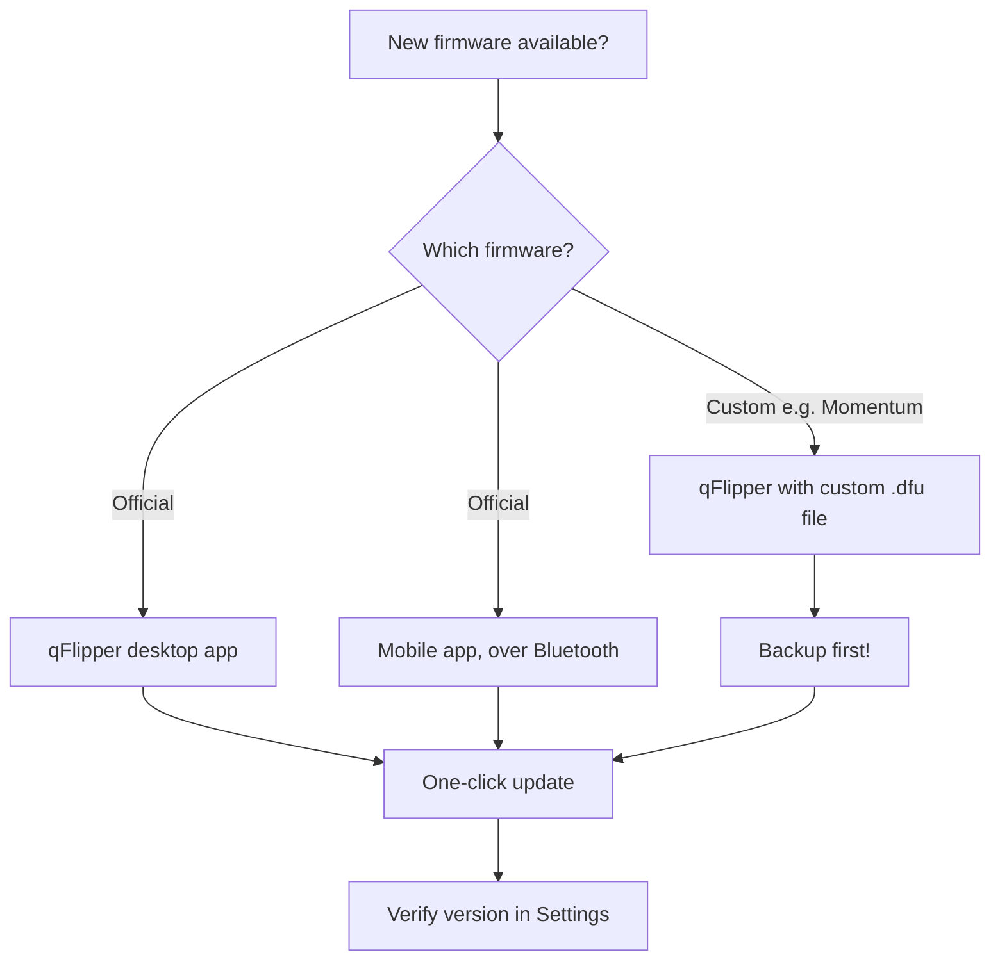
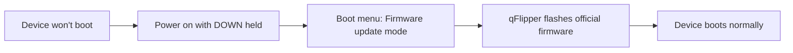

# 固件与 qFlipper — 升级指南

> **学习目标**：完成后你将理解 Flipper Zero 上"firmware（固件）"的含义，了解升级它的三种方式，已在桌面上用 qFlipper 完成升级、做过备份，并知道如何从一次失败的刷机中恢复。
>
> **适用读者**：拥有 Flipper Zero 的新手。桌面方法需要一台电脑（Windows / macOS / Linux）。

## 到底什么是固件？

Flipper Zero 是一台小型计算机：STM32WB55 微控制器，配有一块 1 MB 闪存芯片，存储操作系统和所有内置应用——Sub-GHz 读取器、NFC、RFID、红外、Bad USB，以及主菜单中你看到的一切。这些软件统称为 **firmware（固件）**（官方名称为 **FlipperOS**）。

固件会定期发布更新，带来：

- 新的协议支持（新的 Sub-GHz 和 NFC 卡类型）
- 错误修复和安全补丁
- 新的内置应用和功能
- 更大、由社区维护的 IR 数据库

两大固件家族：

| 固件 | 维护者 | 说明 |
|---|---|---|
| **官方 FlipperOS** | Flipper Devices | 推荐的默认选择。稳定，包含所有内置应用。 |
| **自定义固件（Momentum）** | 社区（Momentum 团队） | 增加额外应用、更好的界面、更多功能。需要通过 qFlipper 手动刷写。 |



## 前置条件

- [ ] Flipper Zero 电量至少 30%（或已插入 USB 供电）
- [ ] 支持数据传输的 USB-C 数据线（不能是仅充电线）
- [ ] 已安装 qFlipper（从[官方下载页面](https://flipper.net/pages/downloads)下载）
- [ ] 如果使用自定义固件：备份当前固件和数据

## 方法 A：使用 qFlipper 升级（推荐）

### 第 1 步：安装 qFlipper

qFlipper 是 Flipper Devices 的官方桌面应用。从[官方下载页面](https://flipper.net/pages/downloads)下载。

| 操作系统 | 安装方式 |
|---|---|
| Windows | 运行 `.exe` 安装程序，按向导操作 |
| macOS | 打开 `.dmg`，将 qFlipper 拖到 Applications |
| Linux（Debian/Ubuntu） | 使用 `sudo apt install ./qFlipper-<version>.deb` 安装 `.deb` |

在 Ubuntu/Debian 上，下载 `.deb` 后：

```bash
sudo apt install ./qFlipper-1.3.1-x86_64.deb
```

**预期输出**（末尾部分）：

```text
Preparing to unpack ./qFlipper-1.3.1-x86_64.deb ...
Unpacking qflipper ...
Setting up qflipper (1.3.1) ...
```

> **注意**：下载页面中的确切文件名和版本会有所不同。请根据你下载的文件调整命令。

### 第 2 步：连接你的 Flipper Zero

1. 将 USB-C 数据线插入 Flipper Zero，再插入电脑。
2. 在 Flipper Zero 上确认 USB 提示：选择 **Connect**（默认允许 USB 连接）。
3. 打开 qFlipper。主屏幕应显示 Flipper Zero 及其**当前固件版本**，例如：

```text
Device: Flipper Zero
Firmware version: 1.0.4
Storage: 14.6 GB free
```

**在 Linux 上验证** — 如果 qFlipper 看不到设备，请检查操作系统是否识别它：

```bash
lsusb
```

**预期输出**（查找 Flipper Devices 那一行）：

```text
Bus 001 Device 004: ID 0483:5740 STMicroelectronics Flipper Zero
```

### 第 3 步：升级

1. 在 qFlipper 中，点击顶栏的 **Update** 按钮（带向上箭头的 Flipper 图标）。
2. qFlipper 检查发布渠道并显示最新版本。点击 **Update Firmware**。
3. 等待。Flipper Zero 屏幕显示进度条；qFlipper 显示类似日志：

```text
Downloading firmware ...
Flashing ...
```

4. 设备重启后，qFlipper 显示新版本。完成 ✅

### 第 4 步：验证

在 Flipper Zero 本机上：**主菜单 → 设置 → 关于**。检查版本是否与 qFlipper 刚刷写的版本一致。

## 方法 B：使用移动应用升级

如果你更喜欢用手机：安装 [Flipper Mobile App](/flipper-zero/mobile-app/)，通过蓝牙配对，然后 **App → Firmware Update**。应用会通过无线方式下载并刷写新固件。完整的配对步骤请参阅[移动应用指南](/flipper-zero/mobile-app/)。

## 方法 C：使用 qFlipper 安装自定义固件（Momentum）

> ⚠️ **警告**：自定义固件可能不稳定或升级更慢。务必先备份，如果不需要额外功能，请换回官方固件。

1. **先备份数据**（参见下一节）。
2. 下载自定义固件 `.dfu` 文件（例如从 [Momentum 发布页面](https://github.com/Next-Flip/Momentum-Firmware/releases)）。
3. 在 qFlipper 中：**点击 Flipper 图标 → Install from file → 选择 .dfu → Flash**。

**预期输出**：

```text
Selected file: momentum-<version>.dfu
Flashing ...
```

4. Flipper Zero 会以自定义固件重启。在 **设置 → 关于** 中验证——版本字符串现在会提到自定义构建。

> 要换回官方固件，请使用 [Flipper 发布页面](https://github.com/flipperdevices/flipperzero-firmware/releases) 的官方 `.dfu` 重复上述操作。

## 备份与恢复

你捕获的密钥、IR 码和设置都存放在 microSD 卡上——所以**最简单的备份就是把 microSD 内容复制到电脑上**。但 qFlipper 也可以备份**内部存储**（地区、名称、设置、Dolphin 等级）。

| 备份类型 | 方法 |
|---|---|
| 完整备份（推荐） | Flipper 连接后，在 qFlipper 中：**Files 标签页 → 全选文件 → Copy to PC** |
| 设置 / 内部数据 | **Flipper 图标 → Backup → Save to file** |
| 恢复 | **Flipper 图标 → Restore → 选择备份文件** |

## 恢复：你的 Flipper 无法开机

别慌——Flipper Zero 有恢复路径：

1. **按住 DOWN 的同时开机**（`LEFT + BACK`）→ 出现启动菜单。
2. 选择 **Firmware update mode**。
3. 连接 USB 并用 qFlipper 刷写官方固件（上面的方法 A）。



## 常见错误

| 错误 | 原因 | 解决方法 |
|---|---|---|
| `Device not found` / `No device detected` | 仅充电数据线，或未确认 USB 提示 | 使用数据线；在 Flipper 上确认 "Connect" 提示 |
| qFlipper 在 Linux 上无法安装 | 缺少依赖 | `sudo apt install ./qFlipper-<ver>.deb`（会安装依赖）；如果失败，改用 AppImage |
| 升级停在 0% | USB 端口问题 | 换一个 USB 端口 / 数据线，重启 qFlipper |
| `Update failed: insufficient storage` | microSD 太满 | 释放 microSD 空间，或使用更大的卡 |
| 自定义固件升级失败 | .dfu 文件错误 | 为你的硬件下载正确的文件；确认是 `.dfu`，而不是源码压缩包 |

## 相关

- [Flipper Zero 快速入门](/flipper-zero/quickstart/)
- [Flipper Mobile App 指南](/flipper-zero/mobile-app/)
- [官方资源](/flipper-zero/official-resources/)
- [Flipper Zero 产品页面](/flipper-zero/products/flipper-zero/)