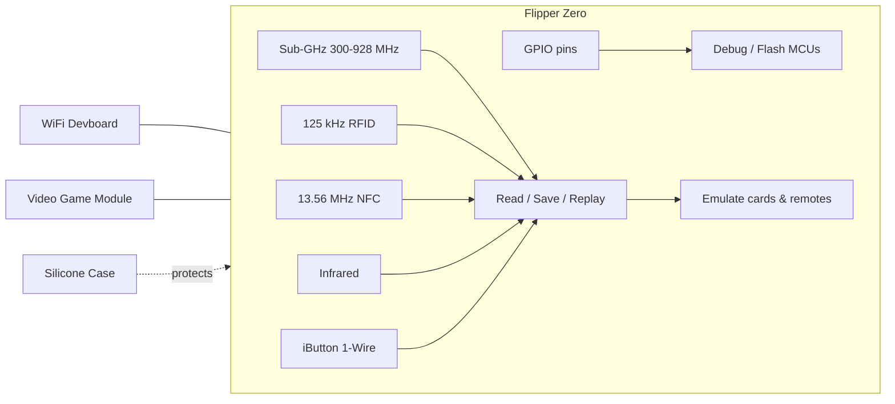

---

id: flipper-index
title: Flipper Zero
slug: /flipper-zero/
sidebar_position: 3
description: Flipper Zero 多功能工具设备——首次设置、使用 qFlipper 进行固件升级、移动应用配对、官方资源、故障排查，以及 Flipper Zero、WiFi Devboard、Video Game Module 和 Silicone Case 的完整产品页面。
tags: [flipper-zero, sub-ghz, nfc, rfid, 125khz, 红外, ibutton, gpio, qflipper, esp32-s2, rp2040]
keywords: [Flipper Zero, qFlipper, WiFi Devboard, Video Game Module, Sub-GHz, NFC, RFID, iButton, GPIO, 固件升级]
authors: yupitek
date: 2026-08-21
last_updated: 2026-08-21
category: overview
difficulty: beginner
toc: true
---

# Flipper Zero

Flipper Zero 是一款便携、玩具造型的多功能工具，专为安全研究人员、硬件黑客和好奇的学生设计。它可以与周围的无线电和电子系统交互——车库门、门禁卡、NFC 卡、电视遥控器、温度传感器、门铃——通过 Sub-GHz 无线电、125 kHz RFID、13.56 MHz NFC、红外、iButton（1-Wire）和 GPIO。它完全开源、可扩展，并且完全自主：5 键方向键和 1.4 英寸单色 LCD 足以满足日常使用。

你可以把它想象成数字系统的瑞士军刀：一个口袋大小的设备，可以**读取**信号、**存储**信号、**重放**信号，并**模拟**门禁卡或遥控器——还能通过 GPIO 引脚充当微控制器的调试器。

## 快速入门

- **[快速入门](/flipper-zero/quickstart/)** — 充电、开机、浏览菜单并在约 10 分钟内读取你的第一张卡。
- **[固件与 qFlipper](/flipper-zero/firmware-qflipper/)** — 保持你的 Flipper Zero 更新，并在刷机出错时恢复它。
- **[移动应用](/flipper-zero/mobile-app/)** — 通过蓝牙配对、同步数据并从手机更新固件。
- **[官方资源](/flipper-zero/official-resources/)** — 固件源码、原理图、社区以及获取帮助的地方。
- **[故障排查](/flipper-zero/troubleshooting/)** — 设备无法开机、无法充电、无法连接？从这里开始。

## Flipper Zero 家族

我们销售并支持 Flipper Zero 产品线中的四款产品：

| 产品 | 功能 | 入口 |
|---|---|---|
| **Flipper Zero** | 多功能工具本体：Sub-GHz、NFC、RFID、IR、iButton、GPIO、BLE | [产品页面](/flipper-zero/products/flipper-zero/) |
| **WiFi Devboard** | ESP32-S2 扩展板：WiFi Marauder、BlackMagic 调试探针、Evil Portal | [产品页面](/flipper-zero/products/wifi-devboard/) |
| **Video Game Module** | RP2040 扩展模块：玩复古游戏、将屏幕镜像到电视、动作感应 | [产品页面](/flipper-zero/products/video-game-module/) |
| **Silicone Case** | 日常携带的防护橡胶保护壳 | [产品页面](/flipper-zero/products/silicone-case/) |

## 它到底能做什么？

- **Sub-GHz（300–928 MHz）** — 使用内置 CC1101 收发器读取、存储和重放来自车库门遥控器、道闸、无线门铃和 IoT 传感器的信号。
- **125 kHz RFID** — 读取和模拟老式感应卡（EM4100、HID、Indala 等）。
- **13.56 MHz NFC** — 读取、写入和模拟高频卡（MIFARE Classic、Ultralight、DESFire、FeliCa、iClass）。
- **红外** — 学习并重放电视 / 空调 / 投影仪遥控器的信号，配有社区维护的 IR 数据库。
- **iButton（1-Wire）** — 读取、写入和模拟 Dallas 式接触钥匙（DS199x、TM2004、RW1990…）。
- **GPIO** — 2.54 mm 排针上的 13 个用户引脚，用于刷写和调试外部微控制器（SPI、UART、I2C、5V/3.3V 电源）。
- **Bluetooth 5.4** — 连接移动应用，实现远程控制、数据共享和无线固件升级。

## 使用 Flipper Zero 合法吗？

在大多数地区，拥有和使用 Flipper Zero 进行研究、教育和测试自己的设备是合法的。但各国法律不同：干扰不属于你的系统（打开别人的车库门、克隆未经授权测试的门禁卡）可能违法。**只在你自己的设备上测试，或获得明确许可后再测试。** WiFi Devboard 和 Video Game Module 同样适用。

> 有关无线研究中使用的 Wi-Fi 适配器和天线，请参阅我们的 [ALFA Network 专区](/alfa-network/)；有关 WiFi Pineapple 和 USB Rubber Ducky 等渗透测试工具，请参阅 [Hak5 专区](/hak5/)。