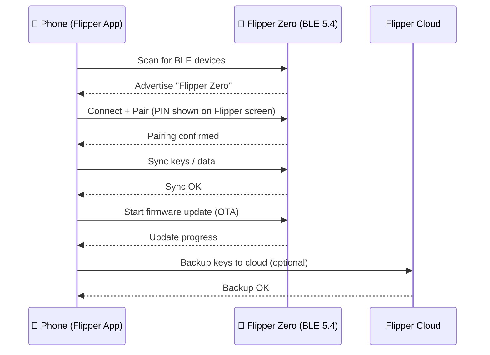

# Flipper Mobile App — 配对指南

> **学习目标**：完成后你将安装官方应用、通过蓝牙配对 Flipper Zero、同步数据，并使用应用进行远程控制和固件升级。
>
> **适用读者**：拥有 iPhone 或 Android 手机的新手。Flipper Zero 必须已经开机运行（参见[快速入门](/flipper-zero/quickstart/)）。

Flipper Zero 的 STM32WB55 射频处理器内置了低功耗蓝牙（BLE 5.4）。官方 **Flipper Mobile App**（由 Flipper Devices 开发）把你的手机变成这只小海豚的大屏遥控器：浏览已存储的密钥、与朋友分享、无线升级固件，甚至可以在房间另一头控制设备。



## 第 1 步：安装应用

| 平台 | 获取方式 |
|---|---|
| iOS（iPhone） | [App Store — Flipper Mobile App](https://apps.apple.com/app/flipper-mobile-app/id1534655259) |
| Android | [Google Play — Flipper Mobile App](https://play.google.com/store/apps/details?id=com.flipperdevices.app) |

确保手机的蓝牙已开启，并且手机距离 Flipper Zero 一两米以内。

## 第 2 步：在 Flipper Zero 上启用蓝牙

1. 打开 Flipper Zero（`LEFT + BACK`）。
2. 进入 **主菜单 → Bluetooth**。
3. 将 **Bluetooth** 设为 **ON**。

Flipper Zero 会开始以 BLE 外设身份广播。

> **你可能会被问到"配对模式"** — 保持默认即可。如果你之前配对过但失败了，请在应用和手机蓝牙设置中取消配对，然后重试。

## 第 3 步：在应用中配对

1. 打开 Flipper Mobile App。
2. 点击 **Connect**（应用会自动扫描附近的 Flipper Zero 设备）。
3. 当 Flipper Zero 出现在列表中时，点击它。
4. Flipper Zero 屏幕上会出现一个 **6 位 PIN 码**。在应用中输入它。
5. 双方确认。应用现在会显示你的 Flipper Zero 及其名称、固件版本和存储空间。

**预期结果**（应用屏幕）：

```text
Flipper Zero
  Firmware: 1.0.4
  Storage: 14.6 GB free
  [Synced]
```

> **为什么需要 PIN 码？** BLE 配对保护连接——这与配对蓝牙耳机是同样的原理。如果 PIN 码不匹配，Flipper Zero 和手机会拒绝连接。

## 第 4 步：同步数据

配对后，应用会同步 Flipper Zero 的内容：

- 已存储的 Sub-GHz 遥控器
- NFC / RFID 卡密钥
- 红外遥控器码
- iButton 密钥
- 设置

你可以在应用的 **Keys** 部分浏览它们、重命名或删除，而且——最有用的是——通过应用**与另一位 Flipper Zero 用户分享密钥**（无需数据线的官方密钥交换方式）。

## 第 5 步：远程控制

应用的 **Remote Control** 标签页会把 Flipper Zero 的界面镜像到你的手机上：

- 在屏幕上点按按钮，代替 5 键方向键
- 从手机触发 "Bad USB" 脚本（键盘模拟）

当 Flipper 被安装在某个不方便的位置（例如插在目标机器上）而你想从口袋里操控它时，这非常方便。

## 第 6 步：无线升级固件

1. 在应用中打开 **Firmware Update**（通常在设备设置 / 菜单下）。
2. 应用检查新版本。点击 **Update**。
3. 让手机保持在几米范围内——升级通过 BLE 传输，需要几分钟。
4. Flipper Zero 会以新固件重启。在 **主菜单 → 设置 → 关于** 中验证。

> 桌面替代方案以及自定义固件（Momentum）请参阅[固件与 qFlipper](/flipper-zero/firmware-qflipper/)——自定义固件是用 qFlipper 刷写的，而不是应用。

## 第 7 步（可选）：Flipper Cloud 备份

应用可以将你的密钥备份到 **Flipper Cloud**（Flipper Devices 的官方云服务），以便日后恢复或迁移到新设备。

1. 在应用中打开 **Flipper Cloud**。
2. 创建账户（邮箱 + 密码）或登录。
3. 点击 **Backup** → 应用会上传一份加密的数据快照。

> 🔒 你的密钥以加密形式上传。不过，请像对待密码一样对待门禁卡和遥控器密钥：不要分享你的云账户，也不要存储未经授权测试的系统的密钥。

## 常见错误

| 错误 | 原因 | 解决方法 |
|---|---|---|
| 应用找不到设备 | Flipper 或手机蓝牙关闭 | 在 Flipper 上开启 BLE（主菜单 → Bluetooth），刷新扫描 |
| 配对失败 / PIN 码错误 | 之前的配对已过期 | 在应用 + 手机蓝牙设置中取消配对，重启两者，重试 |
| 同步卡住 | 手机离得太远 | 移到 1–2 米范围内，重启应用 |
| OTA 升级中途失败 | BLE 连接中断 | 让手机保持靠近，重试；如果反复失败，改用 USB 连接 qFlipper |
| 固件升级后应用无法连接 | 固件和应用版本不匹配 | 从商店更新应用，然后重新连接 |

## 相关

- [Flipper Zero 快速入门](/flipper-zero/quickstart/)
- [固件与 qFlipper](/flipper-zero/firmware-qflipper/)
- [官方资源](/flipper-zero/official-resources/)