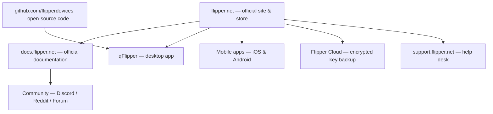

# Flipper Zero 官方资源

> **学习目标**：这个页面是收藏 Flipper Zero 一切官方内容的一个书签——公司网站、文档、源码、工具，以及获取帮助的地方。收藏它。

Flipper Zero 是少数**完全开源**的黑客工具之一：固件、原理图和硬件设计文件都由制造商 Flipper Devices 公开发布。这意味着你可以精确地了解它的工作原理、提交自己的功能，并构建自己的硬件模块。

## 官方网站与商店

| 资源 | URL | 你能找到什么 |
|---|---|---|
| 官方网站与商店 | https://flipper.net | 产品页面、购买、配件 |
| 官方文档 | https://docs.flipper.net | 用户指南、开发者文档、硬件文档 |
| Flipper 博客 | https://blog.flipper.net | 公告、深度文章、发布说明 |
| 支持门户 | https://support.flipper.net | 保修、RMA、帮助工单 |

## 下载

| 资源 | URL | 说明 |
|---|---|---|
| qFlipper 桌面应用 | https://flipper.net/pages/downloads | Windows / macOS / Linux；固件刷写、备份、文件管理器 |
| Flipper Mobile App（iOS） | https://apps.apple.com/app/flipper-mobile-app/id1534655259 | 配对、同步、OTA 升级、远程控制 |
| Flipper Mobile App（Android） | https://play.google.com/store/apps/details?id=com.flipperdevices.app | Android 上功能相同 |

## 开源仓库（GitHub）

所有内容都托管在 **Flipper Devices** GitHub 组织下：https://github.com/flipperdevices

| 仓库 | 里面有什么 |
|---|---|
| [flipperzero-firmware](https://github.com/flipperdevices/flipperzero-firmware) | FlipperOS 固件——官方发布构建、自定义固件基础 |
| [qFlipper](https://github.com/flipperdevices/qFlipper) | 桌面应用源码 |
| [flipperzero-firmware-sources](https://github.com/flipperdevices/flipperzero-firmware-sources) | 用于自行构建的完整固件源码 |
| [video-game-module](https://github.com/flipperdevices/video-game-module) | Video Game Module 固件和游戏 |
| [Flipper Zero 原理图与硬件](https://docs.flipper.net) | 官方文档提供 GPIO 引脚定义和原理图 PDF |

> **发布页面**：用于手动刷写的官方固件 `.dfu` 文件位于 https://github.com/flipperdevices/flipperzero-firmware/releases ——这些就是 qFlipper 使用的文件，也是恢复时刷写的同一批文件。

## 社区渠道

| 渠道 | URL | 用途 |
|---|---|---|
| 官方 Discord | https://discord.gg/flipper | 实时聊天、开发讨论、展示与分享 |
| Reddit r/flipperzero | https://www.reddit.com/r/flipperzero/ | 指南、提问、项目展示 |
| 官方论坛 | https://forum.flipper.net | 长篇讨论和问答 |
| YouTube | https://www.youtube.com/flipperzero | 官方视频和演示 |

> ⚠️ **买家注意**：只从官方 GitHub 组织或官方应用商店下载固件和应用。"Flipper" 克隆网站和第三方固件捆绑包曾被用来传播恶意软件。

## 你应该收藏什么

1. **docs.flipper.net** — 一切的手册。
2. **github.com/flipperdevices** — 源码和发布。
3. **flipper.net/pages/downloads** — qFlipper 和移动应用。
4. **Discord** — 最快的社区帮助。

## 相关

- [Flipper Zero 快速入门](/flipper-zero/quickstart/)
- [固件与 qFlipper](/flipper-zero/firmware-qflipper/)
- [Flipper Mobile App 指南](/flipper-zero/mobile-app/)
- [Flipper Zero 产品页面](/flipper-zero/products/flipper-zero/)
- [WiFi Devboard](/flipper-zero/products/wifi-devboard/)
- [Video Game Module](/flipper-zero/products/video-game-module/)