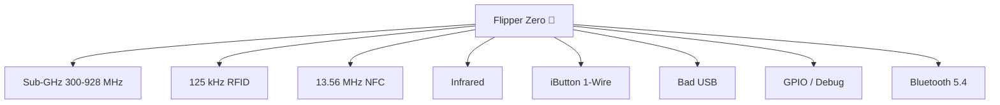

# Flipper Zero — 完整指南

> **一句话定位**：一个口袋大小、玩具造型的多功能工具，用于读取、存储、重放和模拟你周围的无线电信号与门禁系统——还能通过 GPIO 调试硬件。面向学生、爱好者和安全研究人员。



## 规格表

官方规格（来源：Flipper Devices）：

| 类别 | 规格 |
|---|---|
| MCU | **STM32WB55RG** — ARM Cortex-M4 @ 64 MHz + Cortex-M0+ 射频核心 @ 32 MHz |
| Flash / SRAM | 1024 KB 闪存 / 256 KB SRAM（应用与射频共享） |
| 显示屏 | 1.4 英寸单色 LCD，128×64 像素，ST7567 控制器，SPI |
| 电池 | LiPo 2100 mAh，待机最长 28 天 |
| Sub-GHz | CC1101 收发器；315 / 433 / 868 / 915 MHz 频段（因地区而异） |
| RFID（低频） | 125 kHz；AM/OOK；支持 EM400x/410x/420x、HID、Indala、FDX、Pyramid、AWID、Viking、Jablotron、Paradox、Gallagher 等 |
| NFC（高频） | 13.56 MHz；读取 / 写入 / 模拟 MIFARE Classic、Ultralight、DESFire、FeliCa、HID iClass（PicoPass）、NFC Forum 协议 |
| 红外 | RX 950 nm（38 kHz 载波）；TX 940 nm（0–2 MHz，300 mW）；NEC、Kaseikyo、RCA、RC5/RC6、Samsung、SIRC |
| iButton | 1-Wire 读取 / 写入 / 模拟；DS199x、DS1971、CYFRAL、Metakom、TM2004、RW1990 |
| 蓝牙 | BLE 5.4，TX 最高 4 dBm，RX -96 dBm，2 Mbps |
| USB | USB Type-C，USB 2.0（12 Mbps），充电最高 1A |
| GPIO | 2.54 mm 排针上的 13 个用户 I/O 引脚，3.3V CMOS，5V 容限输入，每引脚最高 20 mA |
| microSD | 最大 256 GB（SPI 模式）；建议 2–32 GB；FAT12/16/32、exFAT |
| 机身 | 100 × 40 × 25 mm；102 g；PC/ABS/PMMA |
| 输入 | 5 键方向键 + BACK 按钮 |
| 其他 | 振动马达、蜂鸣器（100–2500 Hz，87 dB）、挂绳孔 |

## 概述

Flipper Zero 完全自主——方向键和单色 LCD 让你无需手机或电脑即可完全控制。它**开源**（固件和原理图由 Flipper Devices 发布），并可通过社区应用和硬件模块扩展，例如 [WiFi Devboard](/flipper-zero/products/wifi-devboard/) 和 [Video Game Module](/flipper-zero/products/video-game-module/)。

**学生与爱好者的典型用例：**

- 研究遥控器和门禁卡的实际工作原理（读取 → 解码 → 模拟）
- 用真实收发器学习射频基础知识
- 控制红外设备并学习遥控器码
- 通过 GPIO 调试微控制器（SPI / UART / I2C / SWD）
- 把 Flipper 变成 USB 键盘（Bad USB）来测试 HID 安全性

> ⚠️ **法律提示**：只在你拥有或有权限测试的设备上测试。干扰不属于你的系统（门、汽车、网络）在大多数司法管辖区都是违法的。

## 快速入门

完整的分步指南：[Flipper Zero 快速入门](/flipper-zero/quickstart/)。60 秒速览版：

1. 通过 USB-C 充电（约 2 小时）。
2. 开机：**LEFT + BACK**。
3. 完成首次开机设置（地区、蓝牙）。
4. 插入 microSD 卡（建议 2–32 GB）。
5. **主菜单 → RFID → Read** → 将测试卡放在顶部边缘 → **OK → Save**。
6. **主菜单 → Sub-GHz → Read** → 按下你自己的遥控器按钮 → **OK → Save**。

## 高级用法

### Sub-GHz 深入解析

- **Read** 捕获原始信号；Flipper 会解码常见协议（AM650、AM270、FM 等）。
- **Raw** 模式存储精确波形，用于分析或重放。
- **频率分析器**（Sub-GHz → Analyze）扫描频段并显示哪些频率处于活动状态——非常适合发现周围设备在发射什么。
- 滚动码遥控器（例如现代车库开门器）无法重放——这是预期行为，不是故障。

### NFC 与 RFID

- **NFC**：读取一张卡、保存，然后 **Emulate**。只有可重写卡支持写入（MIFARE Ultralight、部分 Classic）。
- **RFID**：读取和模拟 125 kHz 感应卡；你也可以手动输入卡 ID（对已知 ID 很有用）。
- 加密卡（带认证的 MIFARE DESFire）没有密钥就无法读取——这是正常的。

### 红外

- **学习**新遥控器：Infrared → Learn → 将原遥控器对准 Flipper → 保存。
- 内置 **IR 数据库**覆盖常见电视 / 空调 / 投影仪品牌，并由社区持续更新。
- 模拟完整遥控器（电视、空调、音响）——一个有几十个按钮的空调遥控器可以存储为多个条目。

### iButton（1-Wire）

- 将 Dallas 式钥匙触碰**顶部边缘的弹簧针**即可读取。
- 可以反向模拟；只有可重写钥匙支持写入（RW1990、TM2004）。

### Bad USB

Flipper Zero 会将自己呈现为 USB HID 键盘。脚本（microSD 卡 `badusb/` 文件夹中的 `.txt` 文件）会自动输入按键——适合测试 USB HID 安全性以及自动化按键输入。示例脚本：

```text
REM Lock the screen test (Windows)
GUI r
STRING cmd
ENTER
STRING timeout /t 5
ENTER
```

> 只在你拥有的机器上运行 Bad USB 脚本。一个会自动打字的键盘就是 HID 攻击的教科书定义。

### GPIO 与硬件调试

2.54 mm 排针暴露 13 个引脚。关键引脚（完整引脚定义见官方文档）：

| 引脚 | 功能 |
|---|---|
| 5V / 3V3 | 电源输出 |
| GND ×2 | 接地 |
| PC0 / PC1 | UART TX / RX |
| PB7 / PA6 / PA7 | SPI SCK / MISO / MOSI |
| PC3 | SWC（SWD 时钟） |
| PA13 / PA14 | SWDIO / SWCLK（调试） |

Flipper 可以充当 **UART/SPI/I2C 转 USB 转换器**、**SPI 闪存编程器**、**AVR ISP 编程器**和 **OpenDAP 调试探针**——足以刷写和调试许多爱好级开发板。

## 固件

- 使用 [qFlipper](/flipper-zero/firmware-qflipper/)（桌面）或[移动应用](/flipper-zero/mobile-app/)（通过蓝牙）升级。
- 自定义固件（例如 Momentum）会增加额外应用，但必须用 qFlipper 从 `.dfu` 文件刷写。切换前先备份。
- 完整源码、发布构建和原理图：[官方资源](/flipper-zero/official-resources/)。

## 兼容性

| 平台 | 支持 | 说明 |
|---|---|---|
| 独立使用（无需电脑） | ✅ | 用方向键完全控制主菜单 |
| Windows | ✅ | qFlipper 桌面应用 |
| macOS | ✅ | qFlipper 桌面应用 |
| Linux | ✅ | qFlipper `.deb` 或 AppImage；用 `lsusb` 验证 |
| iOS / Android | ✅ | 通过 BLE 使用 Flipper Mobile App |

## 故障排查

- 无法开机 → 充电 10 分钟以上，然后 **LEFT + BACK**；如果卡住，进入[恢复模式](/flipper-zero/troubleshooting/#firmware--recovery)。
- 无法捕获 → 检查地区频段、天线位置和距离（[Sub-GHz 与卡片](/flipper-zero/troubleshooting/#sub-ghz--cards)）。
- 完整索引：[Flipper Zero 故障排查](/flipper-zero/troubleshooting/)。

## 相关

- [快速入门](/flipper-zero/quickstart/)
- [固件与 qFlipper](/flipper-zero/firmware-qflipper/)
- [移动应用](/flipper-zero/mobile-app/)
- [WiFi Devboard](/flipper-zero/products/wifi-devboard/)
- [Video Game Module](/flipper-zero/products/video-game-module/)
- [Silicone Case](/flipper-zero/products/silicone-case/)