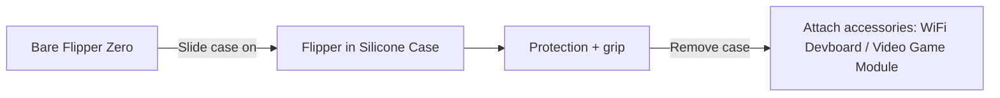
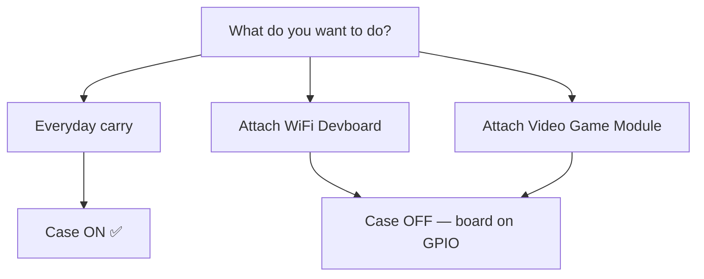

# Silicone Case — 完整指南

> **一句话定位**：Flipper Zero 官方防护硅胶保护壳——让你的赛博海豚免于刮伤、握持更稳，同时保留所有按钮、端口和天线的可用性。

## 规格表

| 类别 | 规格 |
|---|---|
| 材质 | 柔性硅胶橡胶 |
| 兼容性 | 仅限官方 Flipper Zero（匹配 100×40×25 mm 机身） |
| 可访问性 | 所有按钮、方向键、屏幕、USB-C、microSD、GPIO 排针均可正常使用 |
| 颜色 | 黑色（官方） |
| 重量 | 约 20 g（几乎不增加体积） |
| 包装内容 | 1× 硅胶保护壳（无需工具） |

## 概述

Flipper Zero 的机身是光滑的 ABS/PC 塑料——握持舒适，但容易被钥匙、桌面和口袋刮花。Silicone Case 是一个贴合紧密的橡胶套，正好解决这个问题：它保护机身和裸露的侧边按钮，同时增加摩擦力，防止设备从手中滑落。

它还能充当**减震**，应对随身携带的黑客工具难免会遇到的日常跌落。

## 快速入门 — 安装

无需工具，无需拆机。10 秒搞定：

1. 确定保护壳方向：**开孔一侧朝向屏幕**，**底部开口露出 GPIO 排针**。
2. 将 Flipper Zero 滑入，**顶部（天线 / 红外窗口）先入**。
3. 推入直到保护壳卡住 USB-C 端口，侧边按钮与保护壳的按钮盖对齐。

**验证贴合** — 以下所有功能都必须保持可用：

| 功能 | 检查 |
|---|---|
| 方向键 + BACK | 逐个按下每个按钮——行程完整，无挤压感 |
| 屏幕 | 透过开孔完全可见 |
| USB-C 端口 | 数据线能完全插入 |
| microSD 卡槽 | 卡可以插入 / 取出 |
| 红外窗口 | 透明窗口与红外收发器对齐 |
| iButton 弹簧针 | 在顶部边缘保持裸露 |

## 拆卸

1. 将保护壳顶部边缘从设备上掀起。
2. 逐个松动四角（橡胶是柔性的——弯曲，不要硬拽）。
3. 将设备滑出。

> 保护壳即使在低温下也保持柔韧，但如果设备在温暖的口袋里放几分钟，拆卸会更容易。

## 重要：配件与保护壳

保护壳按设计覆盖了 GPIO 排针区域，所以**配件要直接插到 GPIO 引脚上——需要取下保护壳**：

- **[WiFi Devboard](/flipper-zero/products/wifi-devboard/)** — 取下保护壳、装上开发板、再装回去？不行：开发板和保护壳都占用 GPIO 那一端。**二选一。**
- **[Video Game Module](/flipper-zero/products/video-game-module/)** — 模块自带硅胶缓冲圈，适配裸机 Flipper。**安装模块前先取下保护壳**，否则无法正确就位。
- **原型开发板** — 同样的规则：裸机，GPIO 裸露。

## 保养说明

| 情况 | 做法 |
|---|---|
| 灰尘 / 污垢 | 用温水 + 温和肥皂冲洗，自然晾干 |
| 拉伸 / 松弛 | 清洗后，让它在设备外静置一夜——硅胶会回弹 |
| 变色 | 硅胶在紫外线 / 日晒下变色是正常现象——仅影响外观 |
| 更换 | 保护壳是消耗品；不再贴合紧密时就更换 |

## 兼容性与注意事项

| 项目 | 说明 |
|---|---|
| Flipper Zero（所有硬件版本） | ✅ 适配 |
| WiFi Devboard | ⚠️ 佩戴保护壳时无法安装 |
| Video Game Module | ⚠️ 模块自带缓冲圈；需取下保护壳 |
| 佩戴保护壳充电 | ✅ USB-C 完全可访问 |
| 无线范围 | ✅ 无影响（Sub-GHz/NFC 天线在设备上，不会被橡胶遮挡） |

## 故障排查

| 症状 | 原因 | 解决方法 |
|---|---|---|
| 按钮手感发硬 | 保护壳未完全就位 | 按压保护壳边缘，直到按钮盖对齐 |
| 红外无法控制设备 | 红外窗口被保护壳褶皱遮挡 | 重新安装保护壳；保持透明窗口清洁 |
| 保护壳滑落 | 方向装反或已拉伸 | 翻转方向；如果磨损严重就更换 |
| 配件装不上 | 保护壳还在 | 先取下保护壳（见上文） |

## 相关

- [Flipper Zero 产品页面](/flipper-zero/products/flipper-zero/)
- [WiFi Devboard](/flipper-zero/products/wifi-devboard/)
- [Video Game Module](/flipper-zero/products/video-game-module/)
- [Flipper Zero 快速入门](/flipper-zero/quickstart/)