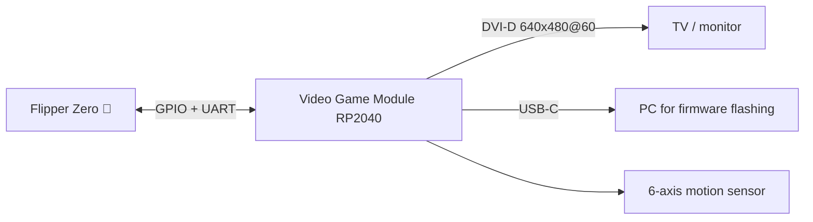
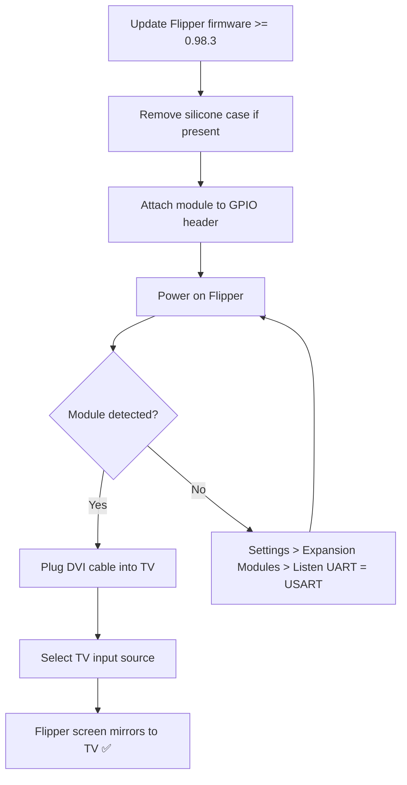

# Video Game Module — 完整指南

> **一句话定位**：一个由 Raspberry Pi RP2040 驱动的模块，卡在 Flipper Zero 上把它变成一台迷你游戏机——将 Flipper 的屏幕镜像到电视（DVI 640×480）、玩复古游戏，并增加 6 轴动作感应。



## 规格表

官方规格（来源：Flipper Devices + Raspberry Pi RP2040）：

| 类别 | 规格 |
|---|---|
| MCU | **Raspberry Pi RP2040** — 双核 ARM Cortex-M0+ @ 最高 133 MHz（为视频输出轻微超频） |
| SRAM | 264 KB 片上 |
| 视频输出 | **DVI-D，640×480 @ 60 Hz**（由 RP2040 PIO 驱动） |
| 动作传感器 | TDK **ICM-42688-P** 6 轴（陀螺仪 + 加速度计） |
| USB | USB Type-C — 设备或主机（不支持供电） |
| GPIO 引出 | 11 个 GPIO 引脚 + 2 个 GND + 3.3 V |
| 控制 | BOOT 按钮（引导加载程序模式）+ RESET 按钮 |
| 兼容性 | 大多数项目与 Raspberry Pi Pico 引脚兼容 |
| 固件 | 开源（github.com/flipperdevices/video-game-module） |
| 要求 | Flipper Zero 固件 **0.98.3 或更高版本** |

## 概述

Video Game Module 是**与 Raspberry Pi 合作开发**的，使用 RP2040——与 Raspberry Pi Pico 相同的芯片。Flipper Devices 对它做了轻微超频，使其 PIO（可编程 I/O）模块能够生成 **640×480@60 Hz 的 DVI-D 视频信号**——经典的"类 HDMI"复古视频模式，在现代电视上看起来非常清晰，因为 Flipper 自己的屏幕只有 128×64。

它能解锁什么：

- **屏幕镜像** — 在电视上显示 Flipper Zero 的界面（非常适合演示和教学）。
- **复古游戏** — 从 microSD 卡加载游戏，用 Flipper 的方向键在电视上玩。
- **动作控制** — 6 轴 ICM-42688-P 传感器支持空中鼠标式控制和动作游戏。
- **独立开发板** — 因为它是完整的 RP2040，可以独立运行 Raspberry Pi Pico 项目（例如 **Scoppy** 示波器应用）。
- **Flipper Zero Game Engine** — 开源引擎（含 IMU 驱动）让编写自己的游戏变得简单。

> 模块自带**硅胶缓冲圈**，可以紧密贴合 Flipper Zero。如果你的 Flipper 戴着 [Silicone Case](/flipper-zero/products/silicone-case/)，请先取下保护壳——模块无法卡在保护壳上。

## 快速入门

### 第 1 步：先升级 Flipper Zero 固件

模块需要 **Flipper Zero 固件 0.98.3 或更高版本**。如果你最近没有升级，现在就用 [qFlipper](/flipper-zero/firmware-qflipper/) 或[移动应用](/flipper-zero/mobile-app/)升级。

### 第 2 步：安装模块

1. 如果戴着 Silicone Case，先取下（模块自带缓冲圈）。
2. 关闭 Flipper Zero 电源。
3. 将模块的连接器与 Flipper 的 GPIO 排针对齐（匹配方向标记），按下直到发出咔嗒声。
4. 打开 Flipper Zero。它应该会自动检测到模块并做好准备。

**验证**：**主菜单 → 设置 → 扩展模块** → **Listen UART** 选项必须设为 **USART**（模块通过 UART 通信）。如果设为其他值，模块将无法被检测到。



### 第 3 步：连接到电视

1. 将视频线插入模块的 **Video Out** 端口（DVI-D；使用 DVI 或 DVI 转 HDMI 线）。
2. 在电视上，将输入源切换到你所用的端口。
3. Flipper Zero 的屏幕会以 640×480@60 Hz 出现在电视上。

> 如果电视上显示 **"Video Game Module not initialized"**，说明 Flipper 固件太旧（或模块在没有 Flipper 的情况下通电）。升级 Flipper 固件后重试。

### 第 4 步：玩游戏

1. 将游戏文件（`.fap` 应用 + 资源）复制到 microSD 卡——参见官方模块文档和 Flipper 应用目录。
2. 在 Flipper 上：**Apps → Games** → 选择你的游戏。
3. 用方向键在电视上玩；使用 IMU 的游戏可以倾斜 / 移动 Flipper 来控制动作。

## 高级用法

### 空中鼠标

配合合适的应用，在空中挥动 Flipper Zero（已安装模块）即可通过蓝牙控制电脑光标——ICM-42688-P 报告旋转和加速度，Flipper 将其转换为鼠标移动。

### 用 Game Engine 编写你自己的游戏

[Flipper Zero Game Engine](https://github.com/flipperdevices/flipperzero-game-engine) 处理向量数学、精灵缓存、渲染和事件处理。使用标准 Flipper 固件 SDK 构建，然后将生成的 `.fap` 复制到 microSD 卡的 `apps/` 目录。

### Raspberry Pi Pico 项目（独立运行）

模块可以**脱离 Flipper Zero 运行**：

1. 按住 **BOOT**，将 USB-C 插入电脑 → RP2040 会以 USB 大容量存储设备出现。
2. 把一个标准 Pico `.uf2` 文件拖进去（例如 Scoppy 示波器固件）。
3. RP2040 会独立运行 Pico 固件——与 Flipper 无关。

```bash
# After BOOT + plug, the drive appears; copying a .uf2 is all it takes
cp scoppy.uf2 /media/$(whoami)/RPI-RP2/
```

**预期输出**：

```text
(nothing printed — the drive unmounts itself after a successful flash)
```

> ⚠️ 刷写通用 Pico `.uf2` 会替换视频游戏固件。要恢复，请用同样的方式重新刷写官方 `vgm-fw-*.uf2`（从 [video-game-module 仓库](https://github.com/flipperdevices/video-game-module)下载）。

## 固件

- 模块固件升级通过 USB-C 在 **BOOT 模式**下刷写（`.uf2` 文件——与 Pico 相同的流程）。
- **模块固件**与 Flipper 自身的固件是分开的。两者都升级以获得最佳兼容性。
- 源码和发布固件：[github.com/flipperdevices/video-game-module](https://github.com/flipperdevices/video-game-module)。

## 兼容性

| 平台 | 支持 | 说明 |
|---|---|---|
| Flipper Zero（官方） | ✅ | 需要固件 ≥ 0.98.3 |
| 电视 / 显示器 | ✅ | DVI-D 640×480@60；通过 DVI 转 HDMI 线使用 HDMI |
| 独立使用（无 Flipper） | ✅ | 运行 Raspberry Pi Pico 固件 |
| 电脑刷写 | ✅ | BOOT + USB-C → 拖放 `.uf2` |

## 故障排查

| 症状 | 原因 | 解决方法 |
|---|---|---|
| "Video Game Module not initialized" | Flipper 固件太旧 | 升级 Flipper 固件至 ≥ 0.98.3 |
| 模块未被检测到 | Listen UART 未设为 USART | 设置 → 扩展模块 → Listen UART = USART |
| 电视无画面 | 输入源 / 线材错误 | 选择正确的 HDMI/DVI 输入；使用支持数据传输的线材 |
| 游戏中无动作控制 | IMU 未初始化 | 重新安装模块（先关机），重启游戏 |
| 模块无法刷写 | 不在引导加载程序模式 | 插入 USB-C 前按住 BOOT |

## 相关

- [Flipper Zero 产品页面](/flipper-zero/products/flipper-zero/)
- [固件与 qFlipper](/flipper-zero/firmware-qflipper/)
- [Silicone Case](/flipper-zero/products/silicone-case/)
- [Flipper Zero 故障排查](/flipper-zero/troubleshooting/)