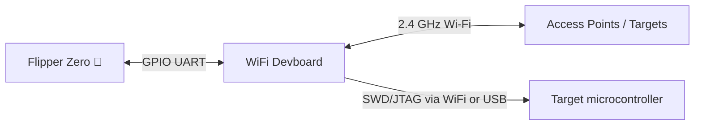
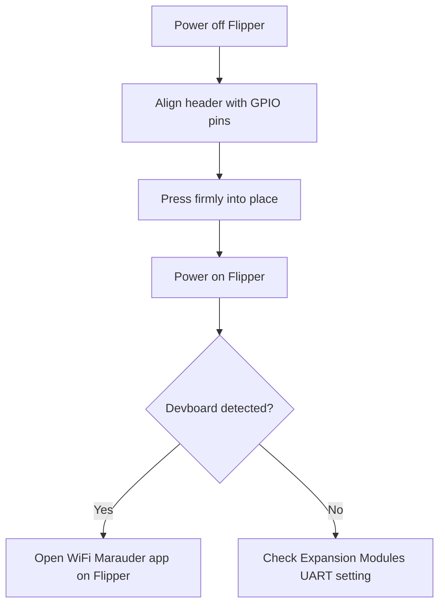

# WiFi Devboard — 完整指南

> **一句话定位**：一块小型 ESP32-S2 开发板，插在 Flipper Zero 的 GPIO 排针上，为它提供 2.4 GHz Wi-Fi——用于 Wi-Fi 审计（Marauder）、强制门户演示（Evil Portal），以及作为无线调试探针（BlackMagic）。



## 规格表

官方规格（来源：Flipper Devices + Espressif ESP32-S2-WROVER 数据手册）：

| 类别 | 规格 |
|---|---|
| 模块 | **ESP32-S2-WROVER** |
| CPU | Xtensa 单核 LX7，最高 240 MHz |
| 无线 | 2.4 GHz Wi-Fi，IEEE 802.11 b/g/n（**无 5 GHz、无蓝牙**——S2 芯片） |
| Flash / PSRAM | 4 MB 闪存 / 2 MB PSRAM |
| SRAM | 320 KB SRAM，16 KB RTC SRAM |
| USB | USB Type-C（USB OTG） |
| 按钮 | BOOT 和 RESET 轻触开关 |
| 接口 | UART、SPI、I2C、GPIO（通过 Flipper 连接器 + 引出排针） |
| 预装固件 | **BlackMagic**（通过 Wi-Fi 或 USB 进行 SWD/JTAG 调试） |
| 兼容性 | 官方 Flipper Zero GPIO 连接器（UART 链路） |

## 概述

WiFi Devboard 是 Flipper Zero 的官方 Wi-Fi 扩展板。它有两个特别之处：

1. **它给 Flipper 一个 Wi-Fi 无线电** — Flipper Zero 本身没有 Wi-Fi，只有 Sub-GHz、NFC、RFID 和 BLE。装上开发板并刷入 **WiFi Marauder** 后，Flipper 就变成一台便携式 Wi-Fi 审计工具：扫描网络、对客户端执行 deauth、探测隐藏 SSID。
2. **它是一个无线调试探针** — 出厂预装 **BlackMagic** 固件，可以通过 SWD/JTAG 刷写和调试其他微控制器（包括 Flipper Zero 自己的 STM32），有线**或通过 Wi-Fi** 均可。

它还是一个完整的 ESP32-S2 开发平台：你可以编写自己的 ESP-IDF 或 Arduino 固件并刷写——这块板子是一个真正的开发套件，而不只是配件。

> ⚠️ **法律提示**：Wi-Fi 审计工具可能干扰网络。只在你拥有或有明确许可测试的网络上测试。对他人网络发起 deauth 攻击在大多数地方都是违法的。

## 快速入门

### 第 1 步：安装开发板

1. 关闭 Flipper Zero 电源。
2. 将开发板的 2.54 mm 排针与 Flipper 的 GPIO 引脚对齐——**匹配丝印方向**（板子插到引脚上时 USB-C 端口朝外）。
3. 用力按下，直到完全贴合。
4. 打开 Flipper。你应该看到新模块被检测到（检查 **设置 → 扩展模块** — UART 应已启用）。



### 第 2 步：在 Flipper 上安装 WiFi Marauder 应用

**WiFi Marauder** Flipper 应用（由 0xchocolate 开发）与开发板上运行的 Marauder 固件通信。

1. 将 Flipper 插入电脑（USB-C）。
2. 在 qFlipper 中，打开 **Apps** 目录（或从 Marauder 项目下载 `.fap`）并安装 **WiFi Marauder**。
3. 在 Flipper 上：**Apps → WiFi Marauder**。
4. 应用通过 UART 链路连接到开发板并显示其状态。

### 第 3 步：向开发板刷写 Marauder 固件

开发板出厂预装 BlackMagic；Marauder 是另一种需要刷写一次的固件。两种方式：

**方式 A — 直接从 Flipper Zero 刷写**（官方支持的路径）：

1. 开发板已安装、Flipper 已开机的情况下，通过 USB 将 Flipper 连接到电脑。
2. 在 qFlipper 中，使用内置的 **ESP32 刷写**选项（qFlipper ≥ 1.3）：它会下载 Marauder 固件并通过 Flipper 的 UART 刷写。
3. qFlipper 日志会显示类似内容：

```text
ESP32 firmware flashing started
Erasing flash ...
Writing 0x00000000 ...
Flashing complete. Rebooting board ...
```

**方式 B — 从电脑通过开发板的 USB-C 刷写**：

1. 让开发板进入**下载模式**：按住 **BOOT**，然后将 USB-C 插入电脑（松开 BOOT）。
2. 安装 Espressif 的 `esptool`（Python）：

```bash
python3 -m pip install esptool
```

3. 刷写 Marauder `.bin`：

```bash
esptool.py --chip esp32s2 --port /dev/ttyACM0 erase_flash
esptool.py --chip esp32s2 --port /dev/ttyACM0 write_flash 0x10000 marauder_vX.Y_esp32s2.bin
```

**预期输出**（末尾部分）：

```text
Hash of data verified.
Leaving...
Hard resetting via RTS pin...
```

> 端口名因操作系统而异：`/dev/ttyACM0`（Linux）、`COMx`（Windows）、`/dev/cu.usbmodem*`（macOS）。请相应调整。

### 第 4 步：验证

回到 Flipper 上：**Apps → WiFi Marauder** → 应用应显示开发板的固件版本和检测到的 AP 数量。将 Flipper 对准你拥有的任何附近网络并运行 **Scan**——你会在 Flipper 屏幕上看到 SSID、信道和加密类型列表。

## 高级用法

### WiFi Marauder 功能

| 功能 | 作用 |
|---|---|
| Scan APs / stations | 列出附近的网络和已连接的客户端 |
| Beacon spam | 广播虚假 SSID（只在你自己的测试实验室使用） |
| Deauth | 强制客户端断开网络（仅限测试网络！） |
| Sniff | 捕获探测请求 |
| Hidden SSID reveal | 客户端探测时显示隐藏网络名称 |
| Packet capture | 将原始 802.11 帧记录到 SD 卡 |

### Evil Portal

刷入 **Evil Portal** ESP32 固件后，它会提供一个强制门户（一个虚假的登录页面），演示开放 Wi-Fi 如何被滥用。结合我们 Hak5 产品线中的 [WiFi Pineapple](/hak5/)，这就是真实世界强制门户攻击的测试方式——始终在你控制的实验室中进行。

### BlackMagic 调试

保留出厂 BlackMagic 固件（或重新刷写它），将开发板用作调试探针：

- 将开发板的 **SWDIO / SWCLK** 引脚连接到目标 MCU（例如 STM32 开发板）。
- 通过 USB-C 调试，或通过 `netcat` 风格的 TCP 连接经 Wi-Fi 调试——上工作台后无需数据线。
- 兼容 GDB 和 OpenOCD 工作流；Flipper Zero 自身的固件恢复也可以使用这条路径。

### 你自己的 ESP32 项目

因为它是标准的 ESP32-S2，安装 ESP-IDF 或 Arduino 核心后，可以像任何其他 ESP32 开发板一样刷写你自己的代码。2 MB PSRAM 为图像密集型实验（摄像头流演示等）提供了充足空间。

## 兼容性

| 平台 | 支持 | 说明 |
|---|---|---|
| Flipper Zero（官方） | ✅ | 通过 GPIO 使用 UART；在扩展模块中检测到 |
| 任意 ESP32 主机 | ✅ | 标准 ESP32-S2 开发板 |
| 电脑刷写 | ✅ | 通过 USB-C 使用 esptool（BOOT + 插入） |
| qFlipper ESP32 刷写器 | ✅ | Flipper 内置刷写，qFlipper ≥ 1.3 |

## 故障排查

| 症状 | 原因 | 解决方法 |
|---|---|---|
| Flipper 检测不到开发板 | 扩展模块 UART 被禁用 | 设置 → 扩展模块 → 启用 UART / USART |
| Marauder 应用提示"no connection" | 板上固件错误 | 刷写 Marauder 固件（第 3 步） |
| `esptool` 无法连接 | 开发板不在下载模式 | 插入 USB-C 前按住 BOOT，插入后松开 |
| 检测到开发板但无法扫描 Wi-Fi | 板上刷的是 BlackMagic，不是 Marauder | 重新刷写 Marauder；BlackMagic 不扫描 |
| 5 GHz 网络不可见 | S2 仅支持 2.4 GHz | 设计如此——测试时使用 2.4 GHz |

## 相关

- [Flipper Zero 产品页面](/flipper-zero/products/flipper-zero/)
- [固件与 qFlipper](/flipper-zero/firmware-qflipper/)
- [Flipper Zero 故障排查](/flipper-zero/troubleshooting/)
- [官方资源](/flipper-zero/official-resources/)
- [Hak5 WiFi Pineapple](/hak5/) — 专用 Wi-Fi 审计平台