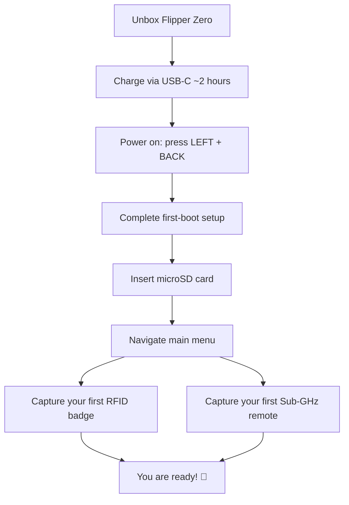

# Flipper Zero 快速入门

> **学习目标**：完成本指南后，你将完成 Flipper Zero 的充电、首次开机、插入 microSD 卡、浏览主菜单，并捕获你的第一张 RFID 门禁卡和第一个 Sub-GHz 遥控器。
>
> **适用读者**：完全的新手。无需焊接、无需电脑——Flipper Zero 完全自主。

你的 Flipper Zero 出厂时已预装固件，电池也充了一部分电。让我们把它从盒子里拿出来，让它与世界对话。



## 包装盒里有什么

| 物品 | 用途 |
|---|---|
| Flipper Zero 设备 | 多功能工具本体 |
| USB Type-C 数据线 | 充电和连接电脑 |
| 塑料保护膜（可撕除） | 运输过程中保护屏幕 |

你还需要一张 **microSD 卡（建议 2–32 GB）**——设备会将捕获的密钥、IR 数据库和应用存储在卡上。Flipper Zero 支持 FAT12、FAT16、FAT32 和 exFAT 格式、最大 256 GB 的卡，但为了可靠性（SPI 模式）建议使用 2–32 GB 的卡。

## 第 1 步：给电池充电

将 USB-C 数据线插入 Flipper Zero 和任意 USB 电源（笔记本电脑、手机充电器、移动电源）。

- 屏幕右上角的电池图标显示电量。
- 充满电大约需要 **2 小时**，待机续航**最长 28 天**（LiPo 2100 mAh）。
- 充电到 100% 会自动停止——整夜插着充电是安全的。

> **小贴士**：充电时 Flipper 仍可使用，但无线发射距离在电池供电时最佳。

## 第 2 步：开机

同时按下 **LEFT + BACK** 开机。会播放赛博海豚标志动画，然后出现主菜单。

| 操作 | 按键组合 |
|---|---|
| 开机 | LEFT + BACK |
| 关机 | LEFT + BACK（长按 2 秒，确认） |
| 导航 | 方向键（UP / DOWN / LEFT / RIGHT） |
| 选择 / 确认 | OK（中间按键） |
| 返回 | BACK |

如果没有任何反应，可能是电池完全耗尽——插上 USB-C 并等待 5 分钟再试。

## 第 3 步：首次开机设置

首次开机时，Flipper Zero 会引导你完成一个简短的设置：

1. **选择地区** — 这会配置启用的 Sub-GHz 频段（根据地区不同为 315、433、868 或 915 MHz）。
2. **启用蓝牙** — 可选但建议启用；之后使用[移动应用](/flipper-zero/mobile-app/)时需要。
3. **检查固件升级** — 你可以立即执行或跳过（参见[固件与 qFlipper](/flipper-zero/firmware-qflipper/)）。我们建议在开始使用前先升级。

## 第 4 步：插入 microSD 卡

1. 查看设备底部边缘——microSD 卡槽位于 USB-C 端口旁边。
2. 将卡推入直到发出咔嗒声（**推入式机制**——卡会锁定到位）。
3. 重启设备（LEFT + BACK → 关机 → 开机）。

你可以验证卡是否被识别：**主菜单 → 设置 → 存储**。你应该看到卡的容量和可用空间，而不是 `SD card: not present`。

> **如果跳过 microSD 会怎样？** 内部闪存（1 MB）很快就会装满——捕获的信号、IR 码和已安装的应用都需要存储空间。强烈建议使用存储卡。

## 第 5 步：浏览主菜单

主菜单是一个垂直列表。使用 **UP / DOWN** 滚动，**OK** 进入，**BACK** 返回。

| 菜单项 | 功能 |
|---|---|
| Sub-GHz | 读取和重放 300–928 MHz 信号（遥控器、传感器） |
| NFC | 读取/写入/模拟 13.56 MHz 卡 |
| RFID | 读取/模拟 125 kHz 感应卡 |
| Infrared | 学习和重放 IR 遥控器信号 |
| iButton | 读取/模拟 1-Wire 接触钥匙 |
| Bad USB | 充当 USB 键盘并输入脚本（HID 攻击） |
| GPIO | 与 2.54 mm 排针引脚交互 |
| Bluetooth | 切换 BLE 并查看已配对设备 |
| Settings | 地区、显示、存储、关于、固件版本 |
| Apps | 社区应用和内置应用（Weather Station 等） |

## 第 6 步：捕获你的第一张 RFID 门禁卡

让我们做一次真实的捕获——这是 Flipper Zero 的"hello world"。

1. 进入 **主菜单 → RFID**。
2. 选择 **Read**（读取 125 kHz 卡）。
3. 将测试卡平放在 **Flipper Zero 的顶部边缘**（RFID 天线位于那里，靠近 iButton 弹簧针）。
4. 观察屏幕——读取成功时，你会看到卡类型和 ID 出现，例如：

```text
EM4100
Key: 04 00 45 23 12
```

5. 按 **OK → Save**。给它起个名字，比如 `test-badge`。

现在你可以模拟它：**RFID → Saved → 选择你的卡 → Emulate**。将 Flipper Zero 放在你平时放卡的位置。读卡器会把你的 Flipper 识别为那张卡。

> ⚠️ **只在你拥有或有权限测试的卡和门上测试。** 克隆不属于你的门禁卡在大多数司法管辖区都是违法的。

## 第 7 步：捕获你的第一个 Sub-GHz 遥控器

将 Flipper Zero 对准你拥有的 Sub-GHz 遥控器（车库门、无线门铃、车钥匙——**只用自己的设备测试**）。

1. 进入 **主菜单 → Sub-GHz**。
2. 按 **OK → Read**（原始信号捕获模式）。
3. 将遥控器对准 Flipper Zero（天线在顶部）并按下遥控器的按钮。
4. 屏幕会显示检测到的频率和调制方式，例如：

```text
433.92 MHz, AM650
```

5. 按 **OK → Save** 并命名为 `my-remote`。

之后重放：**Sub-GHz → Saved → 选择 → Send**。Flipper Zero 会发射捕获的信号。

> **为什么我的频率不同？** 地区很重要：欧洲使用 868 MHz，美国使用 915 MHz，而许多遥控器在全球范围内使用 433.92 MHz。如果你的遥控器显示的频率不在你所在地区启用的频段内，请参阅[故障排查](/flipper-zero/troubleshooting/)。

## 你准备好了 🎉

从这里你可以继续探索：

- **[固件与 qFlipper](/flipper-zero/firmware-qflipper/)** — 保持设备更新，并在出问题时恢复它。
- **[移动应用](/flipper-zero/mobile-app/)** — 从手机远程控制和同步。
- **[Flipper Zero 产品页面](/flipper-zero/products/flipper-zero/)** — 完整规格表、GPIO 引脚定义和高级用法。
- **[WiFi Devboard](/flipper-zero/products/wifi-devboard/)** — 将你的 Flipper 变成 Wi-Fi 渗透测试工具。
- **[Video Game Module](/flipper-zero/products/video-game-module/)** — 复古游戏和电视镜像。

## 常见错误

| 错误 | 症状 | 解决方法 |
|---|---|---|
| 忘记插入 microSD | 设置中显示 "SD card: not present" | 插入卡，重启设备 |
| 地区限制过严 | 无法接收 433 MHz 遥控器 | 在设置中更改地区（或使用支持的 868/915 频段） |
| RFID 门禁卡放置错误 | 无法读取，屏幕保持空白 | 沿顶部边缘滑动卡直到卡到位 |
| 首次开机时电池耗尽 | 无法开机 | 插上 USB-C，等待 5 分钟，重试 |