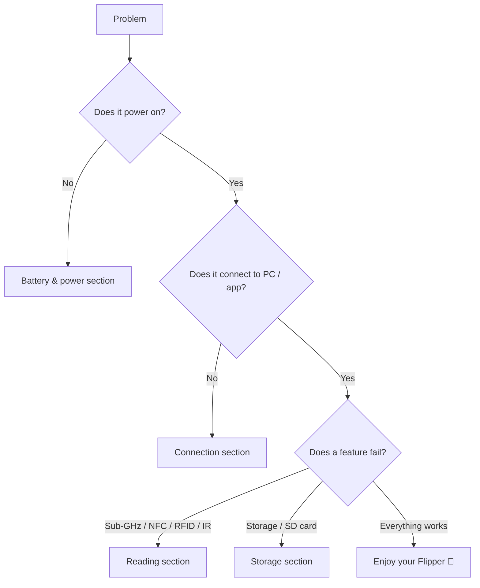

# Flipper Zero 故障排查

> **排查铁律 (Rule of thumb)**: 先硬件 → 再固件/驱动 → 最后设置。用 Flipper Zero 的话说：**电池与数据线 → 固件版本 → 配置（地区、蓝牙、SD 卡）**。

这个页面是一个决策树索引。在下面找到你的症状，跳到对应章节，按顺序执行诊断步骤。



## 问题索引

| 类别 | 症状 | 前往 |
|---|---|---|
| 电源 | 无法开机、无法充电、掉电快 | [电池与电源](#battery--power) |
| 连接 | qFlipper 找不到设备、应用无法配对 | [USB 与蓝牙](#usb--bluetooth) |
| 读取 | 无法捕获 Sub-GHz、NFC/RFID 无法读取 | [Sub-GHz 与卡片](#sub-ghz--cards) |
| 存储 | 检测不到 SD 卡、"无存储空间" | [存储与 microSD](#storage--microsd) |
| 固件 | 升级失败、设备卡在标志画面 | [固件与恢复](#firmware--recovery) |

## 电池与电源

### Q1：设备无法开机

**诊断** — 尝试充电：

1. 将 USB-C 连接到已知良好的充电器，充电 **10 分钟以上**。
2. 按 **LEFT + BACK**。
3. 如果屏幕仍然黑屏，电池可能已完全耗尽（安全模式）——长期存放后这是正常现象。

**根本原因**：锂聚合物电池保护电路在深度放电后会进入低电压状态。

**解决方法**：让它充电（LED 保持亮起）最多一小时；一旦电芯电压超过阈值，它会正常启动。如果充电 2 小时后仍无法开机，电池或充电 IC 可能有故障——参见[仍然卡住？](#still-stuck)。

### Q2：充电缓慢或完全充不进

**诊断**：

```text
Charge LED: OFF → ORANGE (charging) → GREEN (full)
```

| 症状 | 原因 | 解决方法 |
|---|---|---|
| 完全没有 LED | 数据线 / 端口 / 充电器有问题 | 换一根 USB-C 数据线和 5V 充电器 |
| 充电非常慢 | 设计上充电电流限制在约 1A 以内 | 使用任意合格的 5V/2A 充电器；充满约需 2 小时 |
| 充到某个百分比就停 | 电芯不平衡或电池老化 | 在较凉爽的房间充电；如果持续如此，联系支持 |

## USB 与蓝牙

### Q3：qFlipper 提示"找不到设备"

**诊断** — 在 Linux 上，检查 USB 总线：

```bash
lsusb
```

**预期输出**（Flipper Zero 已连接并确认）：

```text
Bus 001 Device 004: ID 0483:5740 STMicroelectronics Flipper Zero
```

| 症状 | 原因 | 解决方法 |
|---|---|---|
| `lsusb` 什么也不显示 | 仅充电数据线 | 使用支持数据传输的 USB-C 数据线 |
| `lsusb` 能看到，qFlipper 看不到 | 未在 Flipper 上确认 USB 提示 | 在 Flipper 上被询问时选择 **Connect**；重新插拔 |
| qFlipper 能看到但卡住 | qFlipper 版本过旧 | 从 [flipper.net/pages/downloads](https://flipper.net/pages/downloads) 更新 qFlipper |
| Windows 上正常，Linux 上不行 | 缺少 udev 规则 | 参见 qFlipper Linux 安装说明 / AppImage |

### Q4：移动应用无法通过蓝牙配对

**诊断** — 在 Flipper Zero 上：**主菜单 → Bluetooth** 必须显示 **ON**。

| 症状 | 原因 | 解决方法 |
|---|---|---|
| 应用找不到设备 | BLE 关闭 / 距离太远 | 在 Flipper 上启用 BLE，让手机保持在 1–2 米内 |
| PIN 码不匹配 | 配对记录过期 | 在应用 + 手机蓝牙设置中取消配对，重启两者，重新配对 |
| 配对成功但同步卡住 | 应用版本过旧，与新固件不兼容 | 更新应用；参见[移动应用指南](/flipper-zero/mobile-app/) |
| 只有重启后才能连接 | BLE 协议栈卡住 | 重启 Flipper（LEFT + BACK → 关机 → 开机） |

## Sub-GHz 与卡片

### Q5：Sub-GHz 无法捕获遥控器

**诊断** — 检查 Flipper 看到了什么：

1. **Sub-GHz → Read**。
2. 将遥控器对准 **Flipper Zero 的顶部**（天线在顶部边缘）。
3. 观察屏幕右上角——信号强度指示条有没有动？

| 症状 | 原因 | 解决方法 |
|---|---|---|
| 指示条有信号但无法解码 | 未知协议或信号太弱 | 靠近一些（范围可达约 50 米，但近距离读取最强）；按住遥控器按钮再试 |
| 完全没有信号 | 频段不符合你的地区 | 地区必须允许遥控器的频率（315/433/868/915 MHz）。在 **设置 → 地区** 中更改地区（在法规允许的前提下） |
| 能捕获但重放无效 | 信号重放时机不对 | 有些遥控器使用滚动码——原始码使用后无法重放。这不是故障 |
| 只听到噪声 | 干扰 | 远离 Wi-Fi 路由器 / 其他发射器 |

> ⚠️ 重放不属于你的信号可能违法。只在你自己的设备上测试。

### Q6：NFC / RFID 无法读取卡片

**诊断**：

1. **NFC**（13.56 MHz）：将卡放在设备**背面中央偏上**的位置，保持平放。
2. **RFID**（125 kHz）：沿**顶部边缘**滑动卡片。

| 症状 | 原因 | 解决方法 |
|---|---|---|
| "No card detected" | 天线位置不对 / 卡类型不支持 | 将卡旋转 90°，尝试两面；有些卡需要一点时间耦合 |
| 能读一些卡，读不了另一些 | 卡类型不受支持（例如带认证的加密 DESFire） | 在[产品页面](/flipper-zero/products/flipper-zero/)查看支持列表；没有密钥无法读取加密卡 |
| 能读取但无法模拟 | 模拟距离设计上就很短 | 模拟天线很小——把 Flipper 紧贴读卡器 |

## 存储与 microSD

### Q7："SD card: not present"或保存失败

**诊断** — **主菜单 → 设置 → 存储**：

| 症状 | 原因 | 解决方法 |
|---|---|---|
| "not present" | 卡没有完全推入 | 推入直到发出咔嗒声（推入式卡槽），然后重启设备 |
| 卡已识别但文件无法保存 | 文件系统错误 / 卡损坏 | 重新格式化为 FAT32（或 exFAT）；见下文 |
| "Storage full" | 1 MB 内部闪存已满 | 使用 microSD 卡（建议 2–32 GB） |

**在 Linux 上重新格式化**（将 `/dev/sdX` 替换为你的卡设备——务必用 `lsblk` 仔细核对！）：

```bash
sudo mkfs.vfat -F 32 /dev/sdX
```

**预期输出**：

```text
mkfs.fat 4.2 (2021-01-31)
```

> ⚠️ 格式化会清空卡片。先备份。绝不要把 `mkfs` 指向你的系统盘——运行前用 `lsblk` 确认设备名。

## 固件与恢复

### Q8：升级失败，或设备卡在启动标志画面

**诊断** — 判断设备是否还活着：

1. 按住 **DOWN** 的同时按 **LEFT + BACK** → 应该出现**启动菜单**。
2. 如果出现了，说明引导加载程序完好——恢复很简单。

**解决方法**：


如果连启动菜单都不出现：让它充电 1 小时，然后重试。如果仍然毫无反应，可能是固件存储损坏——这种情况很少见，需要[联系支持](#still-stuck)。

## 仍然卡住？

如果以上方法都无法解决，请在[官方支持门户](https://support.flipper.net)提交工单。为了快速得到答复，请准备好：

- 固件版本（**设置 → 关于**）和应用版本
- 操作系统 / 手机型号和 qFlipper 版本
- 故障前你做了什么（升级？自定义固件？摔过？）
- 如果是 USB 问题，提供 `lsusb` / `dmesg` 输出（在 Linux 上）

## 相关

- [Flipper Zero 快速入门](/flipper-zero/quickstart/)
- [固件与 qFlipper](/flipper-zero/firmware-qflipper/)
- [Flipper Mobile App 指南](/flipper-zero/mobile-app/)
- [官方资源](/flipper-zero/official-resources/)