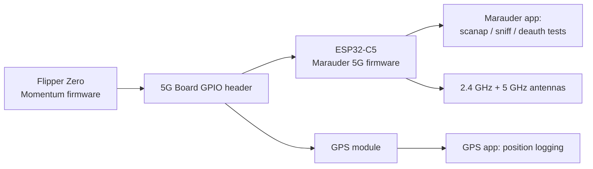
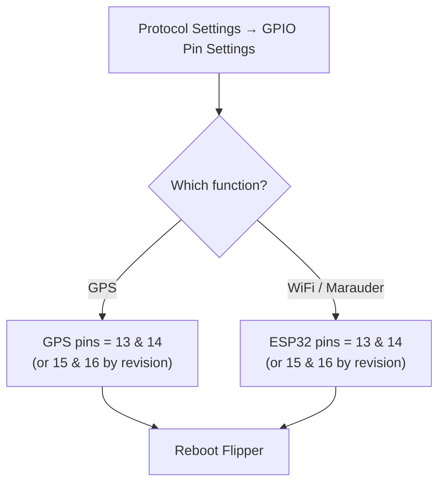

# Flipper Zero 5G 扩展板——完整指南

> **一句话**：5G 扩展板把双频 **2.4 GHz + 5 GHz WiFi** 工具装到你的 Flipper Zero 上——一块运行 Marauder 固件的 ESP32-C5，外加 GPS 接收机和板载电池，集成在一个紧凑模块里。

## 规格速览

| 项目 | 规格 |
|---|---|
| WiFi 模块 | ESP32-C5（2.4 GHz + 5 GHz），预刷 Marauder 5G 固件 |
| GPS | 板载 GPS 模块，带自动电源切换（连接时用 Flipper 供电，分离时用电池供电） |
| 电池 | 800 mAh，板上有充电指示灯 |
| 保护 | 每个信号引脚都有 TVS 二极管 |
| 天线 | WiFi 3 dBi 双频（11 cm）、GPS 20 dBi、SMA 内针连接器 |
| 刷写 | USB-C 端口（左前）；按住右后方的按钮，然后插入 USB 进入刷写模式 |
| 控制 | Flipper Zero 应用：WiFi Marauder、GPS |

## 这块板是干什么的

ESP32-C5 是 WiFi 主力：配合 **Marauder 固件**，它可以扫描接入点和客户端、嗅探信标和探测请求、运行 deauth 和 PMKID 捕获测试，并记录 WiFi 活动——现在还包括老 ESP32 板卡看不到的 **5 GHz** 网络。GPS 模块把你的战争驾驶会话变成带地图的数据，小电池则让 WiFi 侧运行时不耗尽 Flipper 的电量。

> **请只在你自己的网络和设备上使用。** Deauth 攻击和探测嗅探会干扰他人，且在大多数国家受到监管——这是一个实验室/教学工具。



## 开始之前

- Flipper 需要包含 Marauder 和 GPS 应用的**自定义固件**——**Momentum**、**Unleashed** 或 **Xtreme**。（固件基础见 [Flipper Zero 专区](/flipper-zero/)。）
- 按厂商快速入门中的说明在 Flipper 上安装模块（某些版本包含 433 MHz sub-GHz 模块和/或 2.8″ Marauder 屏幕——请阅读你板卡的说明）。

## 设置：GPIO 引脚（Momentum 固件）

在 **Momentum** 上：

1. 打开 `Protocol Settings → GPIO Pin Settings`。
2. 把 **GPS 引脚**设为 `13` 和 `14`（UART 引脚；某些板卡版本使用 15/16——请核对你的厂商快速入门）。
3. 把 **ESP32 / ESP8266 引脚**设为 `13` 和 `14`（或按板卡版本设为 15/16）——这是与 ESP32-C5 通信的 UART。
4. 退出设置并重启 Flipper。



## 使用这块板

### WiFi Marauder

1. 连接板卡后，打开 `Apps → GPIO → [ESP32] WiFi Marauder`。
2. 运行 **Scan AP**：附近的接入点会显示 SSID、信道、RSSI 和加密方式。
3. 运行 **Scan PSD**（数据包嗅探）观察信标/探测流量。
4. **信道跳跃**和**战争驾驶**（配合 GPS）会产生可导出的日志。

`scanap` 后的预期首屏：

```
SSID              CH  RSSI  ENC  AUTH
yupitek-lab       6   -55   WPA2 PSK
Campus_Guest      11  -72   OPEN
...
```

### GPS

1. 接上 GPS 天线，指向天空（靠近窗户也可以；室外更好）。
2. 打开 `Apps → GPIO → GPS`。等待——首次定位可能需要几分钟。
3. 捕获到卫星后，位置数据开始流动。与 Marauder 结合，就能得到带位置标签的 WiFi 日志。

## 更新 ESP32-C5 固件

1. 进入刷写模式：按住右后方的按钮，然后插入 USB-C 线缆。
2. 用你偏好的工具刷写 Marauder 5G（厂商说明 / ESP 刷写器 / FZEasyMarauderFlash 风格的 ESP32 工具）。
3. 拔下，重启 Flipper，重新打开 Marauder 应用。

## 故障排查

| 问题 | 原因 | 修复 |
|---|---|---|
| 应用提示"no module" | GPIO 引脚未设置 | 重新检查 `GPIO Pin Settings`；重启 Flipper |
| GPS 始终无法定位 | 天线未接 / 在室内 | 接上 GPS 天线，靠近窗户/到室外，等待 3–5 分钟 |
| Marauder 扫描不到任何东西 | ESP UART 引脚设置错误 | 按板卡版本设置 ESP32 引脚；重启 |
| 板卡能充电但 Flipper 看不到 | Flipper 固件缺少该应用 | 安装 Momentum/Unleashed/Xtreme |
| 5 GHz 网络不可见 | 固件是 ESP32（非 C5） | 确认板卡运行 ESP32-C5 固件（支持 5 GHz） |

更多帮助：[SDRLAB 故障排查中心](/sdrlab/troubleshooting/)。

## 相关

- [WiFi 多功能板（ESP8266）](/sdrlab/expansion/wifi-multiboard/) — 仅 2.4 GHz 的小兄弟。
- [NRF24 模块](/sdrlab/expansion/nrf24/) — 2.4 GHz 数据包无线电嗅探。
- [Flipper Zero 专区](/flipper-zero/) — 基础固件和设备入门。