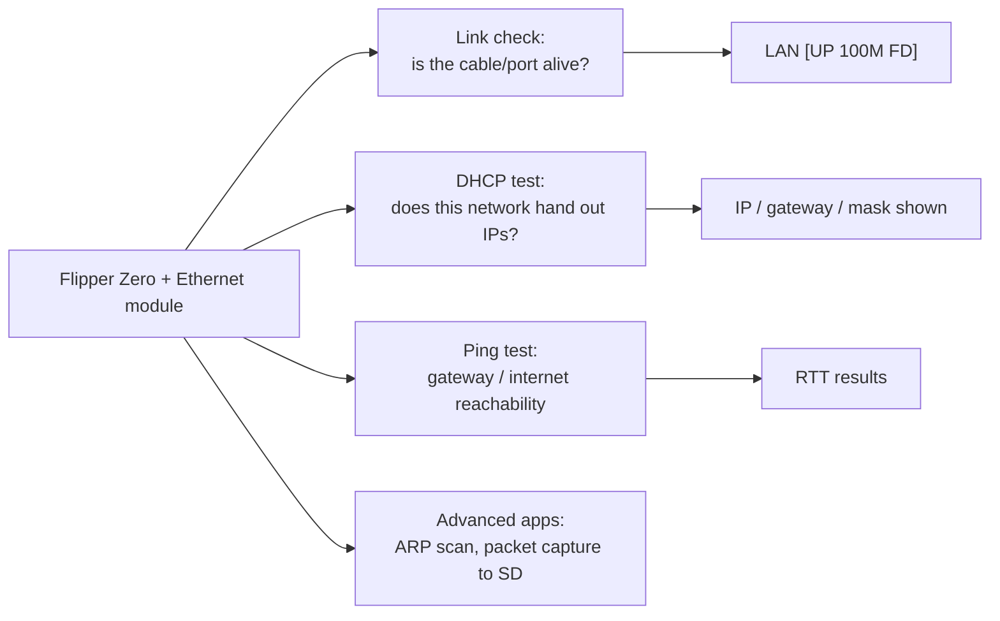

# Flipper Zero 以太网测试模块——完整指南

> **一句话**：以太网测试模块把 **10/100 以太网端口装到你的 Flipper Zero 上**——一块带内置 TCP/IP 协议栈的 WIZnet W5500——让 Flipper 变成口袋里的 LAN 测试仪，用于线缆检查、DHCP 验证和 ping 测试。

## 规格速览

| 项目 | 规格 |
|---|---|
| 控制器 | WIZnet W5500（硬件 TCP/IP 协议栈） |
| 以太网 | 10/100 Mbps，内置 MAC + PHY，自动协商（全/半双工） |
| 协议 | TCP、UDP、ICMP、IPv4、ARP、IGMP、PPPoE；通过 UDP 支持 Wake-on-LAN |
| Socket | 8 个独立 |
| 缓冲 | 32 KB 内部 TX/RX 内存 |
| 接口 | SPI（最高 80 MHz） |
| 电压 | 3.3 V 工作，I/O 耐 5 V |
| 连接器 | RJ45，带链路/活动 LED |
| 供电 | 来自 Flipper GPIO（3.3 V / OTG） |

## 你能用它做什么



对大学网络实验室来说这是宝贝：在向 IT 报障之前先验证墙上的端口、几秒钟证明一根线缆是坏的、在真实网络上演示 DHCP 行为——全部从口袋里完成。

## 与 Flipper 的接线

典型 W5500 模块（W5500 Lite）接线：

| W5500 模块 | Flipper GPIO（引脚） |
|---|---|
| MOSI (MO) | A7（引脚 2） |
| SCLK (SCK) | B3（引脚 5） |
| CS (nSS) | A4（引脚 4） |
| MISO (MI) | A6（引脚 3） |
| RESET (RST) | C3（引脚 7） |
| 3V3 (VCC) | 3V3（引脚 9） |
| GND (G) | GND（引脚 8 或 11） |

> 市面上有现成的"Flipper Zero 用 W5500 以太网模块"板卡（RJ45 + 引出排针）；它们仍然暴露相同的 SPI 信号——请对照上表核对丝印。

## 设置

### 1. 安装应用

以太网应用在**原厂固件和自定义固件**上都能运行。安装方式：

- **Web 目录**（浏览器 + WebUSB）：在 Chromium 浏览器中打开 Flipper 应用目录，连接 Flipper，点击安装。搜索"W5500"或"Ethernet"。
- **手机应用**：Flipper 手机应用 → 应用目录 → GPIO → W5500 Ethernet。

### 2. 连接所有东西

1. 按上表把模块接到 Flipper GPIO。
2. 把以太网线缆插入模块的 RJ45。
3. 另一端插入交换机/路由器/电脑端口。

### 3. 首次测试

1. 启动 **Ethernet** 应用（`Apps → GPIO`）。
2. 检查标题栏：`LAN [UP 100M FD]` 表示链路已建立。
3. 按 **DHCP**——应用请求地址并显示：

```
IP:      192.168.1.162
MASK:    255.255.255.0
GW:      192.168.1.1
```

4. 按 **Ping** 并指向网关（或 `8.8.8.8`）：带延迟的回复确认端到端连通性。

## 故障排查

| 问题 | 原因 | 修复 |
|---|---|---|
| 无链路指示灯 | 线缆/端口/接线不良 | 换一根线缆和端口；重新检查 SPI 接线（尤其是 CS + RESET） |
| `LAN [DOWN]` | 模块未初始化 | 确认 3V3 和 GND；重新运行应用；重启 Flipper |
| DHCP 超时 | 网络没有 DHCP / 线缆故障 | 先检查链路；尝试静态 IP；到别处测试线缆 |
| 应用缺失 | 未安装 | 通过 Web 或手机应用目录安装 |
| 只有 10 Mbps | 某些交换机的自动协商怪癖 | 换一个交换机端口；模块设计上就是 10/100 |

更多帮助：[SDRLAB 故障排查中心](/sdrlab/troubleshooting/)。

## 相关

- [WiFi 多功能板](/sdrlab/expansion/wifi-multiboard/) — 无线网络工具。
- [NRF24 模块](/sdrlab/expansion/nrf24/) — 2.4 GHz 数据包无线电。
- [Flipper Zero 专区](/flipper-zero/) — 基础设备和固件。