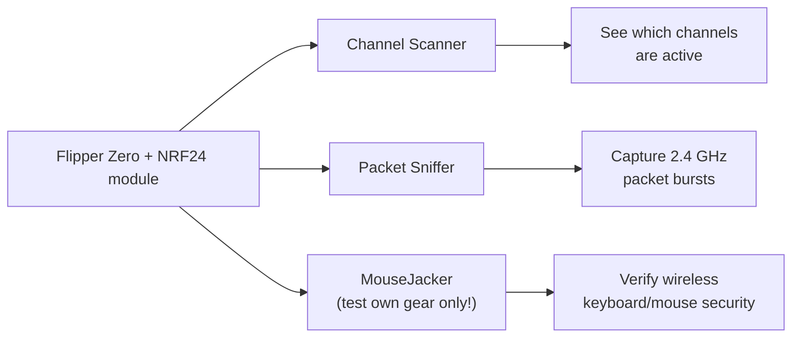

# Flipper Zero NRF24 模块——完整指南

> **一句话**：NRF24 模块为你的 Flipper Zero 增加一台 **2.4 GHz 数据包无线电**——基于无处不在的 Nordic nRF24L01+ 芯片——让你扫描 2.4 GHz 频段、嗅探无线键盘/鼠标流量，并测试你自己设备的安全性。

## 规格速览

| 项目 | 规格 |
|---|---|
| 无线电芯片 | Nordic nRF24L01+（2.4 GHz ISM 频段） |
| 频率范围 | 2.400 – 2.525 GHz（126 个信道，1 MHz 间隔） |
| 调制方式 | GFSK |
| 数据速率 | 250 kbps、1 Mbps、2 Mbps |
| 接口 | SPI（完全由 Flipper 应用控制） |
| 天线 | 外置 SMA（带 PA/LNA 的模块提供好得多的范围） |
| 供电 | 来自 Flipper GPIO（3.3 V） |
| 附加无线电 | 某些板卡把 NRF24 与 CC1101（sub-GHz）组合在同一模块上 |

## 你能用它做什么

- **信道扫描器**：126 个信道中哪些是忙的——有助于找出设备在哪个信道跳频。
- **嗅探器**：观察实验室里 2.4 GHz 设备（无线鼠标、键盘、无人机、游戏手柄）的数据包突发。
- **MouseJack 测试**：著名的 nRF24 "MouseJack" 技术针对*未加密*的无线键盘/鼠标。请严格在你拥有的设备上使用，用来演示为什么未加密的输入设备有风险。

> **法律与道德说明**：在你不拥有的设备上嗅探和注入数据包在大多数司法管辖区是违法的。这个模块是安全教育工具——测试你自己的设备，或你获得书面许可测试的设备。

## 设置

### 1. 固件与应用

NRF24 应用**不在**原厂 Flipper 固件中。请安装捆绑了这些应用的自定义固件——**Momentum**、**Unleashed** 或 **Xtreme**（见 [Flipper Zero 专区](/flipper-zero/)）。

### 2. GPIO 引脚（如需要）

大多数现成的 NRF24 模块已预接线，无需改引脚——直接插入即可。如果你的板卡引脚可配置，请在 `Protocol Settings → GPIO Pin Settings` 下设置 **NRF24 SPI 引脚**（SPI 默认值通常没问题）。在多无线电板卡上，确保 NRF24 无线电是被选中/启用的那个（有拨码开关或按钮时拨到对应位置）。

### 3. 首次测试——信道扫描

1. 接上天线。
2. 打开 `Apps → GPIO → [NRF24] Channel Scanner`。
3. 移动无线鼠标，或反复按无线键盘的按键。
4. 观察信道亮起——设备发射的地方会出现突发。

预期行为：使用中的信道出现活动尖峰；跳频的鼠标会显示突发在信道间跳跃。

## 使用嗅探器

1. 打开 `Apps → GPIO → [NRF24] Sniffer`。
2. 先把 **rate** 设为 2 Mbps（大多数设备），如果什么都看不到再试 1 Mbps / 250 kbps。
3. 把地址设为目标（鼠标上通常是 6 字节地址；应用会显示配置选项）。
4. 按 OK 按钮切换嗅探。设备发射时，地址和数据包计数开始跳动。

## 故障排查

| 问题 | 原因 | 修复 |
|---|---|---|
| 扫描器什么都不显示 | 天线缺失 / 设备闲置 | 接上 SMA 天线；移动/晃动无线设备 |
| 只有噪声 / 没有突发 | 数据速率错误 | 依次尝试 2 Mbps → 1 Mbps → 250 kbps |
| 应用缺失 | 原厂固件 | 安装 Momentum/Unleashed/Xtreme |
| "No module" 错误 | 引脚配置或拨码开关 | 检查 GPIO 引脚设置 / 模块开关；重启 Flipper |
| 范围很小 | 模块没有 PA/LNA | 接受短距离，或使用带 PA/LNA 的模块 |

更多帮助：[SDRLAB 故障排查中心](/sdrlab/troubleshooting/)。

## 相关

- [5G 扩展板](/sdrlab/expansion/5g-board/) — 2.4/5 GHz WiFi + GPS 板卡。
- [WiFi 多功能板](/sdrlab/expansion/wifi-multiboard/) — ESP8266 WiFi 工具。
- [Flipper Zero 专区](/flipper-zero/) — 固件和设备入门。