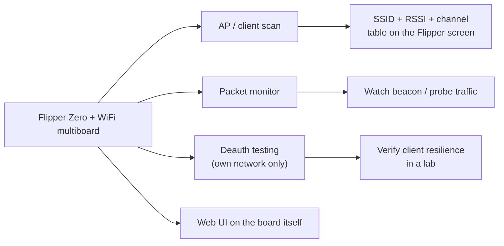

# Flipper Zero WiFi 多功能板（ESP8266）——完整指南

> **一句话**：WiFi 多功能板是一块 **为 Flipper Zero 打造的 ESP8266 驱动的 WiFi 工具**——通常预刷 ESP8266 Deauther 固件——提供接入点扫描、数据包监控和（在你自己的网络上）解除认证测试，外加一个可从任何浏览器控制的独立 Web 界面。

## 规格速览

| 项目 | 规格 |
|---|---|
| WiFi 芯片 | Espressif ESP8266（2.4 GHz，802.11 b/g/n） |
| 固件（典型） | ESP8266 Deauther v2（Spacehuhn）或 ESP8266 Marauder 移植版 |
| 频段 | 仅 2.4 GHz（无 5 GHz） |
| 接口 | UART 串口接到 Flipper GPIO（TX/RX） |
| 供电 | 来自 Flipper GPIO（3.3 V） |
| 附加件（视板卡而定） | 第二无线电模块（NRF24 / CC1101）的插座、无线电选择拨码开关 |
| Web 界面 | AP 模式位于 `192.168.4.1`（默认 SSID `pwned`，密码 `deauther`） |

## 你能用它做什么



ESP8266 Deauther 是经典的袖珍工具：扫描网络、选择目标、运行攻击模式（deauth、信标轰炸）——用 Flipper 作为控制面。由于 ESP8266 还暴露自己的**接入点**，你可以从手机浏览器在 `http://192.168.4.1` 驱动一切——Flipper 屏幕是可选的。

> **请在你拥有或获得明确许可测试的网络上使用。** Deauth 攻击会主动干扰他人的连接；在你不控制的网络上使用它在大多数地方是违法的。这个工具在大学实验室的全部意义，就是学习*为什么*不安全的 WiFi 会失效，以及如何防御它。

## 设置

### 1. Flipper 上的固件

安装自定义固件（**Momentum**、**Unleashed**、**Xtreme**），这样 WiFi deauther/Marauder 应用才可用——见 [Flipper Zero 专区](/flipper-zero/)。

### 2. 刷写 ESP8266（仅首次）

大多数板卡出厂已预刷 Deauther。要（重新）刷写：

1. 按厂商说明让板卡进入刷写模式（通常是在上电时按住某个按钮）。
2. 通过 USB/UART 连接（或使用 Flipper 自带的刷写应用）。
3. 刷写 **ESP8266 Deauther v2** 二进制文件——源码和预编译文件：[SpacehuhnTech/esp8266_deauther](https://github.com/SpacehuhnTech/esp8266_deauther)。

### 3. 接线 / 连接到 Flipper

| ESP8266 | Flipper GPIO |
|---|---|
| TX0 | 14 或 16（RX 引脚） |
| RX0 | 13 或 15（TX 引脚） |
| VIN | 1（5V）或 9（3.3 V） |
| GND | 8 或 11（GND） |

> 在多无线电板卡上，使用前把拨码开关拨到 WiFi/ESP8266 位置。

### 4. 首次运行——扫描

1. 插入板卡，打开 `Apps → WiFi → WiFi Deauther`。
2. 等待启动扫描完成（蓝色 LED 熄灭）。
3. 附近接入点列表出现：SSID、信道、RSSI。

预期应用屏幕：

```
#  SSID            CH  RSSI
1  yupitek-lab     6   -55
2  Library_Guest   1   -78
...
```

## 使用 Web 界面

1. 在手机/电脑上加入 WiFi 网络 `pwned`（密码 `deauther`）。
2. 浏览到 `http://192.168.4.1`。
3. 完整的 Deauther 界面加载：扫描、选择目标、配置攻击、保存设置。
4. 提示：当只用 Flipper 做串口控制时，你可以禁用 Web 界面（`set webinterface false`，保存，重启）来隐藏 `pwned` 接入点。

## 故障排查

| 问题 | 原因 | 修复 |
|---|---|---|
| Web 界面无法访问 | 客户端加入了另一个网络 | 关闭自动加入/移动数据；加入 `pwned`；浏览 `192.168.4.1` |
| 应用启动时卡住 | 启动扫描被打断 | 在触碰控制之前等待蓝色 LED 熄灭 |
| 没有列出网络 | 拨码开关/引脚错误 | 把开关拨到 WiFi；重新检查 TX/RX 接线 |
| 板卡未被检测到 | UART 引脚错误 | 使用引脚 13/15（TX）和 14/16（RX） |
| 信号弱或没有 | 2.4 GHz 天线朝向 | 接上/对准 SMA 天线 |

更多帮助：[SDRLAB 故障排查中心](/sdrlab/troubleshooting/)。

## 相关

- [5G 扩展板](/sdrlab/expansion/5g-board/) — 带 GPS 的 2.4/5 GHz Marauder。
- [NRF24 模块](/sdrlab/expansion/nrf24/) — 2.4 GHz 数据包无线电嗅探。
- [Flipper Zero 专区](/flipper-zero/) — 固件基础。