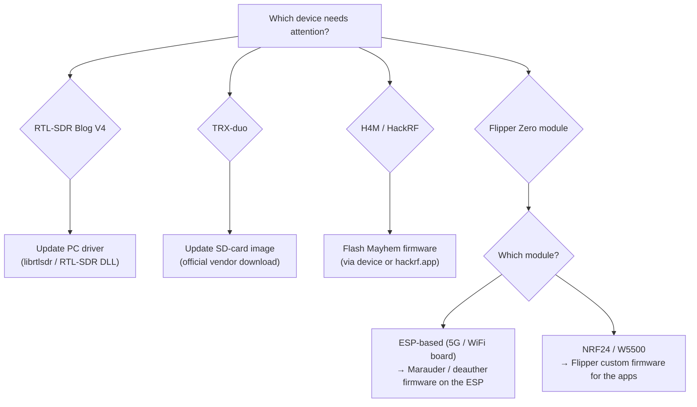
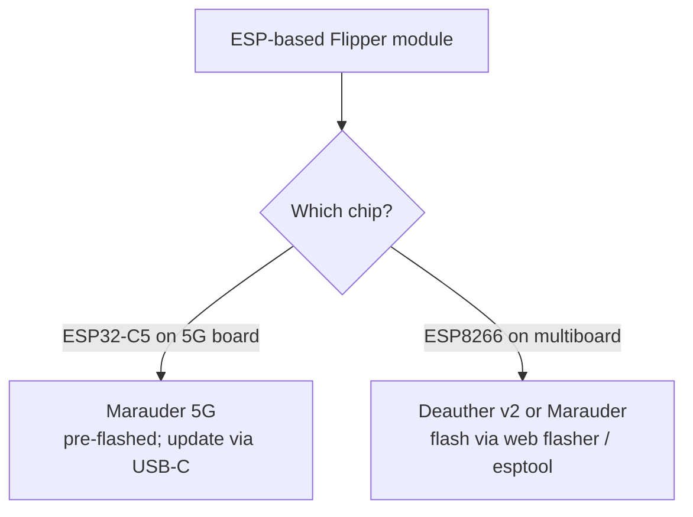

# 固件与驱动程序——保持 SDRLAB 硬件最新

> **学习目标**：你将了解每台 SDRLAB 设备运行的是哪个"大脑"，并能安全地更新它——或者至少确切知道官方更新在哪里。
> **适用读者**：入门到进阶 ｜ **前置条件**：一件来自 [SDRLAB 专区](/sdrlab/) 的设备，并已完成它的[快速入门](/sdrlab/quickstart/)。

## 概念：固件 vs 驱动程序

两个经常被混为一谈的词——让我们把它说清楚：

- **固件**是*嵌入在硬件里*的软件：TRX-duo 的 SD 卡操作系统、H4M 的 PortaPack 操作系统、Flipper 模块上的 ESP 芯片。更新固件会改变设备本身能做什么。
- **驱动程序**是*你电脑上*让操作系统与硬件通信的软件：Linux 上的 `librtlsdr`、Windows 上的 RTL-SDR DLL。



## RTL-SDR Blog V4：更新驱动，而不是接收棒

V4 **没有用户可更新的固件**——重要的是你电脑上的驱动。旧驱动（尤其是发行版自带的）早于 V4 的 R828D 调谐器，会报出令人困惑的错误。V4 页面有完整的 [Linux 驱动安装](/sdrlab/hardware/rtl-sdr-v4/#linux-install)——简版如下：

```bash
sudo apt purge ^librtlsdr
sudo apt install libusb-1.0-0-dev git cmake pkg-config build-essential
git clone https://github.com/osmocom/rtl-sdr
cd rtl-sdr && mkdir build && cd build
cmake ../ -DINSTALL_UDEV_RULES=ON
make && sudo make install
sudo cp ../rtl-sdr.rules /etc/udev/rules.d/
echo 'blacklist dvb_usb_rtl28xxu' | sudo tee /etc/modprobe.d/blacklist-dvb_usb_rtl28xxu.conf
sudo ldconfig
```

然后**重启**并用 `rtl_test` 验证。在 Windows 上，SDR#、SDR++ 和 SDR Console 自带兼容 V4 的最新驱动——保持这些应用更新即可。

## TRX-duo：SD 卡镜像就是固件

TRX-duo 是一台嵌入式 Linux 计算机（Xilinx Zynq 7010 + ARM Cortex-A9），**从 microSD 卡启动**。卡上包含操作系统、FPGA 比特流和 Red Pitaya 兼容应用——更新"固件"实际上就是写入一份更新的官方 SD 镜像。

> ℹ️ **外站资源标注**：TRX-duo 操作系统与 SD 卡镜像文件托管于原厂（`trx-duo.com`）及 Red Pitaya 开源社区存储库，非 Yupitek 本地镜像。下载时请务必从官方发布渠道获取并校验哈希值。
>
> ⚠️ **重要**：SD 镜像必须从**官方厂商页面**下载——**不要**使用来路不明的第三方链接。官方下载位置见 [TRX-duo 页面 → 固件与 SD 镜像](/sdrlab/hardware/trx-duo/#firmware-and-sd-image)（厂商网站，以及带固件/快速入门手册的厂商产品页）。

典型的 SD 卡流程（确切官方说明见产品页面）：

1. 从厂商处下载官方镜像。
2. 用 `dd` 或 balenaEtcher 写入 microSD 卡（≥ 4 GB）。
3. 插入卡片，连接以太网 + USB-C 供电，然后启动。
4. 设备出现在其网络地址上（默认通过 DHCP 请求 IP；无 DHCP 时 Red Pitaya 兼容默认地址为 `http://192.168.1.100`）。

## H4M：Mayhem 固件

H4M 运行开源的 **Mayhem 固件**（把 PortaPack 变成完整工具包的社区分支）。[H4M 页面](/sdrlab/hardware/h4m/#mayhem-firmware) 介绍了安装方法；官方来源如下：

- [Mayhem 固件发布页](https://github.com/portapack-mayhem/mayhem-firmware/releases) — 下载 `FIRMWARE_mayhem_*.zip` 和对应的 `COPY_TO_SDCARD` 文件。
- [hackrf.app](https://hackrf.app/) — 通过 USB（WebUSB）在浏览器中更新。

刷写方法，按便利程度排序：

1. **设备内 Flash Utility** — 把固件 `.bin` 复制到 microSD，打开 `Utilities → Flash Utility`，选择它。最简单。
2. **hackrf.app** — 连接 USB-C，让网站刷写设备。无需本地工具。
3. **hackrf_spiflash**（经典方式）— 设备处于 HackRF 模式时：

```bash
sudo apt install hackrf
hackrf_spiflash -w portapack-h1_h2-mayhem.bin
```

> 让 **microSD 卡内容与固件版本保持同步**：每个版本都会附带一个 `COPY_TO_SDCARD` 压缩包——把它解压到 FAT32 格式的 microSD 卡上。SD 卡不同步是"应用丢失"报告的头号原因。

## Flipper Zero 扩展模块：两层固件

Flipper 模块有*两个*需要留意的"大脑"：

### 1. Flipper Zero 本身（为应用提供自定义固件）

NRF24 嗅探器、mousejacker 和扩展 WiFi 应用**不在**官方 Flipper 固件中。请安装捆绑了这些应用的自定义固件——**Momentum**、**Unleashed** 或 **Xtreme**。更新 Flipper 通过 `qFlipper`（桌面端）或手机应用完成；基础流程见 [Flipper Zero 专区](/flipper-zero/)。

### 2. 模块自己的芯片（ESP 固件）

- **5G 扩展板 / ESP32-C5** → Marauder 固件（2.4/5 GHz）。通过板载 USB-C 端口刷写；厂商出厂时已预刷。
- **WiFi 多功能板 / ESP8266** → ESP8266 Deauther 或 Marauder 固件。通过板载 USB/UART 或网页刷写器刷写。
- **NRF24 / W5500 模块** → 没有模块固件；它们是纯 SPI 外设，完全由 Flipper 应用控制。



## 更新安全清单

- [ ] 重写前备份 SD 卡（TRX-duo、H4M）。
- [ ] 只从**官方厂商/项目页面**下载固件（上面的链接以及每个产品页面上的链接）。
- [ ] 让固件版本与 SD 卡内容匹配（H4M）。
- [ ] 驱动变更后重启 / 重新插拔（RTL-SDR V4）。
- [ ] 用设备专属测试验证（`rtl_test`、`hackrf_info`、Web 界面、模块应用）。

## 相关

- [SDR 软件指南](/sdrlab/sdr-software/) — PC 端该运行什么。
- [故障排查](/sdrlab/troubleshooting/) — 固件升级的"恐怖故事"，在此解决。
- 产品页面：[RTL-SDR V4](/sdrlab/hardware/rtl-sdr-v4/)、[TRX-duo](/sdrlab/hardware/trx-duo/)、[H4M](/sdrlab/hardware/h4m/)。